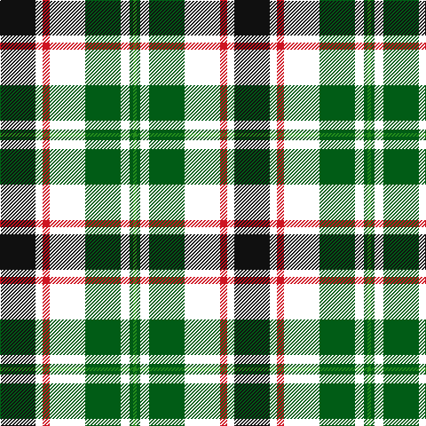

This page is one **sett** — a single exact thread-count. It belongs to the [tartan](/tartans/k20w4r4w20dg20w5dg2g2/)
(the same proportion at any scale), whose colour order is pattern [GGWGWRWK](/stripes/ggwgwrwk/).

Sourced from register-of-tartans.  It is a [8 stripe tartan](/stripes/stripes8/).

Original link https://www.tartanregister.gov.uk/tartanDetails.aspx?ref=10530

## Register references

External register numbers recorded for this tartan.

- Scottish Register of Tartans: [10530](https://www.tartanregister.gov.uk/tartanDetails.aspx?ref=10530)

## Thread count
K/40 W8 R8 W40 G40 W10 G4 Ga/4

## Palette

Palette: <strong>Tartan Register</strong> <small style="color:#888">(2 of 5 colours)</small>
<table><thead><tr><th>Colour</th><th>Threads</th><th>Shade</th><th>Base</th><th>OKLCh</th></tr></thead><tbody><tr><td>K/</td><td style="text-align:right;font-variant-numeric:tabular-nums">40</td><td><code style="background-color:#101010;">#101010</code> <small style="color:#888">#101010</small></td><td>K <code style="background-color:#000000;">#000000</code></td><td><small style="color:#888">oklch(17.3% 0.000 89.9)</small></td></tr><tr><td>W</td><td style="text-align:right;font-variant-numeric:tabular-nums">8</td><td><code style="background-color:#FFFFFF;">#FFFFFF</code> <small style="color:#888">#FFFFFF</small></td><td>W <code style="background-color:#F7F7F7;">#F7F7F7</code></td><td><small style="color:#888">oklch(100.0% 0.000 89.9)</small></td></tr><tr><td>R</td><td style="text-align:right;font-variant-numeric:tabular-nums">8</td><td><code style="background-color:#CE1422;">#CE1422</code> <small style="color:#888">#CE1422</small></td><td>R <code style="background-color:#CC0000;">#CC0000</code></td><td><small style="color:#888">oklch(54.2% 0.212 25.9)</small></td></tr><tr><td>W</td><td style="text-align:right;font-variant-numeric:tabular-nums">40</td><td><code style="background-color:#FFFFFF;">#FFFFFF</code> <small style="color:#888">#FFFFFF</small></td><td>W <code style="background-color:#F7F7F7;">#F7F7F7</code></td><td><small style="color:#888">oklch(100.0% 0.000 89.9)</small></td></tr><tr><td>G</td><td style="text-align:right;font-variant-numeric:tabular-nums">40</td><td><code style="background-color:#015C16;">#015C16</code> <small style="color:#888">#015C16</small></td><td>G <code style="background-color:#006100;">#006100</code></td><td><small style="color:#888">oklch(41.3% 0.128 145.2)</small></td></tr><tr><td>W</td><td style="text-align:right;font-variant-numeric:tabular-nums">10</td><td><code style="background-color:#FFFFFF;">#FFFFFF</code> <small style="color:#888">#FFFFFF</small></td><td>W <code style="background-color:#F7F7F7;">#F7F7F7</code></td><td><small style="color:#888">oklch(100.0% 0.000 89.9)</small></td></tr><tr><td>G</td><td style="text-align:right;font-variant-numeric:tabular-nums">4</td><td><code style="background-color:#015C16;">#015C16</code> <small style="color:#888">#015C16</small></td><td>G <code style="background-color:#006100;">#006100</code></td><td><small style="color:#888">oklch(41.3% 0.128 145.2)</small></td></tr><tr><td>Ga/</td><td style="text-align:right;font-variant-numeric:tabular-nums">4</td><td><code style="background-color:#278F1C;">#278F1C</code> <small style="color:#888">#278F1C</small></td><td>G <code style="background-color:#006100;">#006100</code></td><td><small style="color:#888">oklch(57.0% 0.175 141.8)</small></td></tr></tbody></table>

# Sample pattern

## Nearest tartans

The nearest existing variants by ΔTartan distance, with this tartan at the top so the swatches line up against it.

ΔTartan

Tartan

Sett

—

<a href="/ttd/edit/#slug=k20w4r4w20dg20w5dg2g2~x2">Hackett, William (Coatbridge) (Personal)</a> <a class="nn-out" href="/setts/s8/k20w4r4w20dg20w5dg2g2~x2/" title="open its dictionary page">↗</a>

0.51

<a href="/ttd/edit/#slug=w4k2w18k11db2y18ly2~x2">Barbour - Ancient</a> <a class="nn-out" href="/setts/s7/w4k2w18k11db2y18ly2~x2/" title="open its dictionary page">↗</a>

0.73

<a href="/ttd/edit/#slug=g5ly2t20w2k20w20k2w5~x2">Alexander Brothers - 2007? (Corp.)</a> <a class="nn-out" href="/setts/s8/g5ly2t20w2k20w20k2w5~x2/" title="open its dictionary page">↗</a>

0.84

<a href="/ttd/edit/#slug=db8w33k15dg17t3dg17t3~x2">MacRobart Dress (Personal)</a> <a class="nn-out" href="/setts/s7/db8w33k15dg17t3dg17t3~x2/" title="open its dictionary page">↗</a>

0.89

<a href="/ttd/edit/#slug=db8w33k15g17t3g17t3~x2">MacRobart, dress</a> <a class="nn-out" href="/setts/s7/db8w33k15g17t3g17t3~x2/" title="open its dictionary page">↗</a>

0.95

<a href="/ttd/edit/#slug=lo12k3g24r12g24k32w44g4w8g4">Gillies Dress Green</a> <a class="nn-out" href="/setts/s10/lo12k3g24r12g24k32w44g4w8g4/" title="open its dictionary page">↗</a>

0.96

<a href="/ttd/edit/#slug=dy17g5db2w12db2ly4g7~x4">Northern Ontario</a> <a class="nn-out" href="/setts/s7/dy17g5db2w12db2ly4g7~x4/" title="open its dictionary page">↗</a>

0.98

<a href="/ttd/edit/#slug=g1w1g6db5w6r1g1lo1~x4">Vermont Dress</a> <a class="nn-out" href="/setts/s8/g1w1g6db5w6r1g1lo1~x4/" title="open its dictionary page">↗</a>

0.99

<a href="/ttd/edit/#slug=w7r1w14k6lo2k6g14r2g10lo1~x2">Spanish shirt</a> <a class="nn-out" href="/setts/s10/w7r1w14k6lo2k6g14r2g10lo1~x2/" title="open its dictionary page">↗</a>

1.00

<a href="/ttd/edit/#slug=r5w2o20ly2k16w18k2w5~x2">Ailsa Craig</a> <a class="nn-out" href="/setts/s8/r5w2o20ly2k16w18k2w5~x2/" title="open its dictionary page">↗</a>

1.01

<a href="/ttd/edit/#slug=r5w2t20ly2k16w18k2w5~x2">Ailsa Craig (District)</a> <a class="nn-out" href="/setts/s8/r5w2t20ly2k16w18k2w5~x2/" title="open its dictionary page">↗</a>

## Neighbour map

Every grey dot is one of 14359 variants placed by the first two principal components of the ΔTartan feature space (44% of its variance). Red is this tartan; blue dots are its nearest — click one to open its page.

<svg viewBox="0 0 640 380" role="img" style="max-width:100%;height:auto;border:1px solid #e0e0e0;border-radius:4px;display:block" xmlns="http://www.w3.org/2000/svg"><image href="/nn/cloud.v1.png" width="640" height="380"/><a href="/setts/s7/w4k2w18k11db2y18ly2~x2/"><circle cx="129.6" cy="159.4" r="4" fill="#3465a4"><title>Barbour - Ancient</title></circle></a><a href="/setts/s8/g5ly2t20w2k20w20k2w5~x2/"><circle cx="120.1" cy="154.5" r="4" fill="#3465a4"><title>Alexander Brothers - 2007? (Corp.)</title></circle></a><a href="/setts/s7/db8w33k15dg17t3dg17t3~x2/"><circle cx="114.3" cy="175.9" r="4" fill="#3465a4"><title>MacRobart Dress (Personal)</title></circle></a><a href="/setts/s7/db8w33k15g17t3g17t3~x2/"><circle cx="104.9" cy="173.9" r="4" fill="#3465a4"><title>MacRobart, dress</title></circle></a><a href="/setts/s10/lo12k3g24r12g24k32w44g4w8g4/"><circle cx="106.6" cy="135.6" r="4" fill="#3465a4"><title>Gillies Dress Green</title></circle></a><a href="/setts/s7/dy17g5db2w12db2ly4g7~x4/"><circle cx="102.8" cy="176.7" r="4" fill="#3465a4"><title>Northern Ontario</title></circle></a><a href="/setts/s8/g1w1g6db5w6r1g1lo1~x4/"><circle cx="110.5" cy="181.1" r="4" fill="#3465a4"><title>Vermont Dress</title></circle></a><a href="/setts/s10/w7r1w14k6lo2k6g14r2g10lo1~x2/"><circle cx="126.9" cy="144.2" r="4" fill="#3465a4"><title>Spanish shirt</title></circle></a><a href="/setts/s8/r5w2o20ly2k16w18k2w5~x2/"><circle cx="117.1" cy="148.0" r="4" fill="#3465a4"><title>Ailsa Craig</title></circle></a><a href="/setts/s8/r5w2t20ly2k16w18k2w5~x2/"><circle cx="115.6" cy="148.8" r="4" fill="#3465a4"><title>Ailsa Craig (District)</title></circle></a><circle cx="121.9" cy="153.3" r="5" fill="#c00000"/></svg>

ID: /setts/s8/k20w4r4w20dg20w5dg2g2~x2/
