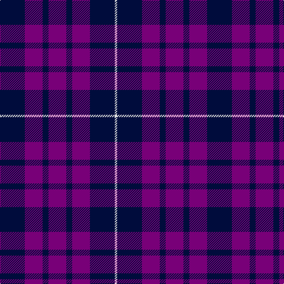

In pattern [KBKBKBKW](/patterns/kbkbkbkw/).

This was sourced from register-of-tartans.  It is a [8 stripes tartan](/stripes/stripes8/).

Original link https://www.tartanregister.gov.uk/tartanDetails.aspx?ref=1718

## Register references

External register numbers recorded for this tartan.

- Scottish Register of Tartans: [1718](https://www.tartanregister.gov.uk/tartanDetails.aspx?ref=1718)
- Scottish Tartans Authority (ITI): 5739

## Thread count
DBa/42 P30 DBa10 P30 DBa10 P30 DBa42 LN/4

## Palette
Each colour and its ΔE from the base-6 reference it is a variant of.

| Colour | Shade | Base | ΔE (OKLab) |
|---|---|---|---|
| DB | <code style="background-color:#003C64;">#003C64</code> `#003C64` | B <code style="background-color:#2A418A;">#2A418A</code> | 0.08 |
| DBa | <code style="background-color:#000C3C;">#000C3C</code> `#000C3C` | K <code style="background-color:#000000;">#000000</code> | 0.21 |
| DP | <code style="background-color:#440044;">#440044</code> `#440044` | B <code style="background-color:#2A418A;">#2A418A</code> | 0.18 |
| LN | <code style="background-color:#E0E0E0;">#E0E0E0</code> `#E0E0E0` | W <code style="background-color:#F7F7F7;">#F7F7F7</code> | 0.07 |
| P | <code style="background-color:#780078;">#780078</code> `#780078` | B <code style="background-color:#2A418A;">#2A418A</code> | 0.17 |

# Sample pattern

## Nearest tartans

The nearest existing variants by ΔTartan distance.

1. [Highland Spirit (Fashion)](/setts/s5/b15k5b15k21w2~b780078-k000c3c-we0e0e0~x2/) — ΔT 1.09
1. [Robbins](/setts/s6/b1r3b1r3b6g1~b1c0070-g006818-r880000~x8/) — ΔT 1.59
1. [Nithsdale (Dalgliesh)](/setts/s10/b16r3g3r10b24r3b3r3b3r10~b1c0070-g006818-r880000~x2/) — ΔT 1.65
1. [Swan (Name)](/setts/s6/k6b17k6b17k27w3~b2c2c80-k101010-we0e0e0~x2/) — ΔT 1.65
1. [Embrace, The](/setts/s8/b10r24b4r3b24w2r6b6~b000088-r8c0000-wfcfcfc~x2/) — ΔT 1.67
1. [Gifford (Personal)](/setts/s7/k15r8y2b25k5b13k5~b2c2c80-k101010-rc80000-ye8c000~x2/) — ΔT 1.79
1. [Mother's Pride](/setts/s4/b10y1b10r10~b1c0070-r880000-yd09800~x4/) — ΔT 1.83
1. [Oban](/setts/s8/b6k10b1k1b1k10ba10k6~b3850c8-ba2c2c80-k101010~x4/) — ΔT 1.84
1. [Scottish Nuclear](/setts/s6/b9k4w1k4b9r1~b2c2c80-k101010-rc80000-wc0c0c0~x4/) — ΔT 1.90
1. [Royal Scotsman Train (Corporate)](/setts/s6/b5k2b14k14b2y2~b2c2c80-k101010-yb8b4b8~x2/) — ΔT 1.92

## Neighbour map

Every grey dot is one of 15726 variants placed by the first two principal components of the ΔTartan feature space (44% of its variance). Red is this tartan; blue dots are its nearest — click one to open its page.

<svg viewBox="0 0 640 380" role="img" style="max-width:100%;height:auto;border:1px solid #e0e0e0;border-radius:4px;display:block" xmlns="http://www.w3.org/2000/svg"><image href="/nn/cloud.v1.png" width="640" height="380"/><a href="/setts/s5/b15k5b15k21w2~b780078-k000c3c-we0e0e0~x2/"><circle cx="334.9" cy="268.0" r="4" fill="#3465a4"><title>Highland Spirit (Fashion)</title></circle></a><a href="/setts/s6/b1r3b1r3b6g1~b1c0070-g006818-r880000~x8/"><circle cx="330.7" cy="272.2" r="4" fill="#3465a4"><title>Robbins</title></circle></a><a href="/setts/s10/b16r3g3r10b24r3b3r3b3r10~b1c0070-g006818-r880000~x2/"><circle cx="381.6" cy="230.2" r="4" fill="#3465a4"><title>Nithsdale (Dalgliesh)</title></circle></a><a href="/setts/s6/k6b17k6b17k27w3~b2c2c80-k101010-we0e0e0~x2/"><circle cx="329.3" cy="271.7" r="4" fill="#3465a4"><title>Swan (Name)</title></circle></a><a href="/setts/s8/b10r24b4r3b24w2r6b6~b000088-r8c0000-wfcfcfc~x2/"><circle cx="350.6" cy="214.2" r="4" fill="#3465a4"><title>Embrace, The</title></circle></a><a href="/setts/s7/k15r8y2b25k5b13k5~b2c2c80-k101010-rc80000-ye8c000~x2/"><circle cx="297.4" cy="223.2" r="4" fill="#3465a4"><title>Gifford (Personal)</title></circle></a><a href="/setts/s4/b10y1b10r10~b1c0070-r880000-yd09800~x4/"><circle cx="392.1" cy="298.3" r="4" fill="#3465a4"><title>Mother's Pride</title></circle></a><a href="/setts/s8/b6k10b1k1b1k10ba10k6~b3850c8-ba2c2c80-k101010~x4/"><circle cx="365.2" cy="259.6" r="4" fill="#3465a4"><title>Oban</title></circle></a><a href="/setts/s6/b9k4w1k4b9r1~b2c2c80-k101010-rc80000-wc0c0c0~x4/"><circle cx="380.1" cy="254.8" r="4" fill="#3465a4"><title>Scottish Nuclear</title></circle></a><a href="/setts/s6/b5k2b14k14b2y2~b2c2c80-k101010-yb8b4b8~x2/"><circle cx="350.4" cy="267.7" r="4" fill="#3465a4"><title>Royal Scotsman Train (Corporate)</title></circle></a><circle cx="337.7" cy="260.1" r="5" fill="#c00000"/></svg>

ID: /setts/s8/k21b15k5b15k5b15k21w2~b780078-k000c3c-we0e0e0~x2/
