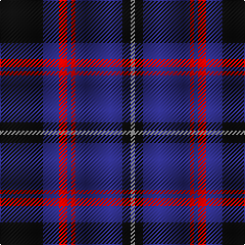

This page is one **sett** — a single exact thread-count. It belongs to the [tartan](/tartans/k21db8r4db2r2db23k4w2/)
(the same proportion at any scale), whose colour order is pattern [KBRBRBKW](/stripes/kbrbrbkw/).

Sourced from tartans-authority.  It is a [8 stripe tartan](/stripes/stripes8/).

Original link http://www.tartansauthority.com/tartan-ferret/display/8441/

## Register references

External register numbers recorded for this tartan.

- Scottish Tartans Authority (ITI): 8441

## Thread count
K/42 DB16 R8 DB4 R4 DB46 K8 LN/4

## Palette

Palette: <strong>Tartan Register</strong>
<table><thead><tr><th>Colour</th><th>Threads</th><th>Shade</th><th>Base</th><th>OKLCh</th></tr></thead><tbody><tr><td>K/</td><td style="text-align:right;font-variant-numeric:tabular-nums">42</td><td><code style="background-color:#101010;">#101010</code> <small style="color:#888">#101010</small></td><td>K <code style="background-color:#000000;">#000000</code></td><td><small style="color:#888">oklch(17.3% 0.000 89.9)</small></td></tr><tr><td>DB</td><td style="text-align:right;font-variant-numeric:tabular-nums">16</td><td><code style="background-color:#2C2C80;">#2C2C80</code> <small style="color:#888">#2C2C80</small></td><td>B <code style="background-color:#2A418A;">#2A418A</code></td><td><small style="color:#888">oklch(35.0% 0.138 276.6)</small></td></tr><tr><td>R</td><td style="text-align:right;font-variant-numeric:tabular-nums">8</td><td><code style="background-color:#C80000;">#C80000</code> <small style="color:#888">#C80000</small></td><td>R <code style="background-color:#CC0000;">#CC0000</code></td><td><small style="color:#888">oklch(52.3% 0.215 29.2)</small></td></tr><tr><td>DB</td><td style="text-align:right;font-variant-numeric:tabular-nums">4</td><td><code style="background-color:#2C2C80;">#2C2C80</code> <small style="color:#888">#2C2C80</small></td><td>B <code style="background-color:#2A418A;">#2A418A</code></td><td><small style="color:#888">oklch(35.0% 0.138 276.6)</small></td></tr><tr><td>R</td><td style="text-align:right;font-variant-numeric:tabular-nums">4</td><td><code style="background-color:#C80000;">#C80000</code> <small style="color:#888">#C80000</small></td><td>R <code style="background-color:#CC0000;">#CC0000</code></td><td><small style="color:#888">oklch(52.3% 0.215 29.2)</small></td></tr><tr><td>DB</td><td style="text-align:right;font-variant-numeric:tabular-nums">46</td><td><code style="background-color:#2C2C80;">#2C2C80</code> <small style="color:#888">#2C2C80</small></td><td>B <code style="background-color:#2A418A;">#2A418A</code></td><td><small style="color:#888">oklch(35.0% 0.138 276.6)</small></td></tr><tr><td>K</td><td style="text-align:right;font-variant-numeric:tabular-nums">8</td><td><code style="background-color:#101010;">#101010</code> <small style="color:#888">#101010</small></td><td>K <code style="background-color:#000000;">#000000</code></td><td><small style="color:#888">oklch(17.3% 0.000 89.9)</small></td></tr><tr><td>LN/</td><td style="text-align:right;font-variant-numeric:tabular-nums">4</td><td><code style="background-color:#E0E0E0;">#E0E0E0</code> <small style="color:#888">#E0E0E0</small></td><td>W <code style="background-color:#F7F7F7;">#F7F7F7</code></td><td><small style="color:#888">oklch(90.7% 0.000 89.9)</small></td></tr></tbody></table>

# Sample pattern

## Nearest tartans

The nearest existing variants by ΔTartan distance, with this tartan at the top so the swatches line up against it.

ΔTartan

Tartan

Sett

—

<a href="/ttd/edit/#slug=k21db8r4db2r2db23k4w2~x2">Murdoch Clebration (Personal)</a> <a class="nn-out" href="/setts/s8/k21db8r4db2r2db23k4w2~x2/" title="open its dictionary page">↗</a>

0.63

<a href="/ttd/edit/#slug=db30r2db2r4db9k26w2k4~x2">Murdoch Celebration (Personal)</a> <a class="nn-out" href="/setts/s8/db30r2db2r4db9k26w2k4~x2/" title="open its dictionary page">↗</a>

0.93

<a href="/ttd/edit/#slug=db4r2db2r4k7db10w2k13db18k2db2~x4">Ibrox</a> <a class="nn-out" href="/setts/s11/db4r2db2r4k7db10w2k13db18k2db2~x4/" title="open its dictionary page">↗</a>

0.94

<a href="/ttd/edit/#slug=db4ly2db17k2r4k2db3k11db3~x2">Stone of Destiny</a> <a class="nn-out" href="/setts/s9/db4ly2db17k2r4k2db3k11db3~x2/" title="open its dictionary page">↗</a>

1.00

<a href="/ttd/edit/#slug=k14t3k3w4k3t3k14db4k4db30k4~x2">Scottish Jewish Community</a> <a class="nn-out" href="/setts/s11/k14t3k3w4k3t3k14db4k4db30k4~x2/" title="open its dictionary page">↗</a>

1.01

<a href="/ttd/edit/#slug=db10r3db3r6db26g12r6g2r3g6lo2~x2">Law of Atholl (Personal)</a> <a class="nn-out" href="/setts/s11/db10r3db3r6db26g12r6g2r3g6lo2~x2/" title="open its dictionary page">↗</a>

1.02

<a href="/ttd/edit/#slug=k15lb3k3w4k3lb3k15db4k4db30k4~x2">Shalom (Fashion)</a> <a class="nn-out" href="/setts/s11/k15lb3k3w4k3lb3k15db4k4db30k4~x2/" title="open its dictionary page">↗</a>

1.04

<a href="/ttd/edit/#slug=k15r8ly2db25k5db13k5~x2">Gifford (Personal)</a> <a class="nn-out" href="/setts/s7/k15r8ly2db25k5db13k5~x2/" title="open its dictionary page">↗</a>

1.16

<a href="/ttd/edit/#slug=o11dbi1o3db1dbi9r1~x4">Dege, of Saville Row</a> <a class="nn-out" href="/setts/s6/o11dbi1o3db1dbi9r1~x4/" title="open its dictionary page">↗</a>

1.18

<a href="/ttd/edit/#slug=k4db36k4db4k34b3k3w4~x2">Slanj Dress (Corporate)</a> <a class="nn-out" href="/setts/s8/k4db36k4db4k34b3k3w4~x2/" title="open its dictionary page">↗</a>

1.20

<a href="/ttd/edit/#slug=db6lo3db3lo15dbi7db7dbi5db17dbi46w4">Rhys Welsh Name Tartan Tartan Number: 5753. Earliest known date: 2002 The tartan for this Welsh surname and its variations, Rees, Preece, Reese, is actually woven in Wales at the Cambrian Woollen Mill, weaving on the same site since 1830. This tartan differs from many traditional patterns in that the warp and weft differ, giving the finished worsted wool cloth more of a predominant stripe, vertically noticeable in the finished Kilt, or Cilt in Wales. See products available Copyright © Blair Urquhart, Comrie, 2015</a> <a class="nn-out" href="/setts/s10/db6lo3db3lo15dbi7db7dbi5db17dbi46w4/" title="open its dictionary page">↗</a>

## Neighbour map

Every grey dot is one of 14359 variants placed by the first two principal components of the ΔTartan feature space (44% of its variance). Red is this tartan; blue dots are its nearest — click one to open its page.

<svg viewBox="0 0 640 380" role="img" style="max-width:100%;height:auto;border:1px solid #e0e0e0;border-radius:4px;display:block" xmlns="http://www.w3.org/2000/svg"><image href="/nn/cloud.v1.png" width="640" height="380"/><a href="/setts/s8/db30r2db2r4db9k26w2k4~x2/"><circle cx="334.1" cy="183.0" r="4" fill="#3465a4"><title>Murdoch Celebration (Personal)</title></circle></a><a href="/setts/s11/db4r2db2r4k7db10w2k13db18k2db2~x4/"><circle cx="305.1" cy="204.7" r="4" fill="#3465a4"><title>Ibrox</title></circle></a><a href="/setts/s9/db4ly2db17k2r4k2db3k11db3~x2/"><circle cx="307.8" cy="208.0" r="4" fill="#3465a4"><title>Stone of Destiny</title></circle></a><a href="/setts/s11/k14t3k3w4k3t3k14db4k4db30k4~x2/"><circle cx="284.0" cy="186.7" r="4" fill="#3465a4"><title>Scottish Jewish Community</title></circle></a><a href="/setts/s11/db10r3db3r6db26g12r6g2r3g6lo2~x2/"><circle cx="279.0" cy="180.6" r="4" fill="#3465a4"><title>Law of Atholl (Personal)</title></circle></a><a href="/setts/s11/k15lb3k3w4k3lb3k15db4k4db30k4~x2/"><circle cx="279.8" cy="181.1" r="4" fill="#3465a4"><title>Shalom (Fashion)</title></circle></a><a href="/setts/s7/k15r8ly2db25k5db13k5~x2/"><circle cx="299.5" cy="226.1" r="4" fill="#3465a4"><title>Gifford (Personal)</title></circle></a><a href="/setts/s6/o11dbi1o3db1dbi9r1~x4/"><circle cx="328.7" cy="209.2" r="4" fill="#3465a4"><title>Dege, of Saville Row</title></circle></a><a href="/setts/s8/k4db36k4db4k34b3k3w4~x2/"><circle cx="348.3" cy="203.3" r="4" fill="#3465a4"><title>Slanj Dress (Corporate)</title></circle></a><a href="/setts/s10/db6lo3db3lo15dbi7db7dbi5db17dbi46w4/"><circle cx="297.5" cy="169.6" r="4" fill="#3465a4"><title>Rhys Welsh Name Tartan Tartan Number: 5753. Earliest known date: 2002 The tartan for this Welsh surname and its variations, Rees, Preece, Reese, is actually woven in Wales at the Cambrian Woollen Mill, weaving on the same site since 1830. This tartan differs from many traditional patterns in that the warp and weft differ, giving the finished worsted wool cloth more of a predominant stripe, vertically noticeable in the finished Kilt, or Cilt in Wales. See products available Copyright © Blair Urquhart, Comrie, 2015</title></circle></a><circle cx="308.6" cy="199.4" r="5" fill="#c00000"/></svg>

ID: /setts/s8/k21db8r4db2r2db23k4w2~x2/
