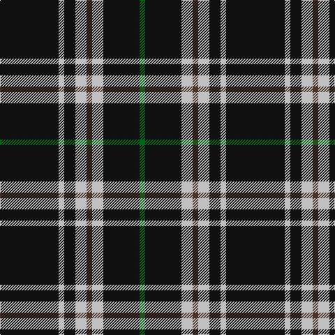

This page is one **sett** — a single exact thread-count. It belongs to the [tartan](/tartans/k21n2k4n4t2n4k13g2/)
(the same proportion at any scale), whose colour order is pattern [GKWBWKWK](/stripes/gkwbwkwk/).

Sourced from tartans-authority.  It is a [8 stripe tartan](/stripes/stripes8/).

Original link http://www.tartansauthority.com/tartan-ferret/display/3042/

2 attestations — the source records this cloth was collapsed from (oldest owns this page)

<ul>
<li>2000 March — Anzac (Fashion) (tartans-authority, <a href="http://www.tartansauthority.com/tartan-ferret/display/3042/">record</a>)</li>
<li>undated — Anzac (register-of-tartans, <a href="https://www.tartanregister.gov.uk/tartanDetails.aspx?ref=5232">record</a>)</li>
</ul>

## Register references

External register numbers recorded for this tartan.

- Scottish Register of Tartans: [5232](https://www.tartanregister.gov.uk/tartanDetails.aspx?ref=5232)
- Scottish Tartans Authority (ITI): 3042

## Thread count
K/84 N8 K16 N16 T8 N16 K52 G/8

## Palette
Each colour and the base-6 reference it is a variant of.

| Colour | Shade | Base |
|---|---|---|
| G | <code style="background-color:#006818;">#006818</code> `oklch(45.0% 0.142 145.0)` <small>#006818</small> | G <code style="background-color:#006100;">#006100</code> |
| K | <code style="background-color:#101010;">#101010</code> `oklch(17.3% 0.000 89.9)` <small>#101010</small> | K <code style="background-color:#000000;">#000000</code> |
| N | <code style="background-color:#C0C0C0;">#C0C0C0</code> `oklch(80.8% 0.000 89.9)` <small>#C0C0C0</small> | W <code style="background-color:#F7F7F7;">#F7F7F7</code> |
| T | <code style="background-color:#4C3428;">#4C3428</code> `oklch(34.9% 0.040 47.5)` <small>#4C3428</small> | B <code style="background-color:#2A418A;">#2A418A</code> |

# Sample pattern

## Nearest tartans

The nearest existing variants by ΔTartan distance, with this tartan at the top so the swatches line up against it.

ΔTartan

Tartan

Sett

—

<a href="/ttd/edit/#slug=k21lb2k4lb4do2lb4k13g2~x4">Anzac (Fashion)</a> <a class="nn-out" href="/setts/s8/k21lb2k4lb4do2lb4k13g2~x4/" title="open its dictionary page">↗</a>

0.89

<a href="/ttd/edit/#slug=k8t3k32b14w3k25t3~x2">Cowe (Personal)</a> <a class="nn-out" href="/setts/s7/k8t3k32b14w3k25t3~x2/" title="open its dictionary page">↗</a>

1.05

<a href="/ttd/edit/#slug=k18t9k18lb2k2lb2k18lr9k18lb2">London Fog Black 2 (fashion)</a> <a class="nn-out" href="/setts/s10/k18t9k18lb2k2lb2k18lr9k18lb2/" title="open its dictionary page">↗</a>

1.05

<a href="/ttd/edit/#slug=g12k8w6k22w3k8w3k40g6">Jensen, Sven (Personal)</a> <a class="nn-out" href="/setts/s9/g12k8w6k22w3k8w3k40g6/" title="open its dictionary page">↗</a>

1.15

<a href="/ttd/edit/#slug=k17r6k2w6k17lo2~x2">Black 1990 (Name)</a> <a class="nn-out" href="/setts/s6/k17r6k2w6k17lo2~x2/" title="open its dictionary page">↗</a>

1.19

<a href="/ttd/edit/#slug=k17r6k2lb6k17lo2~x2">Black (symmetrical)</a> <a class="nn-out" href="/setts/s6/k17r6k2lb6k17lo2~x2/" title="open its dictionary page">↗</a>

1.24

<a href="/ttd/edit/#slug=k16b2k8r3lr3r3k8~x2">Benson (New England)</a> <a class="nn-out" href="/setts/s7/k16b2k8r3lr3r3k8~x2/" title="open its dictionary page">↗</a>

1.29

<a href="/setts/s6/r3lo2k10w1~x6/">St. Eloi</a>

1.29

<a href="/ttd/edit/#slug=k2lb5k1lb1k10r1k1~x4">Lundy Reform</a> <a class="nn-out" href="/setts/s7/k2lb5k1lb1k10r1k1~x4/" title="open its dictionary page">↗</a>

1.30

<a href="/ttd/edit/#slug=n3k31w6k7n3k12w2~x2">Believe - Colette</a> <a class="nn-out" href="/setts/s7/n3k31w6k7n3k12w2~x2/" title="open its dictionary page">↗</a>

1.32

<a href="/ttd/edit/#slug=n3k31w6k8n3k12w2~x2">Believe - Colette</a> <a class="nn-out" href="/setts/s7/n3k31w6k8n3k12w2~x2/" title="open its dictionary page">↗</a>

## Neighbour map

Every grey dot is one of 14299 variants placed by the first two principal components of the ΔTartan feature space (44% of its variance). Red is this tartan; blue dots are its nearest — click one to open its page.

<svg viewBox="0 0 640 380" role="img" style="max-width:100%;height:auto;border:1px solid #e0e0e0;border-radius:4px;display:block" xmlns="http://www.w3.org/2000/svg"><image href="/nn/cloud.v1.png" width="640" height="380"/><a href="/setts/s7/k8t3k32b14w3k25t3~x2/"><circle cx="412.6" cy="212.7" r="4" fill="#3465a4"><title>Cowe (Personal)</title></circle></a><a href="/setts/s10/k18t9k18lb2k2lb2k18lr9k18lb2/"><circle cx="383.8" cy="206.3" r="4" fill="#3465a4"><title>London Fog Black 2 (fashion)</title></circle></a><a href="/setts/s9/g12k8w6k22w3k8w3k40g6/"><circle cx="416.7" cy="197.5" r="4" fill="#3465a4"><title>Jensen, Sven (Personal)</title></circle></a><a href="/setts/s6/k17r6k2w6k17lo2~x2/"><circle cx="372.1" cy="222.4" r="4" fill="#3465a4"><title>Black 1990 (Name)</title></circle></a><a href="/setts/s6/k17r6k2lb6k17lo2~x2/"><circle cx="381.5" cy="227.4" r="4" fill="#3465a4"><title>Black (symmetrical)</title></circle></a><a href="/setts/s7/k16b2k8r3lr3r3k8~x2/"><circle cx="403.6" cy="228.2" r="4" fill="#3465a4"><title>Benson (New England)</title></circle></a><a href="/setts/s6/r3lo2k10w1~x6/"><circle cx="376.7" cy="215.7" r="4" fill="#3465a4"><title>St. Eloi</title></circle></a><a href="/setts/s7/k2lb5k1lb1k10r1k1~x4/"><circle cx="377.0" cy="195.3" r="4" fill="#3465a4"><title>Lundy Reform</title></circle></a><a href="/setts/s7/n3k31w6k7n3k12w2~x2/"><circle cx="472.3" cy="191.8" r="4" fill="#3465a4"><title>Believe - Colette</title></circle></a><a href="/setts/s7/n3k31w6k8n3k12w2~x2/"><circle cx="475.5" cy="194.2" r="4" fill="#3465a4"><title>Believe - Colette</title></circle></a><circle cx="402.9" cy="188.6" r="5" fill="#c00000"/></svg>

ID: /setts/s8/k21lb2k4lb4do2lb4k13g2~x4/
