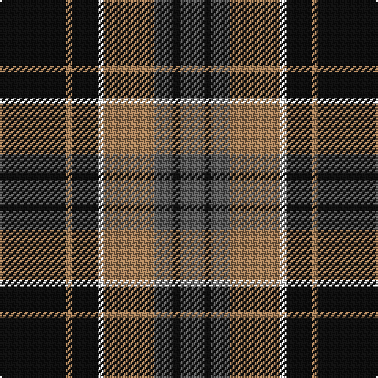

In pattern [BKBRWKRK](/stripes/bkbrwkrk/).

This was sourced from tartans-authority.  It is a [8 stripe tartan](/stripes/stripes8/).

Original link http://www.tartansauthority.com/tartan-ferret/display/3041/

## Attestations

This cloth appears in 2 source records; the oldest owns this page.

- 1978 — Ardmore (Fashion) (tartans-authority, [record](http://www.tartansauthority.com/tartan-ferret/display/3041/))
- undated — Ardmore (register-of-tartans, [record](https://www.tartanregister.gov.uk/tartanDetails.aspx?ref=5237))

## Register references

External register numbers recorded for this tartan.

- Scottish Register of Tartans: [5237](https://www.tartanregister.gov.uk/tartanDetails.aspx?ref=5237)
- Scottish Tartans Authority (ITI): 3041

## Thread count
K/42 LT4 K16 LN4 LT32 N12 K4 N/16

## Palette
Each colour and the base-6 reference it is a variant of.

| Colour | Shade | Base |
|---|---|---|
| K | <code style="background-color:#101010;">#101010</code> `oklch(17.3% 0.000 89.9)` <small>#101010</small> | K <code style="background-color:#000000;">#000000</code> |
| LN | <code style="background-color:#E0E0E0;">#E0E0E0</code> `oklch(90.7% 0.000 89.9)` <small>#E0E0E0</small> | W <code style="background-color:#F7F7F7;">#F7F7F7</code> |
| LT | <code style="background-color:#A07C58;">#A07C58</code> `oklch(61.2% 0.067 66.0)` <small>#A07C58</small> | R <code style="background-color:#CC0000;">#CC0000</code> |
| N | <code style="background-color:#5C5C5C;">#5C5C5C</code> `oklch(47.5% 0.000 89.9)` <small>#5C5C5C</small> | B <code style="background-color:#2A418A;">#2A418A</code> |

# Sample pattern

## Nearest tartans

The nearest existing variants by ΔTartan distance, with this tartan at the top so the swatches line up against it.

ΔTartan

Tartan

Sett

—

<a href="/ttd/edit/#slug=k21o2k8w2o16n6k2n8~x2">Ardmore (Fashion)</a> <a class="nn-out" href="/setts/s8/k21o2k8w2o16n6k2n8~x2/" title="open its dictionary page">↗</a>

0.73

<a href="/ttd/edit/#slug=dg28r4db25w5r22dg27r4db2~x2">New Glasgow (Canada)</a> <a class="nn-out" href="/setts/s8/dg28r4db25w5r22dg27r4db2~x2/" title="open its dictionary page">↗</a>

0.81

<a href="/ttd/edit/#slug=k3dy3lo6k12lo1o2dy2~x4">Strummer, Joe (Commemorative)</a> <a class="nn-out" href="/setts/s7/k3dy3lo6k12lo1o2dy2~x4/" title="open its dictionary page">↗</a>

0.99

<a href="/ttd/edit/#slug=lo32db10k52db10w5k24db16w10k11lo15">Cavan County Crest (Fashion)</a> <a class="nn-out" href="/setts/s10/lo32db10k52db10w5k24db16w10k11lo15/" title="open its dictionary page">↗</a>

1.00

<a href="/ttd/edit/#slug=k4lo17k2lo2g7k2lo2k22db4~x2">Bro-Leon</a> <a class="nn-out" href="/setts/s9/k4lo17k2lo2g7k2lo2k22db4~x2/" title="open its dictionary page">↗</a>

1.04

<a href="/ttd/edit/#slug=r8k18r6k18b27k2w3~x2">MacKean (Personal)</a> <a class="nn-out" href="/setts/s7/r8k18r6k18b27k2w3~x2/" title="open its dictionary page">↗</a>

1.04

<a href="/ttd/edit/#slug=db13dg8r5db3dg2r1ly1~x4">Fibonacci7</a> <a class="nn-out" href="/setts/s7/db13dg8r5db3dg2r1ly1~x4/" title="open its dictionary page">↗</a>

1.05

<a href="/ttd/edit/#slug=k1g12k12r1k1r1k12b12r1~x4">Guthrie (Name)</a> <a class="nn-out" href="/setts/s9/k1g12k12r1k1r1k12b12r1~x4/" title="open its dictionary page">↗</a>

1.07

<a href="/ttd/edit/#slug=t3o26g4t13k13t2~x2">MacTavish / Thom(p)son, hunting</a> <a class="nn-out" href="/setts/s6/t3o26g4t13k13t2~x2/" title="open its dictionary page">↗</a>

1.07

<a href="/ttd/edit/#slug=g3k15r8g2o8k2~x4">Thompson Black (Fashion)</a> <a class="nn-out" href="/setts/s6/g3k15r8g2o8k2~x4/" title="open its dictionary page">↗</a>

1.07

<a href="/ttd/edit/#slug=t4o28g6t12k12t3~x2">MacTavish / Thom(p)son, hunting</a> <a class="nn-out" href="/setts/s6/t4o28g6t12k12t3~x2/" title="open its dictionary page">↗</a>

## Neighbour map

Every grey dot is one of 14299 variants placed by the first two principal components of the ΔTartan feature space (44% of its variance). Red is this tartan; blue dots are its nearest — click one to open its page.

<svg viewBox="0 0 640 380" role="img" style="max-width:100%;height:auto;border:1px solid #e0e0e0;border-radius:4px;display:block" xmlns="http://www.w3.org/2000/svg"><image href="/nn/cloud.v1.png" width="640" height="380"/><a href="/setts/s8/dg28r4db25w5r22dg27r4db2~x2/"><circle cx="228.4" cy="185.5" r="4" fill="#3465a4"><title>New Glasgow (Canada)</title></circle></a><a href="/setts/s7/k3dy3lo6k12lo1o2dy2~x4/"><circle cx="264.7" cy="193.5" r="4" fill="#3465a4"><title>Strummer, Joe (Commemorative)</title></circle></a><a href="/setts/s10/lo32db10k52db10w5k24db16w10k11lo15/"><circle cx="197.9" cy="182.5" r="4" fill="#3465a4"><title>Cavan County Crest (Fashion)</title></circle></a><a href="/setts/s9/k4lo17k2lo2g7k2lo2k22db4~x2/"><circle cx="249.0" cy="168.6" r="4" fill="#3465a4"><title>Bro-Leon</title></circle></a><a href="/setts/s7/r8k18r6k18b27k2w3~x2/"><circle cx="230.3" cy="194.5" r="4" fill="#3465a4"><title>MacKean (Personal)</title></circle></a><a href="/setts/s7/db13dg8r5db3dg2r1ly1~x4/"><circle cx="283.8" cy="207.2" r="4" fill="#3465a4"><title>Fibonacci7</title></circle></a><a href="/setts/s9/k1g12k12r1k1r1k12b12r1~x4/"><circle cx="256.3" cy="186.7" r="4" fill="#3465a4"><title>Guthrie (Name)</title></circle></a><a href="/setts/s6/t3o26g4t13k13t2~x2/"><circle cx="215.2" cy="195.4" r="4" fill="#3465a4"><title>MacTavish / Thom(p)son, hunting</title></circle></a><a href="/setts/s6/g3k15r8g2o8k2~x4/"><circle cx="201.2" cy="223.0" r="4" fill="#3465a4"><title>Thompson Black (Fashion)</title></circle></a><a href="/setts/s6/t4o28g6t12k12t3~x2/"><circle cx="202.5" cy="212.7" r="4" fill="#3465a4"><title>MacTavish / Thom(p)son, hunting</title></circle></a><circle cx="239.6" cy="197.5" r="5" fill="#c00000"/></svg>

ID: /setts/s8/k21o2k8w2o16n6k2n8~x2/
