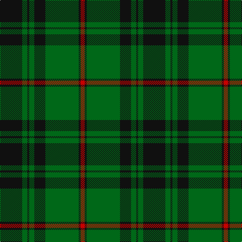

This page is one **sett** — a single exact thread-count. It belongs to the [tartan](/tartans/k22g5k2g5k11g33k2r4/)
(the same proportion at any scale), whose colour order is pattern [KGKGKGKR](/stripes/kgkgkgkr/).

Sourced from tartans-authority.  It is a [8 stripe tartan](/stripes/stripes8/).

Original link http://www.tartansauthority.com/tartan-ferret/display/8006/

## Thread count
K/44 G10 K4 G10 K22 G66 K4 R/8

## Palette
Each colour and the base-6 reference it is a variant of.

| Colour | Shade | Base |
|---|---|---|
| G | <code style="background-color:#006818;">#006818</code> `oklch(45.0% 0.142 145.0)` <small>#006818</small> | G <code style="background-color:#006100;">#006100</code> |
| K | <code style="background-color:#101010;">#101010</code> `oklch(17.3% 0.000 89.9)` <small>#101010</small> | K <code style="background-color:#000000;">#000000</code> |
| R | <code style="background-color:#C80000;">#C80000</code> `oklch(52.3% 0.215 29.2)` <small>#C80000</small> | R <code style="background-color:#CC0000;">#CC0000</code> |

# Sample pattern

## Nearest tartans

The nearest existing variants by ΔTartan distance, with this tartan at the top so the swatches line up against it.

ΔTartan

Tartan

Sett

—

<a href="/ttd/edit/#slug=k22g5k2g5k11g33k2r4~x2">MacArthur-Fox 1993 (Personal)</a> <a class="nn-out" href="/setts/s8/k22g5k2g5k11g33k2r4~x2/" title="open its dictionary page">↗</a>

0.51

<a href="/ttd/edit/#slug=g3k6r2k6g3k2g16k1~x4">Glenbarr</a> <a class="nn-out" href="/setts/s8/g3k6r2k6g3k2g16k1~x4/" title="open its dictionary page">↗</a>

1.01

<a href="/ttd/edit/#slug=g18k3g3k3g3k21g2k21g21k4~x2">Guildry of Stirling</a> <a class="nn-out" href="/setts/s10/g18k3g3k3g3k21g2k21g21k4~x2/" title="open its dictionary page">↗</a>

1.07

<a href="/ttd/edit/#slug=k6db1k6g4k10g20r2~x2">MacKinross</a> <a class="nn-out" href="/setts/s7/k6db1k6g4k10g20r2~x2/" title="open its dictionary page">↗</a>

1.15

<a href="/ttd/edit/#slug=g70k26g12k14db3k16~x2">Duchess of Fife #2</a> <a class="nn-out" href="/setts/s6/g70k26g12k14db3k16~x2/" title="open its dictionary page">↗</a>

1.19

<a href="/ttd/edit/#slug=dg46k18dg6k13r4k4w4~x2">Page</a> <a class="nn-out" href="/setts/s7/dg46k18dg6k13r4k4w4~x2/" title="open its dictionary page">↗</a>

1.24

<a href="/ttd/edit/#slug=g13k2g2k11ly1k2ly1k11g2b1g11~x4">Hopetoun</a> <a class="nn-out" href="/setts/s11/g13k2g2k11ly1k2ly1k11g2b1g11~x4/" title="open its dictionary page">↗</a>

1.24

<a href="/ttd/edit/#slug=r4g4k2g31k10ly3g5k11g6k3~x2">MacArthur-Fox Green</a> <a class="nn-out" href="/setts/s10/r4g4k2g31k10ly3g5k11g6k3~x2/" title="open its dictionary page">↗</a>

1.25

<a href="/ttd/edit/#slug=r3g30k12g6k16ly2~x2">MacArthur (Variant)</a> <a class="nn-out" href="/setts/s6/r3g30k12g6k16ly2~x2/" title="open its dictionary page">↗</a>

1.28

<a href="/ttd/edit/#slug=g2k3ly1k3g2db8g16k1~x4">Harley (Leslie), Robert</a> <a class="nn-out" href="/setts/s8/g2k3ly1k3g2db8g16k1~x4/" title="open its dictionary page">↗</a>

1.28

<a href="/ttd/edit/#slug=k60g64dg5g8dg5g64k60ly8k8ly8">Sin-Cos (Corporate)</a> <a class="nn-out" href="/setts/s10/k60g64dg5g8dg5g64k60ly8k8ly8/" title="open its dictionary page">↗</a>

## Neighbour map

Every grey dot is one of 14299 variants placed by the first two principal components of the ΔTartan feature space (44% of its variance). Red is this tartan; blue dots are its nearest — click one to open its page.

<svg viewBox="0 0 640 380" role="img" style="max-width:100%;height:auto;border:1px solid #e0e0e0;border-radius:4px;display:block" xmlns="http://www.w3.org/2000/svg"><image href="/nn/cloud.v1.png" width="640" height="380"/><a href="/setts/s8/g3k6r2k6g3k2g16k1~x4/"><circle cx="376.8" cy="215.1" r="4" fill="#3465a4"><title>Glenbarr</title></circle></a><a href="/setts/s10/g18k3g3k3g3k21g2k21g21k4~x2/"><circle cx="349.4" cy="231.6" r="4" fill="#3465a4"><title>Guildry of Stirling</title></circle></a><a href="/setts/s7/k6db1k6g4k10g20r2~x2/"><circle cx="333.1" cy="203.8" r="4" fill="#3465a4"><title>MacKinross</title></circle></a><a href="/setts/s6/g70k26g12k14db3k16~x2/"><circle cx="420.0" cy="221.6" r="4" fill="#3465a4"><title>Duchess of Fife #2</title></circle></a><a href="/setts/s7/dg46k18dg6k13r4k4w4~x2/"><circle cx="344.1" cy="209.7" r="4" fill="#3465a4"><title>Page</title></circle></a><a href="/setts/s11/g13k2g2k11ly1k2ly1k11g2b1g11~x4/"><circle cx="303.5" cy="188.7" r="4" fill="#3465a4"><title>Hopetoun</title></circle></a><a href="/setts/s10/r4g4k2g31k10ly3g5k11g6k3~x2/"><circle cx="349.8" cy="176.0" r="4" fill="#3465a4"><title>MacArthur-Fox Green</title></circle></a><a href="/setts/s6/r3g30k12g6k16ly2~x2/"><circle cx="319.5" cy="213.9" r="4" fill="#3465a4"><title>MacArthur (Variant)</title></circle></a><a href="/setts/s8/g2k3ly1k3g2db8g16k1~x4/"><circle cx="338.0" cy="188.9" r="4" fill="#3465a4"><title>Harley (Leslie), Robert</title></circle></a><a href="/setts/s10/k60g64dg5g8dg5g64k60ly8k8ly8/"><circle cx="282.4" cy="189.9" r="4" fill="#3465a4"><title>Sin-Cos (Corporate)</title></circle></a><circle cx="362.7" cy="208.5" r="5" fill="#c00000"/></svg>

ID: /setts/s8/k22g5k2g5k11g33k2r4~x2/
