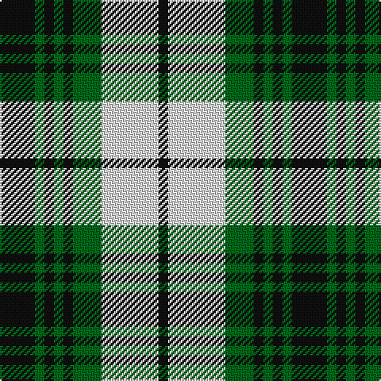

In pattern [KGKGKGWK](/patterns/kgkgkgwk/).

This was sourced from register-of-tartans.  It is a [8 stripes tartan](/stripes/stripes8/).

Original link https://www.tartanregister.gov.uk/tartanDetails.aspx?ref=2036

## Attestations

This cloth appears in 2 source records; the oldest owns this page.

- 01/12/2003 — Lamont Dress (register-of-tartans, [record](https://www.tartanregister.gov.uk/tartanDetails.aspx?ref=2036))
- Dec 2003 — Lamont Dress (Fashion) (tartans-authority, [record](http://www.tartansauthority.com/tartan-ferret/display/6391/))

## Thread count
K/22 G6 K6 G6 K6 G18 LN36 K/6

## Palette
Each colour and its ΔE from the base-6 reference it is a variant of.

| Colour | Shade | Base | ΔE (OKLab) |
|---|---|---|---|
| G | <code style="background-color:#006818;">#006818</code> `#006818` | G <code style="background-color:#006100;">#006100</code> | 0.02 |
| K | <code style="background-color:#101010;">#101010</code> `#101010` | K <code style="background-color:#000000;">#000000</code> | 0.17 |
| LN | <code style="background-color:#E0E0E0;">#E0E0E0</code> `#E0E0E0` | W <code style="background-color:#F7F7F7;">#F7F7F7</code> | 0.07 |

# Sample pattern

## Nearest tartans

The nearest existing variants by ΔTartan distance.

1. [Grey Watch Dress (Fashion)](/setts/s8/b24ba4b4ba4b4ba20w24ba6-b5c5c5c-ba1c1c1c-we0e0e0/) — ΔT 0.92
1. [Grey Watch](/setts/s12/g50k8g8k8g8w40k10w40k40g8k8g8-g808080-k000000-we0e0e0/) — ΔT 1.24
1. [MacKay, Dress (Corporate)](/setts/s6/k8g28k28g4w28b6-b1474b4-g006818-k101010-we0e0e0/) — ΔT 1.27
1. [Lawson, William 2002](/setts/s7/k8w38k22g30k6g32y6-g003c14-k101010-we0e0e0-ye8c000/) — ΔT 1.27
1. [Dalgliesh Dress](/setts/s11/g20k20w8k4y4k4w6k24w24k4w6-g006818-k101010-wc0c0c0-ye8c000/) — ΔT 1.32
1. [Cape Breton](/setts/s7/y10k10g34k12ga48k12y6-g008000-ga808080-k000000-yf0c000/) — ΔT 1.32
1. [Breton District Tartan Tartan Number: 3902. Earliest known date: 2001 Commissioned by Richard Duclos of Le Coudray-Montceaux, France and produced by House of Tartan. See products available Copyright © Blair Urquhart, Comrie, 2015](/setts/s9/g12b22w16k8w16k8w16k54w8-b2c2c80-g289c18-k101010-we0e0e0/) — ΔT 1.33
1. [Laksaa](/setts/s8/g42k4g4k4g4k30w34k6-g808080-k000000-we0e0e0/) — ΔT 1.35
1. [Poulter, Grey (Corporate)](/setts/s13/w50k8w8k8w8k46b46w8b46k46w46k8w8-b5c5c5c-k101010-we0e0e0/) — ΔT 1.35
1. [Cape Breton (yellow stripes)](/setts/s7/y12k12g60k16w36k12y6-g789484-k000000-wc0c0c0-ye8c000/) — ΔT 1.35

## Neighbour map

Every grey dot is one of 15726 variants placed by the first two principal components of the ΔTartan feature space (44% of its variance). Red is this tartan; blue dots are its nearest — click one to open its page.

<svg viewBox="0 0 640 380" role="img" style="max-width:100%;height:auto;border:1px solid #e0e0e0;border-radius:4px;display:block" xmlns="http://www.w3.org/2000/svg"><image href="/nn/cloud.v1.png" width="640" height="380"/><a href="/setts/s8/b24ba4b4ba4b4ba20w24ba6-b5c5c5c-ba1c1c1c-we0e0e0/"><circle cx="171.0" cy="218.4" r="4" fill="#3465a4"><title>Grey Watch Dress (Fashion)</title></circle></a><a href="/setts/s12/g50k8g8k8g8w40k10w40k40g8k8g8-g808080-k000000-we0e0e0/"><circle cx="136.9" cy="188.3" r="4" fill="#3465a4"><title>Grey Watch</title></circle></a><a href="/setts/s6/k8g28k28g4w28b6-b1474b4-g006818-k101010-we0e0e0/"><circle cx="117.9" cy="223.5" r="4" fill="#3465a4"><title>MacKay, Dress (Corporate)</title></circle></a><a href="/setts/s7/k8w38k22g30k6g32y6-g003c14-k101010-we0e0e0-ye8c000/"><circle cx="146.7" cy="225.4" r="4" fill="#3465a4"><title>Lawson, William 2002</title></circle></a><a href="/setts/s11/g20k20w8k4y4k4w6k24w24k4w6-g006818-k101010-wc0c0c0-ye8c000/"><circle cx="164.0" cy="196.2" r="4" fill="#3465a4"><title>Dalgliesh Dress</title></circle></a><a href="/setts/s7/y10k10g34k12ga48k12y6-g008000-ga808080-k000000-yf0c000/"><circle cx="130.0" cy="200.8" r="4" fill="#3465a4"><title>Cape Breton</title></circle></a><a href="/setts/s9/g12b22w16k8w16k8w16k54w8-b2c2c80-g289c18-k101010-we0e0e0/"><circle cx="156.5" cy="192.8" r="4" fill="#3465a4"><title>Breton District Tartan Tartan Number: 3902. Earliest known date: 2001 Commissioned by Richard Duclos of Le Coudray-Montceaux, France and produced by House of Tartan. See products available Copyright © Blair Urquhart, Comrie, 2015</title></circle></a><a href="/setts/s8/g42k4g4k4g4k30w34k6-g808080-k000000-we0e0e0/"><circle cx="192.5" cy="180.1" r="4" fill="#3465a4"><title>Laksaa</title></circle></a><a href="/setts/s13/w50k8w8k8w8k46b46w8b46k46w46k8w8-b5c5c5c-k101010-we0e0e0/"><circle cx="147.1" cy="194.3" r="4" fill="#3465a4"><title>Poulter, Grey (Corporate)</title></circle></a><a href="/setts/s7/y12k12g60k16w36k12y6-g789484-k000000-wc0c0c0-ye8c000/"><circle cx="145.5" cy="181.3" r="4" fill="#3465a4"><title>Cape Breton (yellow stripes)</title></circle></a><circle cx="154.7" cy="216.7" r="5" fill="#c00000"/></svg>

ID: /setts/s8/k22g6k6g6k6g18w36k6-g006818-k101010-we0e0e0/
