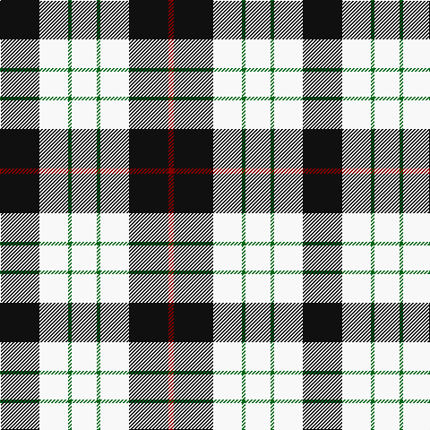

This page is one **sett** — a single exact thread-count. It belongs to the [tartan](/tartans/k22w16g2w14g2w16k22dr3/)
(the same proportion at any scale), whose colour order is pattern [KWGWGWKR](/stripes/kwgwgwkr/).

Sourced from register-of-tartans.  It is a [8 stripe tartan](/stripes/stripes8/).

Original link https://www.tartanregister.gov.uk/tartanDetails.aspx?ref=1959

## Register references

External register numbers recorded for this tartan.

- Scottish Register of Tartans: [1959](https://www.tartanregister.gov.uk/tartanDetails.aspx?ref=1959)
- Scottish Tartans Authority (ITI): 5346

## Thread count
K/44 W32 G4 W28 G4 W32 K44 DR/6

## Palette
Each colour and the base-6 reference it is a variant of.

| Colour | Shade | Base |
|---|---|---|
| DR | <code style="background-color:#880000;">#880000</code> `oklch(39.4% 0.162 29.2)` <small>#880000</small> | R <code style="background-color:#CC0000;">#CC0000</code> |
| G | <code style="background-color:#006818;">#006818</code> `oklch(45.0% 0.142 145.0)` <small>#006818</small> | G <code style="background-color:#006100;">#006100</code> |
| Ga | <code style="background-color:#289C18;">#289C18</code> `oklch(60.6% 0.191 141.6)` <small>#289C18</small> | G <code style="background-color:#006100;">#006100</code> |
| K | <code style="background-color:#101010;">#101010</code> `oklch(17.3% 0.000 89.9)` <small>#101010</small> | K <code style="background-color:#000000;">#000000</code> |
| N | <code style="background-color:#B8B8B8;">#B8B8B8</code> `oklch(78.3% 0.000 89.9)` <small>#B8B8B8</small> | Y <code style="background-color:#F2BF00;">#F2BF00</code> |
| W | <code style="background-color:#F8F8F8;">#F8F8F8</code> `oklch(97.9% 0.000 89.9)` <small>#F8F8F8</small> | W <code style="background-color:#F7F7F7;">#F7F7F7</code> |

# Sample pattern

## Nearest tartans

The nearest existing variants by ΔTartan distance, with this tartan at the top so the swatches line up against it.

ΔTartan

Tartan

Sett

—

<a href="/ttd/edit/#slug=k22w16g2w14g2w16k22r3~x2">Kierson</a> <a class="nn-out" href="/setts/s8/k22w16g2w14g2w16k22r3~x2/" title="open its dictionary page">↗</a>

0.63

<a href="/ttd/edit/#slug=k22w16ly2w14ly2w16k22db3~x2">Kennison</a> <a class="nn-out" href="/setts/s8/k22w16ly2w14ly2w16k22db3~x2/" title="open its dictionary page">↗</a>

0.92

<a href="/ttd/edit/#slug=k6m2k12y3k6lb16y3lb16k2~x2">MacMillan</a> <a class="nn-out" href="/setts/s9/k6m2k12y3k6lb16y3lb16k2~x2/" title="open its dictionary page">↗</a>

1.12

<a href="/ttd/edit/#slug=w2g4k7w2k1w11db2w2~x4">Forbes - 1880 (Clans Originaux)</a> <a class="nn-out" href="/setts/s8/w2g4k7w2k1w11db2w2~x4/" title="open its dictionary page">↗</a>

1.15

<a href="/setts/s12/w6m4w32k32w5k12ly4~x2/">MacPherson Dress Clan Tartan Tartan Number: 3246. Earliest known date: 1842 This version was recorded in the STS Sindex without the suffix, 'Dress', and with red in place of purple. Manufacturers have constistantly produced a MacPherson Dress with double purple stripes. See products available Copyright © Blair Urquhart, Comrie, 2015</a>

1.17

<a href="/ttd/edit/#slug=ly9k32g6w20ly3w9k5~x2">Black and White Golf</a> <a class="nn-out" href="/setts/s7/ly9k32g6w20ly3w9k5~x2/" title="open its dictionary page">↗</a>

1.19

<a href="/ttd/edit/#slug=w5r3w26k21w3k8ly3~x2">MacPherson Dress, Blue (Dance)</a> <a class="nn-out" href="/setts/s7/w5r3w26k21w3k8ly3~x2/" title="open its dictionary page">↗</a>

1.20

<a href="/ttd/edit/#slug=k23ly3k23w36r4~x2">Macleod, Winnifred Mary, Dress</a> <a class="nn-out" href="/setts/s5/k23ly3k23w36r4~x2/" title="open its dictionary page">↗</a>

1.21

<a href="/ttd/edit/#slug=w3p3w30k20w3k9ly3~x2">MacPherson Dress (1951)</a> <a class="nn-out" href="/setts/s7/w3p3w30k20w3k9ly3~x2/" title="open its dictionary page">↗</a>

1.33

<a href="/ttd/edit/#slug=r2w30k15lo2k15r2~x2">Brodie (WCWM)</a> <a class="nn-out" href="/setts/s6/r2w30k15lo2k15r2~x2/" title="open its dictionary page">↗</a>

1.35

<a href="/ttd/edit/#slug=r12ly3w14dt10ly2dt24r2~x2">Yusra (Malay) (Personal)</a> <a class="nn-out" href="/setts/s7/r12ly3w14dt10ly2dt24r2~x2/" title="open its dictionary page">↗</a>

## Neighbour map

Every grey dot is one of 14299 variants placed by the first two principal components of the ΔTartan feature space (44% of its variance). Red is this tartan; blue dots are its nearest — click one to open its page.

<svg viewBox="0 0 640 380" role="img" style="max-width:100%;height:auto;border:1px solid #e0e0e0;border-radius:4px;display:block" xmlns="http://www.w3.org/2000/svg"><image href="/nn/cloud.v1.png" width="640" height="380"/><a href="/setts/s8/k22w16ly2w14ly2w16k22db3~x2/"><circle cx="209.3" cy="185.8" r="4" fill="#3465a4"><title>Kennison</title></circle></a><a href="/setts/s9/k6m2k12y3k6lb16y3lb16k2~x2/"><circle cx="208.5" cy="186.8" r="4" fill="#3465a4"><title>MacMillan</title></circle></a><a href="/setts/s8/w2g4k7w2k1w11db2w2~x4/"><circle cx="225.0" cy="162.8" r="4" fill="#3465a4"><title>Forbes - 1880 (Clans Originaux)</title></circle></a><a href="/setts/s12/w6m4w32k32w5k12ly4~x2/"><circle cx="212.4" cy="162.0" r="4" fill="#3465a4"><title>MacPherson Dress Clan Tartan Tartan Number: 3246. Earliest known date: 1842 This version was recorded in the STS Sindex without the suffix, 'Dress', and with red in place of purple. Manufacturers have constistantly produced a MacPherson Dress with double purple stripes. See products available Copyright © Blair Urquhart, Comrie, 2015</title></circle></a><a href="/setts/s7/ly9k32g6w20ly3w9k5~x2/"><circle cx="177.9" cy="173.4" r="4" fill="#3465a4"><title>Black and White Golf</title></circle></a><a href="/setts/s7/w5r3w26k21w3k8ly3~x2/"><circle cx="228.5" cy="177.6" r="4" fill="#3465a4"><title>MacPherson Dress, Blue (Dance)</title></circle></a><a href="/setts/s5/k23ly3k23w36r4~x2/"><circle cx="247.9" cy="198.9" r="4" fill="#3465a4"><title>Macleod, Winnifred Mary, Dress</title></circle></a><a href="/setts/s7/w3p3w30k20w3k9ly3~x2/"><circle cx="247.6" cy="163.6" r="4" fill="#3465a4"><title>MacPherson Dress (1951)</title></circle></a><a href="/setts/s6/r2w30k15lo2k15r2~x2/"><circle cx="242.9" cy="159.2" r="4" fill="#3465a4"><title>Brodie (WCWM)</title></circle></a><a href="/setts/s7/r12ly3w14dt10ly2dt24r2~x2/"><circle cx="230.1" cy="180.5" r="4" fill="#3465a4"><title>Yusra (Malay) (Personal)</title></circle></a><circle cx="210.2" cy="182.7" r="5" fill="#c00000"/></svg>

ID: /setts/s8/k22w16g2w14g2w16k22r3~x2/
