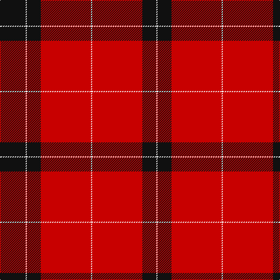

In pattern [KWKRWRKW](/stripes/kwkrwrkw/).

This was sourced from register-of-tartans.  It is a [8 stripe tartan](/stripes/stripes8/).

Original link https://www.tartanregister.gov.uk/tartanDetails.aspx?ref=2010

## Also known as

This cloth is also recorded under:

- Knights Templar Hunting

## Register references

External register numbers recorded for this tartan.

- Scottish Register of Tartans: [2010](https://www.tartanregister.gov.uk/tartanDetails.aspx?ref=2010)
- Scottish Tartans Authority (ITI): 6641
- Scottish Tartans World Register: 2935

## Thread count
K/44 W2 K24 R86 W2 R86 K24 W/2

## Palette
Each colour and its ΔE from the base-6 reference it is a variant of.

| Colour | Shade | Base | ΔE (OKLab) |
|---|---|---|---|
| K | <code style="background-color:#101010;">#101010</code> `#101010` | K <code style="background-color:#000000;">#000000</code> | 0.17 |
| R | <code style="background-color:#C80000;">#C80000</code> `#C80000` | R <code style="background-color:#CC0000;">#CC0000</code> | 0.01 |
| W | <code style="background-color:#F8F8F8;">#F8F8F8</code> `#F8F8F8` | W <code style="background-color:#F7F7F7;">#F7F7F7</code> | 0.00 |

# Sample pattern

## Nearest tartans

The nearest existing variants by ΔTartan distance.

1. [Oilmens (Corporate)](/setts/s8/ly4k1r30k15r24k2r4k1~x4/) — ΔT 1.15
1. [Maxwell Ancient](/setts/s7/r3dg16r4k6r28dg1r3~x2/) — ΔT 1.24
1. [Lovat or Fraser #2](/setts/s6/r80dp19r8dg36r10dp2~x2/) — ΔT 1.30
1. [Knights Templar Htg (Corporate)](/setts/s5/k22w1k12r43w1~x2/) — ΔT 1.36
1. [MacKintosh](/setts/s6/r24db6r3dg12r4db1/) — ΔT 1.47
1. [Stuart of Bute](/setts/s9/r12dg6k1dg2k1dg1k6r24lb2~x2/) — ΔT 1.51
1. [Greig (Personal)](/setts/s6/r60k2w3dg20r10dg20~x2/) — ΔT 1.51
1. [Stuart of Bute](/setts/s9/r12dg6k1dg2k1dg1k6r24lr2~x2/) — ΔT 1.54
1. [Forget Family (Red)](/setts/s6/r42k2w2k18w2k5~x2/) — ΔT 1.56
1. [Maxwell](/setts/s7/r3g16r4k6r28g1r3~x2/) — ΔT 1.56

## Neighbour map

Every grey dot is one of 14299 variants placed by the first two principal components of the ΔTartan feature space (44% of its variance). Red is this tartan; blue dots are its nearest — click one to open its page.

<svg viewBox="0 0 640 380" role="img" style="max-width:100%;height:auto;border:1px solid #e0e0e0;border-radius:4px;display:block" xmlns="http://www.w3.org/2000/svg"><image href="/nn/cloud.v1.png" width="640" height="380"/><a href="/setts/s8/ly4k1r30k15r24k2r4k1~x4/"><circle cx="493.6" cy="143.9" r="4" fill="#3465a4"><title>Oilmens (Corporate)</title></circle></a><a href="/setts/s7/r3dg16r4k6r28dg1r3~x2/"><circle cx="428.6" cy="156.0" r="4" fill="#3465a4"><title>Maxwell Ancient</title></circle></a><a href="/setts/s6/r80dp19r8dg36r10dp2~x2/"><circle cx="455.5" cy="152.3" r="4" fill="#3465a4"><title>Lovat or Fraser #2</title></circle></a><a href="/setts/s5/k22w1k12r43w1~x2/"><circle cx="410.0" cy="156.2" r="4" fill="#3465a4"><title>Knights Templar Htg (Corporate)</title></circle></a><a href="/setts/s6/r24db6r3dg12r4db1/"><circle cx="411.0" cy="178.6" r="4" fill="#3465a4"><title>MacKintosh</title></circle></a><a href="/setts/s9/r12dg6k1dg2k1dg1k6r24lb2~x2/"><circle cx="400.2" cy="118.2" r="4" fill="#3465a4"><title>Stuart of Bute</title></circle></a><a href="/setts/s6/r60k2w3dg20r10dg20~x2/"><circle cx="419.6" cy="150.9" r="4" fill="#3465a4"><title>Greig (Personal)</title></circle></a><a href="/setts/s9/r12dg6k1dg2k1dg1k6r24lr2~x2/"><circle cx="414.1" cy="129.7" r="4" fill="#3465a4"><title>Stuart of Bute</title></circle></a><a href="/setts/s6/r42k2w2k18w2k5~x2/"><circle cx="401.4" cy="150.9" r="4" fill="#3465a4"><title>Forget Family (Red)</title></circle></a><a href="/setts/s7/r3g16r4k6r28g1r3~x2/"><circle cx="436.9" cy="163.2" r="4" fill="#3465a4"><title>Maxwell</title></circle></a><circle cx="450.0" cy="136.4" r="5" fill="#c00000"/></svg>

ID: /setts/s8/k22w1k12r43w1~x2/
