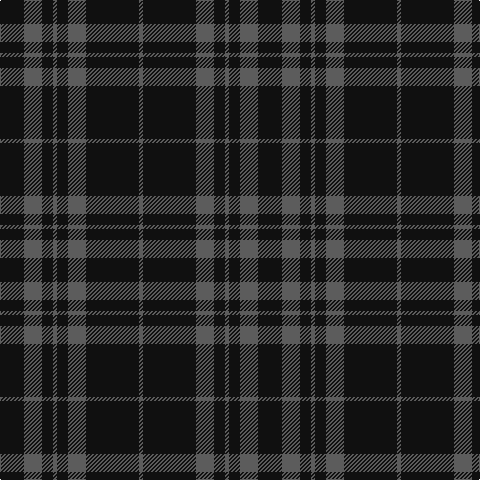

In pattern [BKBKBKBK](/patterns/bkbkbkbk/).

This was sourced from tartans-authority.  It is a [8 stripes tartan](/stripes/stripes8/).

Original link http://www.tartansauthority.com/tartan-ferret/display/8350/

## Attestations

This cloth appears in 2 source records; the oldest owns this page.

- 20th May 2010 — Spirit of Glyndwr Grey (Fashion) (tartans-authority, [record](http://www.tartansauthority.com/tartan-ferret/display/8350/))
- undated — Spirit of Glyndwr Grey Welsh Fashion Tartan Tartan Number: 8350. Earliest known date: 20th May 2010 A modern day plaid, designed and woven in Wales to commemorate Owain Glyn Dwr, crowned Welsh Prince 1406. Colours represent the slates and dark waters of Mid and North Wales, Glyndwrs homeland. Woven by the Cambrian Woollen Mill, Mid Wales exclusively for Wales Tartan Centres, Swansea. See products available Copyright © Blair Urquhart, Comrie, 2015 (house-of-tartan, [record](http://www.house-of-tartan.scotland.net/house/TartanViewjs.asp?colr=Def&tnam=8350))

## Thread count
K/24 N18 K11 N4 K11 N18 K53 N/4

## Palette
Each colour and its ΔE from the base-6 reference it is a variant of.

| Colour | Shade | Base | ΔE (OKLab) |
|---|---|---|---|
| K | <code style="background-color:#101010;">#101010</code> `#101010` | K <code style="background-color:#000000;">#000000</code> | 0.17 |
| N | <code style="background-color:#5C5C5C;">#5C5C5C</code> `#5C5C5C` | B <code style="background-color:#2A418A;">#2A418A</code> | 0.15 |

# Sample pattern

## Nearest tartans

The nearest existing variants by ΔTartan distance.

1. [Spirit of Glyndwr Gold (Fashion)](/setts/s8/k24b18k11b4k11b18k53r4-b5c5c5c-k101010-rc80000/) — ΔT 0.89
1. [Spirit of Glyndwr Gold Welsh Fashion Tartan Tartan Number: 8351. Earliest known date: 25th May 2010 Ysbryd yr aur Glyndwr, a modern day plaid, designed and woven in Wales to commemorate Owain Glyn Dwr, crowned Welsh Prince 1406. Colours represent the slates and dark waters of Mid and North Wales, Glyndwrs homeland, with the added Gold yarn representing the gold colour in his standard (flag). Woven by the Cambrian Woollen Mill, Mid Wales exclusively for Wales Tartan Centres, Swansea. See products available Copyright © Blair Urquhart, Comrie, 2015](/setts/s8/k24b18k11b4k11b18k53y4-b5c5c5c-k101010-ybc8c00/) — ΔT 0.95
1. [Freedom of Scotland](/setts/s6/k30b14k12b22k100b8-b5c5c5c-k101010/) — ΔT 1.24
1. [Grey Spirit](/setts/s10/b90k34b12k34b12k34b12k34b90k8-b5c5c5c-k101010/) — ΔT 1.29
1. [Grey Spirit (Fashion)](/setts/s6/b12k34b12k34b90k8-b5c5c5c-k101010/) — ΔT 1.35
1. [Nightstalker (Corporate)](/setts/s8/b8k8b16k8b8k64g8k8-b5c5c5c-g006818-k101010/) — ΔT 1.51
1. [Grey Spirit Fashion Tartan Tartan Number: 6594. Earliest known date: 01/03/2005 A fashion tartan from ACS Clothing of Glasgow for use in their kilt hire business. Woven by Lochcarron. The grey is actually a grey/black marl (mixture) which can't be shown graphically. See products available Copyright © Blair Urquhart, Comrie, 2015](/setts/s6/b12k32b12k32b90k8-b5f5f5f-k1e1a10/) — ΔT 1.52
1. [Grey Breton (District|)](/setts/s9/b14k19b14k6b14k6b14k47b6-b5c5c5c-k101010/) — ΔT 1.56
1. [Tyneside Scottish (Khaki)](/setts/s13/b44g4b4g4b4g32b32g4b32g32b32g4b4-b1c1c1c-g8c7038/) — ΔT 1.58
1. [Holden Black (Corporate)](/setts/s7/b26k6b6k6b6k70r6-b5c5c5c-k101010-rc80000/) — ΔT 1.67

## Neighbour map

Every grey dot is one of 15726 variants placed by the first two principal components of the ΔTartan feature space (44% of its variance). Red is this tartan; blue dots are its nearest — click one to open its page.

<svg viewBox="0 0 640 380" role="img" style="max-width:100%;height:auto;border:1px solid #e0e0e0;border-radius:4px;display:block" xmlns="http://www.w3.org/2000/svg"><image href="/nn/cloud.v1.png" width="640" height="380"/><a href="/setts/s8/k24b18k11b4k11b18k53r4-b5c5c5c-k101010-rc80000/"><circle cx="460.3" cy="235.1" r="4" fill="#3465a4"><title>Spirit of Glyndwr Gold (Fashion)</title></circle></a><a href="/setts/s8/k24b18k11b4k11b18k53y4-b5c5c5c-k101010-ybc8c00/"><circle cx="453.6" cy="232.9" r="4" fill="#3465a4"><title>Spirit of Glyndwr Gold Welsh Fashion Tartan Tartan Number: 8351. Earliest known date: 25th May 2010 Ysbryd yr aur Glyndwr, a modern day plaid, designed and woven in Wales to commemorate Owain Glyn Dwr, crowned Welsh Prince 1406. Colours represent the slates and dark waters of Mid and North Wales, Glyndwrs homeland, with the added Gold yarn representing the gold colour in his standard (flag). Woven by the Cambrian Woollen Mill, Mid Wales exclusively for Wales Tartan Centres, Swansea. See products available Copyright © Blair Urquhart, Comrie, 2015</title></circle></a><a href="/setts/s6/k30b14k12b22k100b8-b5c5c5c-k101010/"><circle cx="565.1" cy="260.9" r="4" fill="#3465a4"><title>Freedom of Scotland</title></circle></a><a href="/setts/s10/b90k34b12k34b12k34b12k34b90k8-b5c5c5c-k101010/"><circle cx="415.6" cy="243.0" r="4" fill="#3465a4"><title>Grey Spirit</title></circle></a><a href="/setts/s6/b12k34b12k34b90k8-b5c5c5c-k101010/"><circle cx="433.2" cy="257.4" r="4" fill="#3465a4"><title>Grey Spirit (Fashion)</title></circle></a><a href="/setts/s8/b8k8b16k8b8k64g8k8-b5c5c5c-g006818-k101010/"><circle cx="458.3" cy="233.0" r="4" fill="#3465a4"><title>Nightstalker (Corporate)</title></circle></a><a href="/setts/s6/b12k32b12k32b90k8-b5f5f5f-k1e1a10/"><circle cx="460.1" cy="263.4" r="4" fill="#3465a4"><title>Grey Spirit Fashion Tartan Tartan Number: 6594. Earliest known date: 01/03/2005 A fashion tartan from ACS Clothing of Glasgow for use in their kilt hire business. Woven by Lochcarron. The grey is actually a grey/black marl (mixture) which can't be shown graphically. See products available Copyright © Blair Urquhart, Comrie, 2015</title></circle></a><a href="/setts/s9/b14k19b14k6b14k6b14k47b6-b5c5c5c-k101010/"><circle cx="383.2" cy="264.9" r="4" fill="#3465a4"><title>Grey Breton (District|)</title></circle></a><a href="/setts/s13/b44g4b4g4b4g32b32g4b32g32b32g4b4-b1c1c1c-g8c7038/"><circle cx="428.6" cy="222.1" r="4" fill="#3465a4"><title>Tyneside Scottish (Khaki)</title></circle></a><a href="/setts/s7/b26k6b6k6b6k70r6-b5c5c5c-k101010-rc80000/"><circle cx="449.8" cy="211.2" r="4" fill="#3465a4"><title>Holden Black (Corporate)</title></circle></a><circle cx="488.8" cy="254.3" r="5" fill="#c00000"/></svg>

ID: /setts/s8/k24b18k11b4k11b18k53b4-b5c5c5c-k101010/
