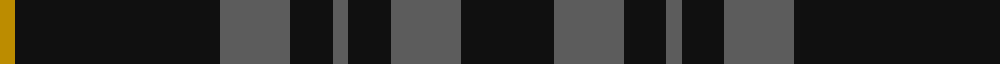
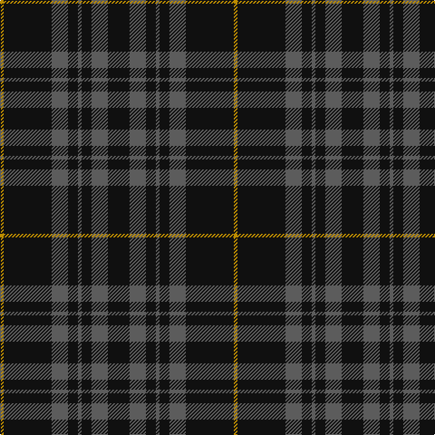

In pattern [KBKBKBKY](/patterns/kbkbkbky/).

This was sourced from house-of-tartan.  It is a [8 stripes tartan](/stripes/stripes8/).

Original link http://www.house-of-tartan.scotland.net/house/TartanViewjs.asp?colr=Def&tnam=8351

## Thread count
DY/4 K53 N18 K11 N4 K11 N18 K/24

## Palette
Each colour and its ΔE from the base-6 reference it is a variant of.

| Colour | Shade | Base | ΔE (OKLab) |
|---|---|---|---|
| DY | <code style="background-color:#BC8C00;">#BC8C00</code> `#BC8C00` | Y <code style="background-color:#F2BF00;">#F2BF00</code> | 0.16 |
| K | <code style="background-color:#101010;">#101010</code> `#101010` | K <code style="background-color:#000000;">#000000</code> | 0.17 |
| N | <code style="background-color:#5C5C5C;">#5C5C5C</code> `#5C5C5C` | B <code style="background-color:#2A418A;">#2A418A</code> | 0.15 |
| R | <code style="background-color:#C80000;">#C80000</code> `#C80000` | R <code style="background-color:#CC0000;">#CC0000</code> | 0.01 |

# Sample pattern

## Nearest tartans

The nearest existing variants by ΔTartan distance.

1. [Spirit of Glyndwr Gold (Fashion)](/setts/s8/k24b18k11b4k11b18k53r4~b5c5c5c-k101010-rc80000/) — ΔT 0.23
1. [Spirit of Glyndwr Grey (Fashion)](/setts/s8/k24b18k11b4k11b18k53b4~b5c5c5c-k101010/) — ΔT 0.95
1. [Nightstalker (Corporate)](/setts/s8/b1k1b2k1b1k8g1k1~b5c5c5c-g006818-k101010~x8/) — ΔT 1.29
1. [Holden Black (Corporate)](/setts/s7/b13k3b3k3b3k35r3~b5c5c5c-k101010-rc80000~x2/) — ΔT 1.32
1. [Grey Spirit](/setts/s10/b45k17b6k17b6k17b6k17b45k4~b5c5c5c-k101010~x2/) — ΔT 1.47
1. [Grey Spirit (Fashion)](/setts/s6/b6k17b6k17b45k4~b5c5c5c-k101010~x2/) — ΔT 1.53
1. [Tyneside Scottish (Khaki)](/setts/s13/b11g1b1g1b1g8b8g1b8g8b8g1b1~b1c1c1c-g8c7038~x4/) — ΔT 1.61
1. [Sunderland of Scotland (Fashion)](/setts/s7/r1k21r5k3r5k9ra1~k101010-r888888-rac80000~x4/) — ΔT 1.63
1. [Melange](/setts/s9/k80b4k44b50k36b4g12k12g45~b5c5c5c-g8c7038-k101010/) — ΔT 1.65
1. [Gunn (Logan)](/setts/s6/g2k12g1k12g12r2~g005020-k101010-rdc0000~x2/) — ΔT 1.67

## Neighbour map

Every grey dot is one of 15726 variants placed by the first two principal components of the ΔTartan feature space (44% of its variance). Red is this tartan; blue dots are its nearest — click one to open its page.

<svg viewBox="0 0 640 380" role="img" style="max-width:100%;height:auto;border:1px solid #e0e0e0;border-radius:4px;display:block" xmlns="http://www.w3.org/2000/svg"><image href="/nn/cloud.v1.png" width="640" height="380"/><a href="/setts/s8/k24b18k11b4k11b18k53r4~b5c5c5c-k101010-rc80000/"><circle cx="459.6" cy="238.6" r="4" fill="#3465a4"><title>Spirit of Glyndwr Gold (Fashion)</title></circle></a><a href="/setts/s8/k24b18k11b4k11b18k53b4~b5c5c5c-k101010/"><circle cx="487.7" cy="258.2" r="4" fill="#3465a4"><title>Spirit of Glyndwr Grey (Fashion)</title></circle></a><a href="/setts/s8/b1k1b2k1b1k8g1k1~b5c5c5c-g006818-k101010~x8/"><circle cx="457.9" cy="236.1" r="4" fill="#3465a4"><title>Nightstalker (Corporate)</title></circle></a><a href="/setts/s7/b13k3b3k3b3k35r3~b5c5c5c-k101010-rc80000~x2/"><circle cx="449.7" cy="214.7" r="4" fill="#3465a4"><title>Holden Black (Corporate)</title></circle></a><a href="/setts/s10/b45k17b6k17b6k17b6k17b45k4~b5c5c5c-k101010~x2/"><circle cx="414.8" cy="245.8" r="4" fill="#3465a4"><title>Grey Spirit</title></circle></a><a href="/setts/s6/b6k17b6k17b45k4~b5c5c5c-k101010~x2/"><circle cx="432.0" cy="260.7" r="4" fill="#3465a4"><title>Grey Spirit (Fashion)</title></circle></a><a href="/setts/s13/b11g1b1g1b1g8b8g1b8g8b8g1b1~b1c1c1c-g8c7038~x4/"><circle cx="427.5" cy="225.8" r="4" fill="#3465a4"><title>Tyneside Scottish (Khaki)</title></circle></a><a href="/setts/s7/r1k21r5k3r5k9ra1~k101010-r888888-rac80000~x4/"><circle cx="478.3" cy="198.9" r="4" fill="#3465a4"><title>Sunderland of Scotland (Fashion)</title></circle></a><a href="/setts/s9/k80b4k44b50k36b4g12k12g45~b5c5c5c-g8c7038-k101010/"><circle cx="370.2" cy="209.1" r="4" fill="#3465a4"><title>Melange</title></circle></a><a href="/setts/s6/g2k12g1k12g12r2~g005020-k101010-rdc0000~x2/"><circle cx="401.4" cy="265.0" r="4" fill="#3465a4"><title>Gunn (Logan)</title></circle></a><circle cx="452.7" cy="236.6" r="5" fill="#c00000"/></svg>

ID: /setts/s8/k24b18k11b4k11b18k53y4~b5c5c5c-k101010-ybc8c00/
