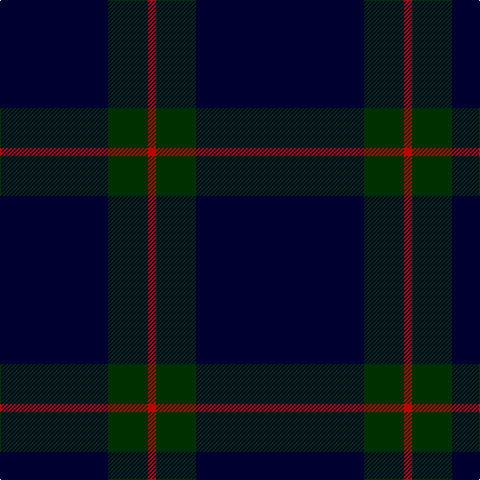

This page is one **sett** — a single exact thread-count. It belongs to the [tartan](/tartans/k24k3k3k3k3k18dg20r4/)
(the same proportion at any scale), whose colour order is pattern [KKKKKKGR](/stripes/kkkkkkgr/).

Sourced from weddslist.  It is a [8 stripe tartan](/stripes/stripes8/).

Original link http://www.weddslist.com/cgi-bin/tartans/pg.pl?source=sts

## Thread count
DB/48 DB6 DB6 DB6 DB6 DB36 DG40 R/8

## Palette

Palette: <strong>custom</strong>
<table><thead><tr><th>Colour</th><th>Threads</th><th>Shade</th><th>Base</th><th>OKLCh</th></tr></thead><tbody><tr><td>DB/</td><td style="text-align:right;font-variant-numeric:tabular-nums">48</td><td><code style="background-color:#000030;">#000030</code> <small style="color:#888">#000030</small></td><td>K <code style="background-color:#000000;">#000000</code></td><td><small style="color:#888">oklch(14.0% 0.097 264.1)</small></td></tr><tr><td>DB</td><td style="text-align:right;font-variant-numeric:tabular-nums">6</td><td><code style="background-color:#000030;">#000030</code> <small style="color:#888">#000030</small></td><td>K <code style="background-color:#000000;">#000000</code></td><td><small style="color:#888">oklch(14.0% 0.097 264.1)</small></td></tr><tr><td>DB</td><td style="text-align:right;font-variant-numeric:tabular-nums">6</td><td><code style="background-color:#000030;">#000030</code> <small style="color:#888">#000030</small></td><td>K <code style="background-color:#000000;">#000000</code></td><td><small style="color:#888">oklch(14.0% 0.097 264.1)</small></td></tr><tr><td>DB</td><td style="text-align:right;font-variant-numeric:tabular-nums">6</td><td><code style="background-color:#000030;">#000030</code> <small style="color:#888">#000030</small></td><td>K <code style="background-color:#000000;">#000000</code></td><td><small style="color:#888">oklch(14.0% 0.097 264.1)</small></td></tr><tr><td>DB</td><td style="text-align:right;font-variant-numeric:tabular-nums">6</td><td><code style="background-color:#000030;">#000030</code> <small style="color:#888">#000030</small></td><td>K <code style="background-color:#000000;">#000000</code></td><td><small style="color:#888">oklch(14.0% 0.097 264.1)</small></td></tr><tr><td>DB</td><td style="text-align:right;font-variant-numeric:tabular-nums">36</td><td><code style="background-color:#000030;">#000030</code> <small style="color:#888">#000030</small></td><td>K <code style="background-color:#000000;">#000000</code></td><td><small style="color:#888">oklch(14.0% 0.097 264.1)</small></td></tr><tr><td>DG</td><td style="text-align:right;font-variant-numeric:tabular-nums">40</td><td><code style="background-color:#003000;">#003000</code> <small style="color:#888">#003000</small></td><td>G <code style="background-color:#006100;">#006100</code></td><td><small style="color:#888">oklch(26.8% 0.091 142.5)</small></td></tr><tr><td>R/</td><td style="text-align:right;font-variant-numeric:tabular-nums">8</td><td><code style="background-color:#C00000;">#C00000</code> <small style="color:#888">#C00000</small></td><td>R <code style="background-color:#CC0000;">#CC0000</code></td><td><small style="color:#888">oklch(50.7% 0.208 29.2)</small></td></tr></tbody></table>

# Sample pattern

## Nearest tartans

The nearest existing variants by ΔTartan distance, with this tartan at the top so the swatches line up against it.

ΔTartan

Tartan

Sett

—

<a href="/ttd/edit/#slug=k24k3k3k3k3k18dg20r4~x2">The Caledonian Hotel</a> <a class="nn-out" href="/setts/s8/k24k3k3k3k3k18dg20r4~x2/" title="open its dictionary page">↗</a>

1.61

<a href="/ttd/edit/#slug=k1g1k8n1k1n2k1n1~x8">Nightstalker (Corporate)</a> <a class="nn-out" href="/setts/s8/k1g1k8n1k1n2k1n1~x8/" title="open its dictionary page">↗</a>

1.75

<a href="/ttd/edit/#slug=k24n18k11n4k11n18k53r4">Spirit of Glyndwr Gold (Fashion)</a> <a class="nn-out" href="/setts/s8/k24n18k11n4k11n18k53r4/" title="open its dictionary page">↗</a>

1.77

<a href="/ttd/edit/#slug=k6db10k10b1k1b1k10b6~x4">Oban</a> <a class="nn-out" href="/setts/s8/k6db10k10b1k1b1k10b6~x4/" title="open its dictionary page">↗</a>

1.79

<a href="/ttd/edit/#slug=db20dp2db3dp2db14g18db4~x2">Pringle, James (Fashion)</a> <a class="nn-out" href="/setts/s7/db20dp2db3dp2db14g18db4~x2/" title="open its dictionary page">↗</a>

1.80

<a href="/ttd/edit/#slug=db1k3db1k3db8r1~x4">Morgan (MacKay Blue) Clan Tartan Tartan Number: 264. Earliest known date: 1842 The design comes from the Vestiarium Scoticum (1842). The authors, the Sobieski Stuart brothers, enjoyed a popular following among the Scottish gentry in the early Victorian era, and in the spirit of the times, added mystery, romance and some spurious historical documentation to the subject of tartan. Of the better known tartans, the book offers some minor variation, but in other cases it provides the only recorded version of many tartans in use today. See products available Copyright © Blair Urquhart, Comrie, 2015</a> <a class="nn-out" href="/setts/s6/db1k3db1k3db8r1~x4/" title="open its dictionary page">↗</a>

1.82

<a href="/ttd/edit/#slug=k12db1k2dbi1k1dbi4dg1k1~x4">Scottish Funereal Association</a> <a class="nn-out" href="/setts/s8/k12db1k2dbi1k1dbi4dg1k1~x4/" title="open its dictionary page">↗</a>

1.83

<a href="/ttd/edit/#slug=k24n18k11n4k11n18k53n4">Spirit of Glyndwr Grey (Fashion)</a> <a class="nn-out" href="/setts/s8/k24n18k11n4k11n18k53n4/" title="open its dictionary page">↗</a>

1.85

<a href="/ttd/edit/#slug=k24n18k11n4k11n18k53lo4">Spirit of Glyndwr Gold Welsh Fashion Tartan Tartan Number: 8351. Earliest known date: 25th May 2010 Ysbryd yr aur Glyndwr, a modern day plaid, designed and woven in Wales to commemorate Owain Glyn Dwr, crowned Welsh Prince 1406. Colours represent the slates and dark waters of Mid and North Wales, Glyndwrs homeland, with the added Gold yarn representing the gold colour in his standard (flag). Woven by the Cambrian Woollen Mill, Mid Wales exclusively for Wales Tartan Centres, Swansea. See products available Copyright © Blair Urquhart, Comrie, 2015</a> <a class="nn-out" href="/setts/s8/k24n18k11n4k11n18k53lo4/" title="open its dictionary page">↗</a>

1.85

<a href="/ttd/edit/#slug=k25lo5k5dg25k25db3k10~x2">London Community Gospel Choir, The</a> <a class="nn-out" href="/setts/s7/k25lo5k5dg25k25db3k10~x2/" title="open its dictionary page">↗</a>

1.89

<a href="/ttd/edit/#slug=db6dg3db24k2db4k16db5dg2db23dg2k2ly2~x2">Moon (New Maldon, Surrey)</a> <a class="nn-out" href="/setts/s12/db6dg3db24k2db4k16db5dg2db23dg2k2ly2~x2/" title="open its dictionary page">↗</a>

## Neighbour map

Every grey dot is one of 14359 variants placed by the first two principal components of the ΔTartan feature space (44% of its variance). Red is this tartan; blue dots are its nearest — click one to open its page.

<svg viewBox="0 0 640 380" role="img" style="max-width:100%;height:auto;border:1px solid #e0e0e0;border-radius:4px;display:block" xmlns="http://www.w3.org/2000/svg"><image href="/nn/cloud.v1.png" width="640" height="380"/><a href="/setts/s8/k1g1k8n1k1n2k1n1~x8/"><circle cx="459.4" cy="238.5" r="4" fill="#3465a4"><title>Nightstalker (Corporate)</title></circle></a><a href="/setts/s8/k24n18k11n4k11n18k53r4/"><circle cx="460.6" cy="240.0" r="4" fill="#3465a4"><title>Spirit of Glyndwr Gold (Fashion)</title></circle></a><a href="/setts/s8/k6db10k10b1k1b1k10b6~x4/"><circle cx="367.6" cy="264.8" r="4" fill="#3465a4"><title>Oban</title></circle></a><a href="/setts/s7/db20dp2db3dp2db14g18db4~x2/"><circle cx="434.7" cy="264.7" r="4" fill="#3465a4"><title>Pringle, James (Fashion)</title></circle></a><a href="/setts/s6/db1k3db1k3db8r1~x4/"><circle cx="404.2" cy="272.9" r="4" fill="#3465a4"><title>Morgan (MacKay Blue) Clan Tartan Tartan Number: 264. Earliest known date: 1842 The design comes from the Vestiarium Scoticum (1842). The authors, the Sobieski Stuart brothers, enjoyed a popular following among the Scottish gentry in the early Victorian era, and in the spirit of the times, added mystery, romance and some spurious historical documentation to the subject of tartan. Of the better known tartans, the book offers some minor variation, but in other cases it provides the only recorded version of many tartans in use today. See products available Copyright © Blair Urquhart, Comrie, 2015</title></circle></a><a href="/setts/s8/k12db1k2dbi1k1dbi4dg1k1~x4/"><circle cx="494.6" cy="229.3" r="4" fill="#3465a4"><title>Scottish Funereal Association</title></circle></a><a href="/setts/s8/k24n18k11n4k11n18k53n4/"><circle cx="488.8" cy="259.6" r="4" fill="#3465a4"><title>Spirit of Glyndwr Grey (Fashion)</title></circle></a><a href="/setts/s8/k24n18k11n4k11n18k53lo4/"><circle cx="453.9" cy="237.4" r="4" fill="#3465a4"><title>Spirit of Glyndwr Gold Welsh Fashion Tartan Tartan Number: 8351. Earliest known date: 25th May 2010 Ysbryd yr aur Glyndwr, a modern day plaid, designed and woven in Wales to commemorate Owain Glyn Dwr, crowned Welsh Prince 1406. Colours represent the slates and dark waters of Mid and North Wales, Glyndwrs homeland, with the added Gold yarn representing the gold colour in his standard (flag). Woven by the Cambrian Woollen Mill, Mid Wales exclusively for Wales Tartan Centres, Swansea. See products available Copyright © Blair Urquhart, Comrie, 2015</title></circle></a><a href="/setts/s7/k25lo5k5dg25k25db3k10~x2/"><circle cx="408.4" cy="274.2" r="4" fill="#3465a4"><title>London Community Gospel Choir, The</title></circle></a><a href="/setts/s12/db6dg3db24k2db4k16db5dg2db23dg2k2ly2~x2/"><circle cx="449.3" cy="215.4" r="4" fill="#3465a4"><title>Moon (New Maldon, Surrey)</title></circle></a><circle cx="464.3" cy="275.0" r="5" fill="#c00000"/></svg>

ID: /setts/s8/k24k3k3k3k3k18dg20r4~x2/
