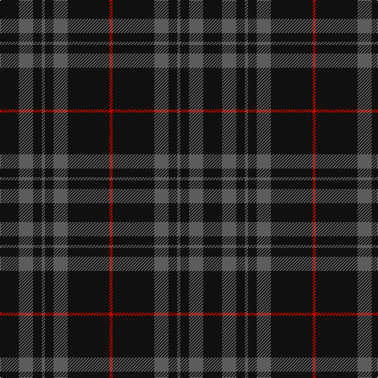

This page is one **sett** — a single exact thread-count. It belongs to the [tartan](/tartans/k24n18k11n4k11n18k53r4/)
(the same proportion at any scale), whose colour order is pattern [KBKBKBKR](/stripes/kbkbkbkr/).

Sourced from tartans-authority.  It is a [8 stripe tartan](/stripes/stripes8/).

Original link http://www.tartansauthority.com/tartan-ferret/display/8351/

## Also known as

This cloth is also recorded under:

- Spirit of Glyndwr Red

3 attestations — the source records this cloth was collapsed from (oldest owns this page)

<ul>
<li>25th May 2010 — Spirit of Glyndwr Gold (Fashion) (tartans-authority, <a href="http://www.tartansauthority.com/tartan-ferret/display/8351/">record</a>)</li>
<li>20th May 2010 — Spirit of Glyndwr Red (Fashion) (tartans-authority, <a href="http://www.tartansauthority.com/tartan-ferret/display/8352/">record</a>)</li>
<li>undated — Spirit of Glyndwr Red Welsh Fashion Tartan Tartan Number: 8352. Earliest known date: 20th May 2010 Ysbryd yr coch Glyndwr, a modern day plaid, designed and woven in Wales to commemorate Owain Glyn Dwr, crowned Welsh Prince 1406. Colours represent the slates and dark waters of Mid and North Wales, Glyndwrs homeland, with the added Scarlet Red yarn representing the predominant colour in his standard (flag). Woven by the Cambrian Woollen Mill, Mid Wales exclusively for Wales Tartan Centres, Swansea. See products available Copyright © Blair Urquhart, Comrie, 2015 (house-of-tartan, <a href="http://www.house-of-tartan.scotland.net/house/TartanViewjs.asp?colr=Def&tnam=8352">record</a>)</li>
</ul>

## Thread count
K/24 N18 K11 N4 K11 N18 K53 R/4

## Palette

Palette: <strong>Tartan Register</strong> <small style="color:#888">(2 of 3 colours)</small>
<table><thead><tr><th>Colour</th><th>Threads</th><th>Shade</th><th>Base</th><th>OKLCh</th></tr></thead><tbody><tr><td>K/</td><td style="text-align:right;font-variant-numeric:tabular-nums">24</td><td><code style="background-color:#101010;">#101010</code> <small style="color:#888">#101010</small></td><td>K <code style="background-color:#000000;">#000000</code></td><td><small style="color:#888">oklch(17.3% 0.000 89.9)</small></td></tr><tr><td>N</td><td style="text-align:right;font-variant-numeric:tabular-nums">18</td><td><code style="background-color:#5C5C5C;">#5C5C5C</code> <small style="color:#888">#5C5C5C</small></td><td>B <code style="background-color:#2A418A;">#2A418A</code></td><td><small style="color:#888">oklch(47.5% 0.000 89.9)</small></td></tr><tr><td>K</td><td style="text-align:right;font-variant-numeric:tabular-nums">11</td><td><code style="background-color:#101010;">#101010</code> <small style="color:#888">#101010</small></td><td>K <code style="background-color:#000000;">#000000</code></td><td><small style="color:#888">oklch(17.3% 0.000 89.9)</small></td></tr><tr><td>N</td><td style="text-align:right;font-variant-numeric:tabular-nums">4</td><td><code style="background-color:#5C5C5C;">#5C5C5C</code> <small style="color:#888">#5C5C5C</small></td><td>B <code style="background-color:#2A418A;">#2A418A</code></td><td><small style="color:#888">oklch(47.5% 0.000 89.9)</small></td></tr><tr><td>K</td><td style="text-align:right;font-variant-numeric:tabular-nums">11</td><td><code style="background-color:#101010;">#101010</code> <small style="color:#888">#101010</small></td><td>K <code style="background-color:#000000;">#000000</code></td><td><small style="color:#888">oklch(17.3% 0.000 89.9)</small></td></tr><tr><td>N</td><td style="text-align:right;font-variant-numeric:tabular-nums">18</td><td><code style="background-color:#5C5C5C;">#5C5C5C</code> <small style="color:#888">#5C5C5C</small></td><td>B <code style="background-color:#2A418A;">#2A418A</code></td><td><small style="color:#888">oklch(47.5% 0.000 89.9)</small></td></tr><tr><td>K</td><td style="text-align:right;font-variant-numeric:tabular-nums">53</td><td><code style="background-color:#101010;">#101010</code> <small style="color:#888">#101010</small></td><td>K <code style="background-color:#000000;">#000000</code></td><td><small style="color:#888">oklch(17.3% 0.000 89.9)</small></td></tr><tr><td>R/</td><td style="text-align:right;font-variant-numeric:tabular-nums">4</td><td><code style="background-color:#C80000;">#C80000</code> <small style="color:#888">#C80000</small></td><td>R <code style="background-color:#CC0000;">#CC0000</code></td><td><small style="color:#888">oklch(52.3% 0.215 29.2)</small></td></tr></tbody></table>

# Sample pattern

## Nearest tartans

The nearest existing variants by ΔTartan distance, with this tartan at the top so the swatches line up against it.

ΔTartan

Tartan

Sett

—

<a href="/ttd/edit/#slug=k24n18k11n4k11n18k53r4">Spirit of Glyndwr Gold (Fashion)</a> <a class="nn-out" href="/setts/s8/k24n18k11n4k11n18k53r4/" title="open its dictionary page">↗</a>

0.23

<a href="/ttd/edit/#slug=k24n18k11n4k11n18k53lo4">Spirit of Glyndwr Gold Welsh Fashion Tartan Tartan Number: 8351. Earliest known date: 25th May 2010 Ysbryd yr aur Glyndwr, a modern day plaid, designed and woven in Wales to commemorate Owain Glyn Dwr, crowned Welsh Prince 1406. Colours represent the slates and dark waters of Mid and North Wales, Glyndwrs homeland, with the added Gold yarn representing the gold colour in his standard (flag). Woven by the Cambrian Woollen Mill, Mid Wales exclusively for Wales Tartan Centres, Swansea. See products available Copyright © Blair Urquhart, Comrie, 2015</a> <a class="nn-out" href="/setts/s8/k24n18k11n4k11n18k53lo4/" title="open its dictionary page">↗</a>

0.89

<a href="/ttd/edit/#slug=k24n18k11n4k11n18k53n4">Spirit of Glyndwr Grey (Fashion)</a> <a class="nn-out" href="/setts/s8/k24n18k11n4k11n18k53n4/" title="open its dictionary page">↗</a>

1.26

<a href="/ttd/edit/#slug=k1g1k8n1k1n2k1n1~x8">Nightstalker (Corporate)</a> <a class="nn-out" href="/setts/s8/k1g1k8n1k1n2k1n1~x8/" title="open its dictionary page">↗</a>

1.33

<a href="/ttd/edit/#slug=n13k3n3k3n3k35r3~x2">Holden Black (Corporate)</a> <a class="nn-out" href="/setts/s7/n13k3n3k3n3k35r3~x2/" title="open its dictionary page">↗</a>

1.48

<a href="/ttd/edit/#slug=n45k17n6k17n6k17n6k17n45k4~x2">Grey Spirit</a> <a class="nn-out" href="/setts/s10/n45k17n6k17n6k17n6k17n45k4~x2/" title="open its dictionary page">↗</a>

1.54

<a href="/ttd/edit/#slug=n6k17n6k17n45k4~x2">Grey Spirit (Fashion)</a> <a class="nn-out" href="/setts/s6/n6k17n6k17n45k4~x2/" title="open its dictionary page">↗</a>

1.56

<a href="/ttd/edit/#slug=k22n17k2n4k2n2k37n4k2r3~x2">Witches' Blood, The</a> <a class="nn-out" href="/setts/s10/k22n17k2n4k2n2k37n4k2r3~x2/" title="open its dictionary page">↗</a>

1.63

<a href="/ttd/edit/#slug=k15n7k6n11k50n4~x2">Freedom of Scotland</a> <a class="nn-out" href="/setts/s6/k15n7k6n11k50n4~x2/" title="open its dictionary page">↗</a>

1.64

<a href="/ttd/edit/#slug=dg2k12dg1k12dg12r2~x2">Gunn (Logan)</a> <a class="nn-out" href="/setts/s6/dg2k12dg1k12dg12r2~x2/" title="open its dictionary page">↗</a>

1.68

<a href="/ttd/edit/#slug=dt11y1dt1y1dt1y8dt8y1dt8y8dt8y1dt1~x4">Tyneside Scottish (Khaki)</a> <a class="nn-out" href="/setts/s13/dt11y1dt1y1dt1y8dt8y1dt8y8dt8y1dt1~x4/" title="open its dictionary page">↗</a>

## Neighbour map

Every grey dot is one of 14299 variants placed by the first two principal components of the ΔTartan feature space (44% of its variance). Red is this tartan; blue dots are its nearest — click one to open its page.

<svg viewBox="0 0 640 380" role="img" style="max-width:100%;height:auto;border:1px solid #e0e0e0;border-radius:4px;display:block" xmlns="http://www.w3.org/2000/svg"><image href="/nn/cloud.v1.png" width="640" height="380"/><a href="/setts/s8/k24n18k11n4k11n18k53lo4/"><circle cx="454.4" cy="236.6" r="4" fill="#3465a4"><title>Spirit of Glyndwr Gold Welsh Fashion Tartan Tartan Number: 8351. Earliest known date: 25th May 2010 Ysbryd yr aur Glyndwr, a modern day plaid, designed and woven in Wales to commemorate Owain Glyn Dwr, crowned Welsh Prince 1406. Colours represent the slates and dark waters of Mid and North Wales, Glyndwrs homeland, with the added Gold yarn representing the gold colour in his standard (flag). Woven by the Cambrian Woollen Mill, Mid Wales exclusively for Wales Tartan Centres, Swansea. See products available Copyright © Blair Urquhart, Comrie, 2015</title></circle></a><a href="/setts/s8/k24n18k11n4k11n18k53n4/"><circle cx="489.3" cy="258.8" r="4" fill="#3465a4"><title>Spirit of Glyndwr Grey (Fashion)</title></circle></a><a href="/setts/s8/k1g1k8n1k1n2k1n1~x8/"><circle cx="459.8" cy="237.8" r="4" fill="#3465a4"><title>Nightstalker (Corporate)</title></circle></a><a href="/setts/s7/n13k3n3k3n3k35r3~x2/"><circle cx="451.5" cy="215.0" r="4" fill="#3465a4"><title>Holden Black (Corporate)</title></circle></a><a href="/setts/s10/n45k17n6k17n6k17n6k17n45k4~x2/"><circle cx="416.5" cy="246.7" r="4" fill="#3465a4"><title>Grey Spirit</title></circle></a><a href="/setts/s6/n6k17n6k17n45k4~x2/"><circle cx="433.7" cy="260.9" r="4" fill="#3465a4"><title>Grey Spirit (Fashion)</title></circle></a><a href="/setts/s10/k22n17k2n4k2n2k37n4k2r3~x2/"><circle cx="514.7" cy="206.5" r="4" fill="#3465a4"><title>Witches' Blood, The</title></circle></a><a href="/setts/s6/k15n7k6n11k50n4~x2/"><circle cx="565.0" cy="265.8" r="4" fill="#3465a4"><title>Freedom of Scotland</title></circle></a><a href="/setts/s6/dg2k12dg1k12dg12r2~x2/"><circle cx="403.3" cy="269.0" r="4" fill="#3465a4"><title>Gunn (Logan)</title></circle></a><a href="/setts/s13/dt11y1dt1y1dt1y8dt8y1dt8y8dt8y1dt1~x4/"><circle cx="429.0" cy="224.3" r="4" fill="#3465a4"><title>Tyneside Scottish (Khaki)</title></circle></a><circle cx="461.1" cy="239.3" r="5" fill="#c00000"/></svg>

ID: /setts/s8/k24n18k11n4k11n18k53r4/
