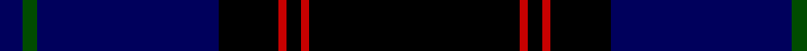

In pattern [BGBKRKRK](/patterns/bgbkrkrk/).

This was sourced from weddslist.  It is a [8 stripes tartan](/stripes/stripes8/).

Original link http://www.weddslist.com/cgi-bin/tartans/pg.pl?source=rb

## Thread count
DB/3 G2 DB24 K8 R1 K2 R1 K/28

## Palette
Each colour and its ΔE from the base-6 reference it is a variant of.

| Colour | Shade | Base | ΔE (OKLab) |
|---|---|---|---|
| DB | <code style="background-color:#00005C;">#00005C</code> `#00005C` | B <code style="background-color:#2A418A;">#2A418A</code> | 0.19 |
| G | <code style="background-color:#004C00;">#004C00</code> `#004C00` | G <code style="background-color:#006100;">#006100</code> | 0.07 |
| K | <code style="background-color:#000000;">#000000</code> `#000000` | K <code style="background-color:#000000;">#000000</code> | 0.00 |
| R | <code style="background-color:#C80000;">#C80000</code> `#C80000` | R <code style="background-color:#CC0000;">#CC0000</code> | 0.01 |

# Sample pattern

## Nearest tartans

The nearest existing variants by ΔTartan distance.

1. [Home](/setts/s8/k56r2k4r2k16b48g4b6-b000052-g11450d-k000000-raa0000/) — ΔT 0.50
1. [Home](/setts/s8/k28r1k2r1k8b24g2b3-b000052-g11450d-k000000-raa0000/) — ΔT 0.50
1. [Home, or Hume](/setts/s8/k56r2k4r2k16b48g4b6-b304080-g008000-k000000-rc00000/) — ΔT 1.54
1. [Home or Hume (Vestiarium Scoticum)](/setts/s8/k56r2k4r2k16b48g4b6-b2c4084-g005020-k101010-rdc0000/) — ΔT 1.59
1. [Home or Hume Clan Tartan Tartan Number: 127. Earliest known date: 1842 D.W.Stewart says, "The tartan of the ancient and notable family of Home, though differing in colour, has the same scheme as the Grey Douglas. Both first appear in the Vestiarium Scoticum." Border 'Clans' are mentioned in an Act of the Scottish Parliament in 1587, but no evidence of a Clan tartan exists before the earliest date given here. See products available Copyright © Blair Urquhart, Comrie, 2015](/setts/s8/k56r2k4r2k16b48g4b6-b2c2c80-g006818-k101010-rc80000/) — ΔT 1.67
1. [MacNeill](/setts/s9/b10r6b42k10b10k80ka4k4w2-b304080-k101010-ka000000-rc00000-we0e0e0/) — ΔT 1.78
1. [Lyndon Prep (School)](/setts/s6/b16w4b72k72y4k16-b1c0070-k101010-w98c8e8-ye8c000/) — ΔT 1.83
1. [Peter of Lee](/setts/s8/r8g6k4g76b60k6b6k6-b000050-g003000-k000000-rc00000/) — ΔT 1.85
1. [MacKay V](/setts/s6/b4k12b4k12b32r2-b000064-k000000-rc80000/) — ΔT 1.85
1. [MacKay VS](/setts/s6/b4k12b4k12b32r2-b000052-k000000-raa0000/) — ΔT 1.89

## Neighbour map

Every grey dot is one of 15726 variants placed by the first two principal components of the ΔTartan feature space (44% of its variance). Red is this tartan; blue dots are its nearest — click one to open its page.

<svg viewBox="0 0 640 380" role="img" style="max-width:100%;height:auto;border:1px solid #e0e0e0;border-radius:4px;display:block" xmlns="http://www.w3.org/2000/svg"><image href="/nn/cloud.v1.png" width="640" height="380"/><a href="/setts/s8/k56r2k4r2k16b48g4b6-b000052-g11450d-k000000-raa0000/"><circle cx="420.0" cy="179.3" r="4" fill="#3465a4"><title>Home</title></circle></a><a href="/setts/s8/k28r1k2r1k8b24g2b3-b000052-g11450d-k000000-raa0000/"><circle cx="420.0" cy="179.3" r="4" fill="#3465a4"><title>Home</title></circle></a><a href="/setts/s8/k56r2k4r2k16b48g4b6-b304080-g008000-k000000-rc00000/"><circle cx="364.1" cy="149.9" r="4" fill="#3465a4"><title>Home, or Hume</title></circle></a><a href="/setts/s8/k56r2k4r2k16b48g4b6-b2c4084-g005020-k101010-rdc0000/"><circle cx="420.2" cy="171.0" r="4" fill="#3465a4"><title>Home or Hume (Vestiarium Scoticum)</title></circle></a><a href="/setts/s8/k56r2k4r2k16b48g4b6-b2c2c80-g006818-k101010-rc80000/"><circle cx="431.4" cy="176.1" r="4" fill="#3465a4"><title>Home or Hume Clan Tartan Tartan Number: 127. Earliest known date: 1842 D.W.Stewart says, &quot;The tartan of the ancient and notable family of Home, though differing in colour, has the same scheme as the Grey Douglas. Both first appear in the Vestiarium Scoticum.&quot; Border 'Clans' are mentioned in an Act of the Scottish Parliament in 1587, but no evidence of a Clan tartan exists before the earliest date given here. See products available Copyright © Blair Urquhart, Comrie, 2015</title></circle></a><a href="/setts/s9/b10r6b42k10b10k80ka4k4w2-b304080-k101010-ka000000-rc00000-we0e0e0/"><circle cx="406.1" cy="124.7" r="4" fill="#3465a4"><title>MacNeill</title></circle></a><a href="/setts/s6/b16w4b72k72y4k16-b1c0070-k101010-w98c8e8-ye8c000/"><circle cx="364.1" cy="212.8" r="4" fill="#3465a4"><title>Lyndon Prep (School)</title></circle></a><a href="/setts/s8/r8g6k4g76b60k6b6k6-b000050-g003000-k000000-rc00000/"><circle cx="353.2" cy="183.2" r="4" fill="#3465a4"><title>Peter of Lee</title></circle></a><a href="/setts/s6/b4k12b4k12b32r2-b000064-k000000-rc80000/"><circle cx="424.3" cy="238.5" r="4" fill="#3465a4"><title>MacKay V</title></circle></a><a href="/setts/s6/b4k12b4k12b32r2-b000052-k000000-raa0000/"><circle cx="446.7" cy="248.8" r="4" fill="#3465a4"><title>MacKay VS</title></circle></a><circle cx="405.5" cy="172.7" r="5" fill="#c00000"/></svg>

ID: /setts/s8/k28r1k2r1k8b24g2b3-b00005c-g004c00-k000000-rc80000/
