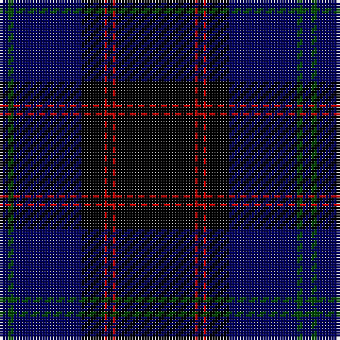

**Bands:** [BGBKRKRK](/stripes/bgbkrkrk/) · **Stripes:** [DB DG DB K R K R K](/stripes/stripes8/) DB DG DB K R K R K

This was sourced from weddslist.  It is a [8 band tartan](/bands/bands8/).

Original link http://www.weddslist.com/cgi-bin/tartans/pg.pl?source=rb

## Attestations

This cloth appears in 2 source records; the oldest owns this page.

- undated — Home (weddslist, [record](http://www.weddslist.com/cgi-bin/tartans/pg.pl?source=rb))
- undated — Home (weddslist, [record](http://www.weddslist.com/cgi-bin/tartans/pg.pl?source=x))

## Register references

External register numbers recorded for this tartan.

- Scottish Register of Tartans: [2540](https://www.tartanregister.gov.uk/tartanDetails.aspx?ref=2540)
- Scottish Register of Tartans: [2625](https://www.tartanregister.gov.uk/tartanDetails.aspx?ref=2625)
- Scottish Register of Tartans: [2666](https://www.tartanregister.gov.uk/tartanDetails.aspx?ref=2666)
- Scottish Register of Tartans: [3555](https://www.tartanregister.gov.uk/tartanDetails.aspx?ref=3555)
- Scottish Register of Tartans: [3808](https://www.tartanregister.gov.uk/tartanDetails.aspx?ref=3808)
- Scottish Tartans Authority (ITI): 1429
- Scottish Tartans Authority (ITI): 218
- Scottish Tartans World Register: 1010
- Scottish Tartans World Register: 1429
- Scottish Tartans World Register: 1585
- Scottish Tartans World Register: 218
- Scottish Tartans World Register: 864

## Variants

Other setts woven to the same stripe pattern.

- [Home or Hume (Vestiarium Scoticum)](/setts/s8/k28r1k2r1k8db24dg2db3~x2/)

## Thread count
DB/3 G2 DB24 K8 R1 K2 R1 K/28

## Palette
Each colour and its ΔE from the base-6 reference it is a variant of.

| Colour | Shade | Base | ΔE (OKLab) |
|---|---|---|---|
| DB | <code style="background-color:#00005C;">#00005C</code> `#00005C` | B <code style="background-color:#2A418A;">#2A418A</code> | 0.19 |
| G | <code style="background-color:#004C00;">#004C00</code> `#004C00` | G <code style="background-color:#006100;">#006100</code> | 0.07 |
| K | <code style="background-color:#000000;">#000000</code> `#000000` | K <code style="background-color:#000000;">#000000</code> | 0.00 |
| R | <code style="background-color:#C80000;">#C80000</code> `#C80000` | R <code style="background-color:#CC0000;">#CC0000</code> | 0.01 |

# Sample pattern

## Nearest tartans

The nearest existing variants by ΔTartan distance.

1. [Home, or Hume](/setts/s8/k28r1k2r1k8db24g2db3~x2/) — ΔT 1.57
1. [Home or Hume (Vestiarium Scoticum)](/setts/s8/k28r1k2r1k8db24dg2db3~x2/) — ΔT 1.60
1. [MacNeill](/setts/s9/db5r3db21k5db5k40k2k2w1~x2/) — ΔT 1.79
1. [Lyndon Prep (School)](/setts/s6/db4lb1db18k18ly1k4~x4/) — ΔT 1.84
1. [MacKay V](/setts/s6/db2k6db2k6db16r1~x2/) — ΔT 1.85
1. [Peter of Lee](/setts/s8/r4dg3k2dg38db30k3db3k3~x2/) — ΔT 1.86
1. [Trotter (Personal)](/setts/s9/dt23k2dt2k2dt2k28r2k4n2~x2/) — ΔT 1.92
1. [Oliphant](/setts/s6/db4k4db24dg32lr1dg2~x2/) — ΔT 1.92
1. [Strachan](/setts/s9/r2k3k40k3ly2k3dg20k3r2~x2/) — ΔT 1.93
1. [Paxton (Personal)](/setts/s11/k48dp5k9g3k2g3k2g14dp7k2dp10~x2/) — ΔT 1.94

## Neighbour map

Every grey dot is one of 14313 variants placed by the first two principal components of the ΔTartan feature space (44% of its variance). Red is this tartan; blue dots are its nearest — click one to open its page.

<svg viewBox="0 0 640 380" role="img" style="max-width:100%;height:auto;border:1px solid #e0e0e0;border-radius:4px;display:block" xmlns="http://www.w3.org/2000/svg"><image href="/nn/cloud.v1.png" width="640" height="380"/><a href="/setts/s8/k28r1k2r1k8db24g2db3~x2/"><circle cx="368.4" cy="152.7" r="4" fill="#3465a4"><title>Home, or Hume</title></circle></a><a href="/setts/s8/k28r1k2r1k8db24dg2db3~x2/"><circle cx="424.5" cy="177.9" r="4" fill="#3465a4"><title>Home or Hume (Vestiarium Scoticum)</title></circle></a><a href="/setts/s9/db5r3db21k5db5k40k2k2w1~x2/"><circle cx="411.3" cy="130.8" r="4" fill="#3465a4"><title>MacNeill</title></circle></a><a href="/setts/s6/db4lb1db18k18ly1k4~x4/"><circle cx="368.1" cy="219.4" r="4" fill="#3465a4"><title>Lyndon Prep (School)</title></circle></a><a href="/setts/s6/db2k6db2k6db16r1~x2/"><circle cx="427.4" cy="244.7" r="4" fill="#3465a4"><title>MacKay V</title></circle></a><a href="/setts/s8/r4dg3k2dg38db30k3db3k3~x2/"><circle cx="358.4" cy="190.9" r="4" fill="#3465a4"><title>Peter of Lee</title></circle></a><a href="/setts/s9/dt23k2dt2k2dt2k28r2k4n2~x2/"><circle cx="404.6" cy="198.9" r="4" fill="#3465a4"><title>Trotter (Personal)</title></circle></a><a href="/setts/s6/db4k4db24dg32lr1dg2~x2/"><circle cx="389.7" cy="191.0" r="4" fill="#3465a4"><title>Oliphant</title></circle></a><a href="/setts/s9/r2k3k40k3ly2k3dg20k3r2~x2/"><circle cx="316.2" cy="141.1" r="4" fill="#3465a4"><title>Strachan</title></circle></a><a href="/setts/s11/k48dp5k9g3k2g3k2g14dp7k2dp10~x2/"><circle cx="394.6" cy="147.2" r="4" fill="#3465a4"><title>Paxton (Personal)</title></circle></a><circle cx="410.4" cy="179.3" r="5" fill="#c00000"/></svg>

ID: /setts/s8/k28r1k2r1k8db24dg2db3/
