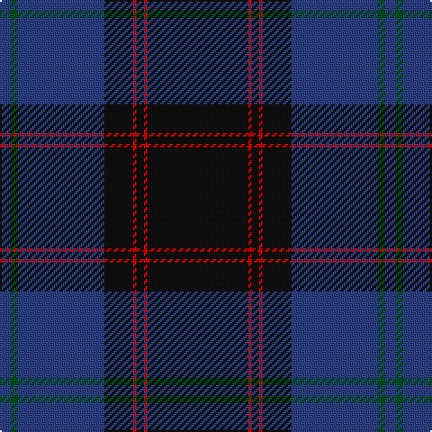

**Bands:** [BGBKRKRK](/stripes/bgbkrkrk/) · **Stripes:** [DB DG DB K R K R K](/stripes/stripes8/) DB DG DB K R K R K

This was sourced from register-of-tartans.  It is a [8 band tartan](/bands/bands8/).

Original link https://www.tartanregister.gov.uk/tartanDetails.aspx?ref=1758

## Attestations

This cloth appears in 2 source records; the oldest owns this page.

- 01/01/1842 — Home or Hume (Vestiarium Scoticum) (register-of-tartans, [record](https://www.tartanregister.gov.uk/tartanDetails.aspx?ref=1758))
- undated — Home (weddslist, [record](http://www.weddslist.com/cgi-bin/tartans/pg.pl?source=tinsel))

## Register references

External register numbers recorded for this tartan.

- Scottish Register of Tartans: [1166](https://www.tartanregister.gov.uk/tartanDetails.aspx?ref=1166)
- Scottish Register of Tartans: [1510](https://www.tartanregister.gov.uk/tartanDetails.aspx?ref=1510)
- Scottish Register of Tartans: [1758](https://www.tartanregister.gov.uk/tartanDetails.aspx?ref=1758)
- Scottish Register of Tartans: [2307](https://www.tartanregister.gov.uk/tartanDetails.aspx?ref=2307)
- Scottish Register of Tartans: [2349](https://www.tartanregister.gov.uk/tartanDetails.aspx?ref=2349)
- Scottish Register of Tartans: [2540](https://www.tartanregister.gov.uk/tartanDetails.aspx?ref=2540)
- Scottish Register of Tartans: [2582](https://www.tartanregister.gov.uk/tartanDetails.aspx?ref=2582)
- Scottish Register of Tartans: [2585](https://www.tartanregister.gov.uk/tartanDetails.aspx?ref=2585)
- Scottish Register of Tartans: [2625](https://www.tartanregister.gov.uk/tartanDetails.aspx?ref=2625)
- Scottish Register of Tartans: [2730](https://www.tartanregister.gov.uk/tartanDetails.aspx?ref=2730)
- Scottish Register of Tartans: [2862](https://www.tartanregister.gov.uk/tartanDetails.aspx?ref=2862)
- Scottish Register of Tartans: [3072](https://www.tartanregister.gov.uk/tartanDetails.aspx?ref=3072)
- Scottish Register of Tartans: [3555](https://www.tartanregister.gov.uk/tartanDetails.aspx?ref=3555)
- Scottish Register of Tartans: [4925](https://www.tartanregister.gov.uk/tartanDetails.aspx?ref=4925)
- Scottish Register of Tartans: [696](https://www.tartanregister.gov.uk/tartanDetails.aspx?ref=696)
- Scottish Register of Tartans: [697](https://www.tartanregister.gov.uk/tartanDetails.aspx?ref=697)
- Scottish Register of Tartans: [982](https://www.tartanregister.gov.uk/tartanDetails.aspx?ref=982)
- Scottish Tartans Authority (ITI): 1277
- Scottish Tartans Authority (ITI): 1429
- Scottish Tartans Authority (ITI): 218
- Scottish Tartans Authority (ITI): 977
- Scottish Tartans World Register: 1042
- Scottish Tartans World Register: 127
- Scottish Tartans World Register: 1277
- Scottish Tartans World Register: 1399
- Scottish Tartans World Register: 1429
- Scottish Tartans World Register: 1593
- Scottish Tartans World Register: 218
- Scottish Tartans World Register: 2218
- Scottish Tartans World Register: 3061
- Scottish Tartans World Register: 441
- Scottish Tartans World Register: 737
- Scottish Tartans World Register: 858
- Scottish Tartans World Register: 864
- Scottish Tartans World Register: 873
- Scottish Tartans World Register: 897
- Scottish Tartans World Register: 977
- Scottish Tartans World Register: 978

## Variants

Other setts woven to the same stripe pattern.

- [Home](/setts/s8/k28r1k2r1k8db24dg2db3/)

## Thread count
B/6 G4 B48 K16 R2 K4 R2 K/56

## Palette
Each colour and its ΔE from the base-6 reference it is a variant of.

| Colour | Shade | Base | ΔE (OKLab) |
|---|---|---|---|
| B | <code style="background-color:#2C4084;">#2C4084</code> `#2C4084` | B <code style="background-color:#2A418A;">#2A418A</code> | 0.01 |
| G | <code style="background-color:#005020;">#005020</code> `#005020` | G <code style="background-color:#006100;">#006100</code> | 0.07 |
| K | <code style="background-color:#101010;">#101010</code> `#101010` | K <code style="background-color:#000000;">#000000</code> | 0.17 |
| R | <code style="background-color:#DC0000;">#DC0000</code> `#DC0000` | R <code style="background-color:#CC0000;">#CC0000</code> | 0.03 |

# Sample pattern

## Nearest tartans

The nearest existing variants by ΔTartan distance.

1. [MacNeill](/setts/s9/db5r3db21k5db5k40k2k2w1~x2/) — ΔT 1.19
1. [Hope-Weir/Weir](/setts/s8/k8ly1k1db28k12dg2k1t2~x2/) — ΔT 1.19
1. [Patriot, The (Fashion)](/setts/s7/k10db4k34dt2k2dt30w3~x2/) — ΔT 1.23
1. [Trotter (Personal)](/setts/s9/dt23k2dt2k2dt2k28r2k4n2~x2/) — ΔT 1.26
1. [Potts (Personal)](/setts/s6/ly1y3db3do28db36y1~x2/) — ΔT 1.26
1. [Edinburgh, The University of](/setts/s7/k8m26k22dt110w4k5w4/) — ΔT 1.32
1. [MacArthur Fox Green (Personal)](/setts/s10/r4dt4k2dt31k10ly3dt5k11dt6k3~x2/) — ΔT 1.33
1. [Pride of Scotland, Dark (Fashion)](/setts/s11/do8k2o2do2k13do2k2ly1do14k26ly2~x2/) — ΔT 1.34
1. [Connecticut State Police Pipe Band](/setts/s6/k42n2k2n17db8lo4~x2/) — ΔT 1.35
1. [Koot Wedding (Personal)](/setts/s6/dt48k32r1k8r3w3~x2/) — ΔT 1.35

## Neighbour map

Every grey dot is one of 14313 variants placed by the first two principal components of the ΔTartan feature space (44% of its variance). Red is this tartan; blue dots are its nearest — click one to open its page.

<svg viewBox="0 0 640 380" role="img" style="max-width:100%;height:auto;border:1px solid #e0e0e0;border-radius:4px;display:block" xmlns="http://www.w3.org/2000/svg"><image href="/nn/cloud.v1.png" width="640" height="380"/><a href="/setts/s9/db5r3db21k5db5k40k2k2w1~x2/"><circle cx="411.3" cy="130.8" r="4" fill="#3465a4"><title>MacNeill</title></circle></a><a href="/setts/s8/k8ly1k1db28k12dg2k1t2~x2/"><circle cx="370.8" cy="149.7" r="4" fill="#3465a4"><title>Hope-Weir/Weir</title></circle></a><a href="/setts/s7/k10db4k34dt2k2dt30w3~x2/"><circle cx="388.6" cy="210.9" r="4" fill="#3465a4"><title>Patriot, The (Fashion)</title></circle></a><a href="/setts/s9/dt23k2dt2k2dt2k28r2k4n2~x2/"><circle cx="404.6" cy="198.9" r="4" fill="#3465a4"><title>Trotter (Personal)</title></circle></a><a href="/setts/s6/ly1y3db3do28db36y1~x2/"><circle cx="453.2" cy="186.7" r="4" fill="#3465a4"><title>Potts (Personal)</title></circle></a><a href="/setts/s7/k8m26k22dt110w4k5w4/"><circle cx="427.6" cy="159.8" r="4" fill="#3465a4"><title>Edinburgh, The University of</title></circle></a><a href="/setts/s10/r4dt4k2dt31k10ly3dt5k11dt6k3~x2/"><circle cx="375.9" cy="190.0" r="4" fill="#3465a4"><title>MacArthur Fox Green (Personal)</title></circle></a><a href="/setts/s11/do8k2o2do2k13do2k2ly1do14k26ly2~x2/"><circle cx="429.7" cy="175.7" r="4" fill="#3465a4"><title>Pride of Scotland, Dark (Fashion)</title></circle></a><a href="/setts/s6/k42n2k2n17db8lo4~x2/"><circle cx="388.3" cy="187.2" r="4" fill="#3465a4"><title>Connecticut State Police Pipe Band</title></circle></a><a href="/setts/s6/dt48k32r1k8r3w3~x2/"><circle cx="404.6" cy="166.3" r="4" fill="#3465a4"><title>Koot Wedding (Personal)</title></circle></a><circle cx="424.5" cy="177.9" r="5" fill="#c00000"/></svg>

ID: /setts/s8/k28r1k2r1k8db24dg2db3~x2/
