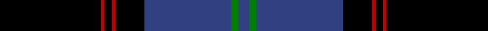
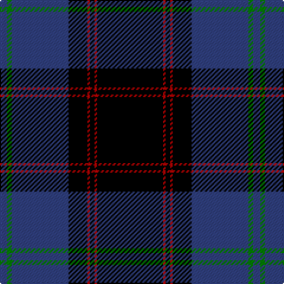

In pattern [BGBKRKRK](/stripes/bgbkrkrk/).

This was sourced from weddslist.  It is a [8 stripe tartan](/stripes/stripes8/).

Original link http://www.weddslist.com/cgi-bin/tartans/pg.pl?source=sts

## Also known as

This cloth is also recorded under:

- Home or Hume
- Home, or Hume

## Attestations

This cloth appears in 2 source records; the oldest owns this page.

- undated — Home, or Hume (weddslist, [record](http://www.weddslist.com/cgi-bin/tartans/pg.pl?source=sts))
- undated — Home or Hume Clan Tartan Tartan Number: 127. Earliest known date: 1842 D.W.Stewart says, "The tartan of the ancient and notable family of Home, though differing in colour, has the same scheme as the Grey Douglas. Both first appear in the Vestiarium Scoticum." Border 'Clans' are mentioned in an Act of the Scottish Parliament in 1587, but no evidence of a Clan tartan exists before the earliest date given here. See products available Copyright © Blair Urquhart, Comrie, 2015 (house-of-tartan, [record](http://www.house-of-tartan.scotland.net/house/TartanViewjs.asp?colr=Def&tnam=127))

## Thread count
K/56 R2 K4 R2 K16 B48 G4 B/6

## Palette
Each colour and the base-6 reference it is a variant of.

| Colour | Shade | Base |
|---|---|---|
| B | <code style="background-color:#304080;">#304080</code> `oklch(39.4% 0.109 270.2)` <small>#304080</small> | B <code style="background-color:#2A418A;">#2A418A</code> |
| G | <code style="background-color:#008000;">#008000</code> `oklch(52.0% 0.177 142.5)` <small>#008000</small> | G <code style="background-color:#006100;">#006100</code> |
| K | <code style="background-color:#000000;">#000000</code> `oklch(0.0% 0.000 0.0)` <small>#000000</small> | K <code style="background-color:#000000;">#000000</code> |
| R | <code style="background-color:#C00000;">#C00000</code> `oklch(50.7% 0.208 29.2)` <small>#C00000</small> | R <code style="background-color:#CC0000;">#CC0000</code> |

# Sample pattern

## Nearest tartans

The nearest existing variants by ΔTartan distance.

1. [Hope-Weir / Weir](/setts/s8/k8ly1k1db28k12g2k1t2~x2/) — ΔT 1.22
1. [Ramsay](/setts/s6/k4w2k28db30k1db3~x2/) — ΔT 1.28
1. [Angus](/setts/s9/k3r1k32db28r1db2r1db2r3~x2/) — ΔT 1.29
1. [Scotland's Own](/setts/s12/db4w1db30k15p4db2k2db2k10db4p2db2~x2/) — ΔT 1.32
1. [Genet, Edmond Charles 'Citizen' (Personal)](/setts/s7/r4k9dg9k40r2k2w2~x2/) — ΔT 1.33
1. [Dunlop](/setts/s8/k3r1k30w1db28r1db1w3~x2/) — ΔT 1.49
1. [Pride of Nova Scotia (Corporate)](/setts/s7/k3lo2k36dt16k5dt2w3~x2/) — ΔT 1.49
1. [Stewart of Bute Hunting Clan/Family Tartan Tartan Number: 5175. Earliest known date: 01/01/2002 No details known. See products available Copyright © Blair Urquhart, Comrie, 2015](/setts/s10/k22g11k2g4k2g6k16k40k2lb6~x2/) — ΔT 1.56
1. [Niagara Region](/setts/s12/w4k2w2k28dt4k2dt2r1k13r1dg13r2~x2/) — ΔT 1.58
1. [Arbroath Smokie Corporate Tartan Tartan Number: 6596. Earliest known date: 01/01/2005 Designed by Heather Yellowly of the Strathmore Woollen Co, of Forfar for Campbell Scott of Arbroath Fisheries. The tartan celebrates the European protective geographical status being awarded to the Arbroath Smokie - one of only a few food products to have been awarded this status. Colours: red represents the sandstone of Arbroath Abbey where the Declaration of Independence was signed in 1320; blue and white represent the sea; the red glow of the smokie barrel and the golden yellow of the delicacy itself. See products available Copyright © Blair Urquhart, Comrie, 2015](/setts/s9/lo1k45dt23w1dt6r2lo1r2lo1~x2/) — ΔT 1.58

## Neighbour map

Every grey dot is one of 14299 variants placed by the first two principal components of the ΔTartan feature space (44% of its variance). Red is this tartan; blue dots are its nearest — click one to open its page.

<svg viewBox="0 0 640 380" role="img" style="max-width:100%;height:auto;border:1px solid #e0e0e0;border-radius:4px;display:block" xmlns="http://www.w3.org/2000/svg"><image href="/nn/cloud.v1.png" width="640" height="380"/><a href="/setts/s8/k8ly1k1db28k12g2k1t2~x2/"><circle cx="320.6" cy="125.7" r="4" fill="#3465a4"><title>Hope-Weir / Weir</title></circle></a><a href="/setts/s6/k4w2k28db30k1db3~x2/"><circle cx="364.6" cy="178.8" r="4" fill="#3465a4"><title>Ramsay</title></circle></a><a href="/setts/s9/k3r1k32db28r1db2r1db2r3~x2/"><circle cx="365.7" cy="139.3" r="4" fill="#3465a4"><title>Angus</title></circle></a><a href="/setts/s12/db4w1db30k15p4db2k2db2k10db4p2db2~x2/"><circle cx="365.1" cy="126.2" r="4" fill="#3465a4"><title>Scotland's Own</title></circle></a><a href="/setts/s7/r4k9dg9k40r2k2w2~x2/"><circle cx="358.5" cy="146.8" r="4" fill="#3465a4"><title>Genet, Edmond Charles 'Citizen' (Personal)</title></circle></a><a href="/setts/s8/k3r1k30w1db28r1db1w3~x2/"><circle cx="359.5" cy="139.2" r="4" fill="#3465a4"><title>Dunlop</title></circle></a><a href="/setts/s7/k3lo2k36dt16k5dt2w3~x2/"><circle cx="414.2" cy="177.3" r="4" fill="#3465a4"><title>Pride of Nova Scotia (Corporate)</title></circle></a><a href="/setts/s10/k22g11k2g4k2g6k16k40k2lb6~x2/"><circle cx="323.7" cy="163.5" r="4" fill="#3465a4"><title>Stewart of Bute Hunting Clan/Family Tartan Tartan Number: 5175. Earliest known date: 01/01/2002 No details known. See products available Copyright © Blair Urquhart, Comrie, 2015</title></circle></a><a href="/setts/s12/w4k2w2k28dt4k2dt2r1k13r1dg13r2~x2/"><circle cx="339.7" cy="110.7" r="4" fill="#3465a4"><title>Niagara Region</title></circle></a><a href="/setts/s9/lo1k45dt23w1dt6r2lo1r2lo1~x2/"><circle cx="382.1" cy="99.6" r="4" fill="#3465a4"><title>Arbroath Smokie Corporate Tartan Tartan Number: 6596. Earliest known date: 01/01/2005 Designed by Heather Yellowly of the Strathmore Woollen Co, of Forfar for Campbell Scott of Arbroath Fisheries. The tartan celebrates the European protective geographical status being awarded to the Arbroath Smokie - one of only a few food products to have been awarded this status. Colours: red represents the sandstone of Arbroath Abbey where the Declaration of Independence was signed in 1320; blue and white represent the sea; the red glow of the smokie barrel and the golden yellow of the delicacy itself. See products available Copyright © Blair Urquhart, Comrie, 2015</title></circle></a><circle cx="368.5" cy="152.6" r="5" fill="#c00000"/></svg>

ID: /setts/s8/k28r1k2r1k8db24g2db3~x2/
