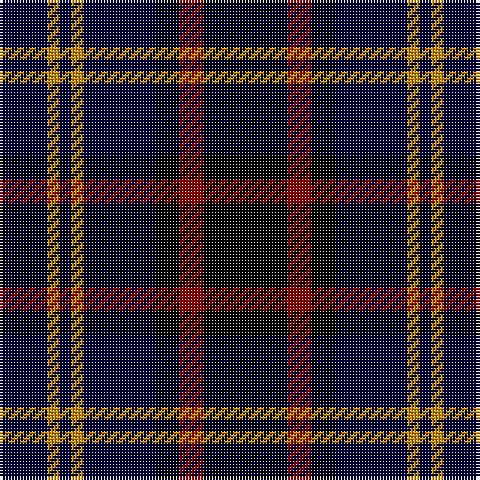

In pattern [KRKKYKYK](/patterns/krkkykyk/).

This was sourced from register-of-tartans.  It is a [8 stripes tartan](/stripes/stripes8/).

Original link https://www.tartanregister.gov.uk/tartanDetails.aspx?ref=3413

## Attestations

This cloth appears in 2 source records; the oldest owns this page.

- 01/01/1999 — Printing Industries of America (register-of-tartans, [record](https://www.tartanregister.gov.uk/tartanDetails.aspx?ref=3413))
- 1999 — Printing Industries of America (Corp (tartans-authority, [record](http://www.tartansauthority.com/tartan-ferret/display/5446/))

## Thread count
DB/16 DY4 DB4 DY4 DB24 K8 DR8 K/28

## Palette
Each colour and its ΔE from the base-6 reference it is a variant of.

| Colour | Shade | Base | ΔE (OKLab) |
|---|---|---|---|
| DB | <code style="background-color:#000034;">#000034</code> `#000034` | K <code style="background-color:#000000;">#000000</code> | 0.18 |
| DR | <code style="background-color:#8C0000;">#8C0000</code> `#8C0000` | R <code style="background-color:#C80000;">#C80000</code> | 0.13 |
| DY | <code style="background-color:#C88C00;">#C88C00</code> `#C88C00` | Y <code style="background-color:#E8C000;">#E8C000</code> | 0.15 |
| K | <code style="background-color:#000000;">#000000</code> `#000000` | K <code style="background-color:#000000;">#000000</code> | 0.00 |

# Sample pattern

## Nearest tartans

The nearest existing variants by ΔTartan distance.

1. [Forbes LC](/setts/s7/b2k12b12k12g12k2y2-b000052-g11450d-k000000-yaaaaaa/) — ΔT 0.93
1. [Forbes LC](/setts/s7/b1k6b6k6g6k1y1-b000052-g11450d-k000000-yaaaaaa/) — ΔT 0.93
1. [Forbes LC](/setts/s7/b1k6b6k6g6k1w1-b00004c-g004c00-k000000-wd0d0d0/) — ΔT 0.99
1. [Scottish Express International](/setts/s6/b6k29ba6k29b50ka6-b304080-ba8080d0-k000000-ka000030/) — ΔT 1.20
1. [Allianz Deutschland 2012](/setts/s7/b12ba6b12ba40k40ba16w8-b20608c-ba141c50-k000000-we8e8e8/) — ΔT 1.27
1. [Fletcher](/setts/s7/b6k1b6k8r1g8k2-b00004c-g004c00-k000000-rc80000/) — ΔT 1.31
1. [Fletcher C](/setts/s7/b12k2b12k16r2g16r4-b000052-g11450d-k000000-raa0000/) — ΔT 1.31
1. [Fletcher C](/setts/s7/b6k1b6k8r1g8r2-b000052-g11450d-k000000-raa0000/) — ΔT 1.31
1. [Episcopal Clergy](/setts/s11/b4g16b4g8b4k32w4k32g28b4k4-b64003c-g003014-k000000-wc8c8c8/) — ΔT 1.32
1. [Laois Irish County Tartan Tartan Number: 2252. Earliest known date: 1996 One of a series of Irish District tartans designed by Polly Wittering of the House of Edgar, with colours reminiscent of the Country with soft warm colours dominating. See products available Copyright © Blair Urquhart, Comrie, 2015](/setts/s9/k30b4k10b10k36g10k10g4k30-b5c6c8c-g6c841c-k000000/) — ΔT 1.32

## Neighbour map

Every grey dot is one of 15726 variants placed by the first two principal components of the ΔTartan feature space (44% of its variance). Red is this tartan; blue dots are its nearest — click one to open its page.

<svg viewBox="0 0 640 380" role="img" style="max-width:100%;height:auto;border:1px solid #e0e0e0;border-radius:4px;display:block" xmlns="http://www.w3.org/2000/svg"><image href="/nn/cloud.v1.png" width="640" height="380"/><a href="/setts/s7/b2k12b12k12g12k2y2-b000052-g11450d-k000000-yaaaaaa/"><circle cx="219.7" cy="259.9" r="4" fill="#3465a4"><title>Forbes LC</title></circle></a><a href="/setts/s7/b1k6b6k6g6k1y1-b000052-g11450d-k000000-yaaaaaa/"><circle cx="219.7" cy="259.9" r="4" fill="#3465a4"><title>Forbes LC</title></circle></a><a href="/setts/s7/b1k6b6k6g6k1w1-b00004c-g004c00-k000000-wd0d0d0/"><circle cx="209.4" cy="255.7" r="4" fill="#3465a4"><title>Forbes LC</title></circle></a><a href="/setts/s6/b6k29ba6k29b50ka6-b304080-ba8080d0-k000000-ka000030/"><circle cx="252.6" cy="232.3" r="4" fill="#3465a4"><title>Scottish Express International</title></circle></a><a href="/setts/s7/b12ba6b12ba40k40ba16w8-b20608c-ba141c50-k000000-we8e8e8/"><circle cx="196.3" cy="234.2" r="4" fill="#3465a4"><title>Allianz Deutschland 2012</title></circle></a><a href="/setts/s7/b6k1b6k8r1g8k2-b00004c-g004c00-k000000-rc80000/"><circle cx="193.2" cy="252.2" r="4" fill="#3465a4"><title>Fletcher</title></circle></a><a href="/setts/s7/b12k2b12k16r2g16r4-b000052-g11450d-k000000-raa0000/"><circle cx="179.4" cy="246.8" r="4" fill="#3465a4"><title>Fletcher C</title></circle></a><a href="/setts/s7/b6k1b6k8r1g8r2-b000052-g11450d-k000000-raa0000/"><circle cx="179.4" cy="246.8" r="4" fill="#3465a4"><title>Fletcher C</title></circle></a><a href="/setts/s11/b4g16b4g8b4k32w4k32g28b4k4-b64003c-g003014-k000000-wc8c8c8/"><circle cx="264.4" cy="206.4" r="4" fill="#3465a4"><title>Episcopal Clergy</title></circle></a><a href="/setts/s9/k30b4k10b10k36g10k10g4k30-b5c6c8c-g6c841c-k000000/"><circle cx="275.4" cy="227.5" r="4" fill="#3465a4"><title>Laois Irish County Tartan Tartan Number: 2252. Earliest known date: 1996 One of a series of Irish District tartans designed by Polly Wittering of the House of Edgar, with colours reminiscent of the Country with soft warm colours dominating. See products available Copyright © Blair Urquhart, Comrie, 2015</title></circle></a><circle cx="228.0" cy="233.4" r="5" fill="#c00000"/></svg>

ID: /setts/s8/k28r8k8ka24y4ka4y4ka16-k000000-ka000034-r8c0000-yc88c00/
