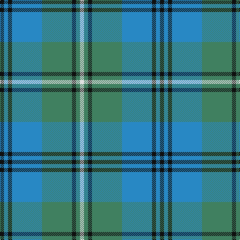

In pattern [KBKBGKGW](/patterns/kbkbgkgw/).

This was sourced from tartans-authority.  It is a [8 stripes tartan](/stripes/stripes8/).

Original link http://www.tartansauthority.com/tartan-ferret/display/6500/

## Thread count
K/8 B8 K8 B60 G60 K8 G8 LN/8

## Palette
Each colour and its ΔE from the base-6 reference it is a variant of.

| Colour | Shade | Base | ΔE (OKLab) |
|---|---|---|---|
| B | <code style="background-color:#2888C4;">#2888C4</code> `#2888C4` | B <code style="background-color:#2A418A;">#2A418A</code> | 0.21 |
| G | <code style="background-color:#408060;">#408060</code> `#408060` | G <code style="background-color:#006100;">#006100</code> | 0.14 |
| K | <code style="background-color:#101010;">#101010</code> `#101010` | K <code style="background-color:#000000;">#000000</code> | 0.17 |
| LN | <code style="background-color:#E0E0E0;">#E0E0E0</code> `#E0E0E0` | W <code style="background-color:#F7F7F7;">#F7F7F7</code> | 0.07 |

# Sample pattern

## Nearest tartans

The nearest existing variants by ΔTartan distance.

1. [Marie Curie Fields Of Hope](/setts/s9/b12y1b2y1b3k5g10y1g2~b1474b4-g006818-k101010-yd09800~x4/) — ΔT 1.14
1. [Peter of Lee (Personal)](/setts/s8/r3g1k1g12b12k1b1k1~b1474b4-g408060-k101010-rc80000~x4/) — ΔT 1.21
1. [Flower of Scotland](/setts/s6/b3g25b3k16b25r3~b1474b4-g009468-k101010-rc80000~x2/) — ΔT 1.21
1. [Auld Lang Syne (Philip King Tailoring)](/setts/s8/k1b1k1b7g7k1g1w1~b5c8ca8-g8c7038-k101010-w98c8e8~x6/) — ΔT 1.26
1. [MacThomas](/setts/s7/b5r3b32k16g32ra3g5~b1474b4-g1b835d-k101010-rcb15ab-rabb62ce~x2/) — ΔT 1.27
1. [Morneau, Richard (Personal)](/setts/s10/b29ba8g21r3g8b11w3ba3w3g8~b1474b4-ba202060-g006818-rc80000-wfcfcfc~x2/) — ΔT 1.29
1. [Graden (Personal)](/setts/s9/b22g4k4g14w3g4w3g4k3~b203078-g006818-k101010-wc0c0c0~x2/) — ΔT 1.30
1. [Stewart of Appin 1](/setts/s10/g8r3g3r5g26b7ba3b28r3b6~b304080-ba5480b0-g008000-rc00000~x2/) — ΔT 1.34
1. [Beck-McSorley](/setts/s8/r1g1r1g7ra7r1ra1rb1~g003820-r9c68a4-ra888888-rbe87878~x6/) — ΔT 1.35
1. [Manx Centenary District Tartan Tartan Number: 129. Earliest known date: pre 1992 Sample presented by Dr. D.G. Teall See products available Copyright © Blair Urquhart, Comrie, 2015](/setts/s9/b22g3b3g3b3g9r28g3r6~b2c2c80-g006818-r888888~x2/) — ΔT 1.37

## Neighbour map

Every grey dot is one of 15726 variants placed by the first two principal components of the ΔTartan feature space (44% of its variance). Red is this tartan; blue dots are its nearest — click one to open its page.

<svg viewBox="0 0 640 380" role="img" style="max-width:100%;height:auto;border:1px solid #e0e0e0;border-radius:4px;display:block" xmlns="http://www.w3.org/2000/svg"><image href="/nn/cloud.v1.png" width="640" height="380"/><a href="/setts/s9/b12y1b2y1b3k5g10y1g2~b1474b4-g006818-k101010-yd09800~x4/"><circle cx="251.0" cy="188.8" r="4" fill="#3465a4"><title>Marie Curie Fields Of Hope</title></circle></a><a href="/setts/s8/r3g1k1g12b12k1b1k1~b1474b4-g408060-k101010-rc80000~x4/"><circle cx="279.5" cy="185.9" r="4" fill="#3465a4"><title>Peter of Lee (Personal)</title></circle></a><a href="/setts/s6/b3g25b3k16b25r3~b1474b4-g009468-k101010-rc80000~x2/"><circle cx="206.9" cy="227.1" r="4" fill="#3465a4"><title>Flower of Scotland</title></circle></a><a href="/setts/s8/k1b1k1b7g7k1g1w1~b5c8ca8-g8c7038-k101010-w98c8e8~x6/"><circle cx="232.1" cy="199.4" r="4" fill="#3465a4"><title>Auld Lang Syne (Philip King Tailoring)</title></circle></a><a href="/setts/s7/b5r3b32k16g32ra3g5~b1474b4-g1b835d-k101010-rcb15ab-rabb62ce~x2/"><circle cx="208.7" cy="192.9" r="4" fill="#3465a4"><title>MacThomas</title></circle></a><a href="/setts/s10/b29ba8g21r3g8b11w3ba3w3g8~b1474b4-ba202060-g006818-rc80000-wfcfcfc~x2/"><circle cx="191.7" cy="178.8" r="4" fill="#3465a4"><title>Morneau, Richard (Personal)</title></circle></a><a href="/setts/s9/b22g4k4g14w3g4w3g4k3~b203078-g006818-k101010-wc0c0c0~x2/"><circle cx="213.6" cy="205.7" r="4" fill="#3465a4"><title>Graden (Personal)</title></circle></a><a href="/setts/s10/g8r3g3r5g26b7ba3b28r3b6~b304080-ba5480b0-g008000-rc00000~x2/"><circle cx="266.0" cy="193.1" r="4" fill="#3465a4"><title>Stewart of Appin 1</title></circle></a><a href="/setts/s8/r1g1r1g7ra7r1ra1rb1~g003820-r9c68a4-ra888888-rbe87878~x6/"><circle cx="233.3" cy="200.5" r="4" fill="#3465a4"><title>Beck-McSorley</title></circle></a><a href="/setts/s9/b22g3b3g3b3g9r28g3r6~b2c2c80-g006818-r888888~x2/"><circle cx="276.1" cy="210.9" r="4" fill="#3465a4"><title>Manx Centenary District Tartan Tartan Number: 129. Earliest known date: pre 1992 Sample presented by Dr. D.G. Teall See products available Copyright © Blair Urquhart, Comrie, 2015</title></circle></a><circle cx="229.7" cy="199.5" r="5" fill="#c00000"/></svg>

ID: /setts/s8/k2b2k2b15g15k2g2w2~b2888c4-g408060-k101010-we0e0e0~x4/
