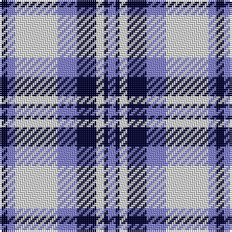

In pattern [BKWKBWBK](/stripes/bkwkbwbk/).

This was sourced from weddslist.  It is a [8 stripe tartan](/stripes/stripes8/).

Original link http://www.weddslist.com/cgi-bin/tartans/pg.pl?source=sts

## Thread count
DB/4 B4 LN22 B10 DB10 LN4 DB2 B/4

## Palette
Each colour and the base-6 reference it is a variant of.

| Colour | Shade | Base |
|---|---|---|
| B | <code style="background-color:#8080D0;">#8080D0</code> `oklch(63.4% 0.119 282.5)` <small>#8080D0</small> | B <code style="background-color:#2A418A;">#2A418A</code> |
| DB | <code style="background-color:#000030;">#000030</code> `oklch(14.0% 0.097 264.1)` <small>#000030</small> | K <code style="background-color:#000000;">#000000</code> |
| LN | <code style="background-color:#E0E0E0;">#E0E0E0</code> `oklch(90.7% 0.000 89.9)` <small>#E0E0E0</small> | W <code style="background-color:#F7F7F7;">#F7F7F7</code> |

# Sample pattern

## Nearest tartans

The nearest existing variants by ΔTartan distance.

1. [(1) Abercrombie](/setts/s9/b27w2b14k14lg4k4lg4k4lg27/) — ΔT 1.15
1. [Laval (Tartan de..), dress](/setts/s8/db2w2db8dr8w10db2w1db1~x2/) — ΔT 1.23
1. [Fraser Arisaid #2](/setts/s10/dt14w2dt3w2dr10w32dr10dt10w2dt3~x2/) — ΔT 1.23
1. [MacPherson Dress Blue (Dance)](/setts/s7/w5k3w26db21w3db8ly3~x2/) — ΔT 1.33
1. [Bannockbane Light Blue](/setts/s8/db2t2db15t1w10t15db2t2~x2/) — ΔT 1.34
1. [Bonnie Royal](/setts/s6/w5db32g12db2w30k4~x2/) — ΔT 1.36
1. [Ailsa, Royal Blue (Dance)](/setts/s6/db8t3db28w32dt3w4~x2/) — ΔT 1.37
1. [Strathclyde 1975 (District)](/setts/s7/k2lb16w2db16w15k2w2~x2/) — ΔT 1.38
1. [Jeux Canada Games '87 (Corporate)](/setts/s9/w16db3w2db3w2db3r5db6w2~x4/) — ΔT 1.39
1. [Yale College, Wrexham](/setts/s8/t57k5t9m29k18w9m9w5/) — ΔT 1.40

## Neighbour map

Every grey dot is one of 14299 variants placed by the first two principal components of the ΔTartan feature space (44% of its variance). Red is this tartan; blue dots are its nearest — click one to open its page.

<svg viewBox="0 0 640 380" role="img" style="max-width:100%;height:auto;border:1px solid #e0e0e0;border-radius:4px;display:block" xmlns="http://www.w3.org/2000/svg"><image href="/nn/cloud.v1.png" width="640" height="380"/><a href="/setts/s9/b27w2b14k14lg4k4lg4k4lg27/"><circle cx="184.6" cy="159.4" r="4" fill="#3465a4"><title>(1) Abercrombie</title></circle></a><a href="/setts/s8/db2w2db8dr8w10db2w1db1~x2/"><circle cx="186.8" cy="189.6" r="4" fill="#3465a4"><title>Laval (Tartan de..), dress</title></circle></a><a href="/setts/s10/dt14w2dt3w2dr10w32dr10dt10w2dt3~x2/"><circle cx="226.4" cy="142.4" r="4" fill="#3465a4"><title>Fraser Arisaid #2</title></circle></a><a href="/setts/s7/w5k3w26db21w3db8ly3~x2/"><circle cx="234.9" cy="177.1" r="4" fill="#3465a4"><title>MacPherson Dress Blue (Dance)</title></circle></a><a href="/setts/s8/db2t2db15t1w10t15db2t2~x2/"><circle cx="234.4" cy="178.3" r="4" fill="#3465a4"><title>Bannockbane Light Blue</title></circle></a><a href="/setts/s6/w5db32g12db2w30k4~x2/"><circle cx="197.9" cy="161.8" r="4" fill="#3465a4"><title>Bonnie Royal</title></circle></a><a href="/setts/s6/db8t3db28w32dt3w4~x2/"><circle cx="243.3" cy="175.5" r="4" fill="#3465a4"><title>Ailsa, Royal Blue (Dance)</title></circle></a><a href="/setts/s7/k2lb16w2db16w15k2w2~x2/"><circle cx="128.5" cy="176.0" r="4" fill="#3465a4"><title>Strathclyde 1975 (District)</title></circle></a><a href="/setts/s9/w16db3w2db3w2db3r5db6w2~x4/"><circle cx="256.4" cy="180.8" r="4" fill="#3465a4"><title>Jeux Canada Games '87 (Corporate)</title></circle></a><a href="/setts/s8/t57k5t9m29k18w9m9w5/"><circle cx="223.8" cy="166.7" r="4" fill="#3465a4"><title>Yale College, Wrexham</title></circle></a><circle cx="201.5" cy="182.7" r="5" fill="#c00000"/></svg>

ID: /setts/s8/k2b2w11b5k5w2k1b2~x2/
