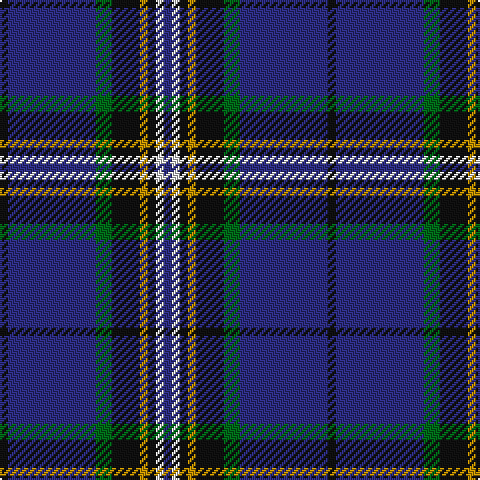

In pattern [BWKYKGBK](/stripes/bwkykgbk/).

This was sourced from register-of-tartans.  It is a [8 stripe tartan](/stripes/stripes8/).

Original link https://www.tartanregister.gov.uk/tartanDetails.aspx?ref=1360

## Attestations

This cloth appears in 2 source records; the oldest owns this page.

- 01/01/1998 — Glasgow, University of (register-of-tartans, [record](https://www.tartanregister.gov.uk/tartanDetails.aspx?ref=1360))
- Nov. 1999 — Glasgow, University of (Corporate) (tartans-authority, [record](http://www.tartansauthority.com/tartan-ferret/display/2680/))

## Register references

External register numbers recorded for this tartan.

- Scottish Register of Tartans: [1360](https://www.tartanregister.gov.uk/tartanDetails.aspx?ref=1360)
- Scottish Tartans Authority (ITI): 2680
- Scottish Tartans World Register: 2680

## Thread count
K/4 DB44 G8 K14 DY4 K4 LN4 DB/4

## Palette
Each colour and the base-6 reference it is a variant of.

| Colour | Shade | Base |
|---|---|---|
| DB | <code style="background-color:#2C2C80;">#2C2C80</code> `oklch(35.0% 0.138 276.6)` <small>#2C2C80</small> | B <code style="background-color:#2A418A;">#2A418A</code> |
| DY | <code style="background-color:#BC8C00;">#BC8C00</code> `oklch(66.8% 0.137 84.1)` <small>#BC8C00</small> | Y <code style="background-color:#F2BF00;">#F2BF00</code> |
| G | <code style="background-color:#006818;">#006818</code> `oklch(45.0% 0.142 145.0)` <small>#006818</small> | G <code style="background-color:#006100;">#006100</code> |
| K | <code style="background-color:#101010;">#101010</code> `oklch(17.3% 0.000 89.9)` <small>#101010</small> | K <code style="background-color:#000000;">#000000</code> |
| LN | <code style="background-color:#E0E0E0;">#E0E0E0</code> `oklch(90.7% 0.000 89.9)` <small>#E0E0E0</small> | W <code style="background-color:#F7F7F7;">#F7F7F7</code> |

# Sample pattern

## Nearest tartans

The nearest existing variants by ΔTartan distance, with this tartan at the top so the swatches line up against it.

ΔTartan

Tartan

Sett

—

<a href="/ttd/edit/#slug=k2db22g4k7lo2k2w2db2~x2">Glasgow, University of</a> <a class="nn-out" href="/setts/s8/k2db22g4k7lo2k2w2db2~x2/" title="open its dictionary page">↗</a>

0.77

<a href="/ttd/edit/#slug=db8w2k8g12r2db3r2db24r2~x2">Burt #2 (Name)</a> <a class="nn-out" href="/setts/s9/db8w2k8g12r2db3r2db24r2~x2/" title="open its dictionary page">↗</a>

0.80

<a href="/ttd/edit/#slug=db6ly3k2ly5db30g2k4g2db6db4~x2">St. Andrews University (Corporate)</a> <a class="nn-out" href="/setts/s10/db6ly3k2ly5db30g2k4g2db6db4~x2/" title="open its dictionary page">↗</a>

0.95

<a href="/ttd/edit/#slug=db10k1g2k2t3k2g2k1db10w1~x8">Isle of Harris</a> <a class="nn-out" href="/setts/s10/db10k1g2k2t3k2g2k1db10w1~x8/" title="open its dictionary page">↗</a>

1.04

<a href="/ttd/edit/#slug=r4g2r2k5dt22w2~x4">Reese (Personal)</a> <a class="nn-out" href="/setts/s6/r4g2r2k5dt22w2~x4/" title="open its dictionary page">↗</a>

1.04

<a href="/ttd/edit/#slug=k2db22g4k7y2k2w2db2~x2">Glasgow, University of</a> <a class="nn-out" href="/setts/s8/k2db22g4k7y2k2w2db2~x2/" title="open its dictionary page">↗</a>

1.12

<a href="/ttd/edit/#slug=db20dy1db1dy1dg8k1w3~x2">Chestico</a> <a class="nn-out" href="/setts/s7/db20dy1db1dy1dg8k1w3~x2/" title="open its dictionary page">↗</a>

1.14

<a href="/setts/s14/k2db22g4k7lo2k2w2db2~x2/">Glasgow, University of Corporate Tartan Tartan Number: 2680. Earliest known date: 2002 The official livery and promotional university tartan (STS). See products available Copyright © Blair Urquhart, Comrie, 2015</a>

1.17

<a href="/ttd/edit/#slug=db42k6lo2k3lo2g10r7k2~x2">MacBeth (Fashion)</a> <a class="nn-out" href="/setts/s8/db42k6lo2k3lo2g10r7k2~x2/" title="open its dictionary page">↗</a>

1.17

<a href="/ttd/edit/#slug=r12lo6k88db45k6db6ly6">City of Rome Pipe Band (Corporate)</a> <a class="nn-out" href="/setts/s7/r12lo6k88db45k6db6ly6/" title="open its dictionary page">↗</a>

1.20

<a href="/ttd/edit/#slug=w2r3db12db3db3db28r3db3ly2~x2">Royal Scottish Corporation</a> <a class="nn-out" href="/setts/s9/w2r3db12db3db3db28r3db3ly2~x2/" title="open its dictionary page">↗</a>

## Neighbour map

Every grey dot is one of 14299 variants placed by the first two principal components of the ΔTartan feature space (44% of its variance). Red is this tartan; blue dots are its nearest — click one to open its page.

<svg viewBox="0 0 640 380" role="img" style="max-width:100%;height:auto;border:1px solid #e0e0e0;border-radius:4px;display:block" xmlns="http://www.w3.org/2000/svg"><image href="/nn/cloud.v1.png" width="640" height="380"/><a href="/setts/s9/db8w2k8g12r2db3r2db24r2~x2/"><circle cx="288.0" cy="171.6" r="4" fill="#3465a4"><title>Burt #2 (Name)</title></circle></a><a href="/setts/s10/db6ly3k2ly5db30g2k4g2db6db4~x2/"><circle cx="301.0" cy="139.8" r="4" fill="#3465a4"><title>St. Andrews University (Corporate)</title></circle></a><a href="/setts/s10/db10k1g2k2t3k2g2k1db10w1~x8/"><circle cx="285.8" cy="171.9" r="4" fill="#3465a4"><title>Isle of Harris</title></circle></a><a href="/setts/s6/r4g2r2k5dt22w2~x4/"><circle cx="322.4" cy="176.9" r="4" fill="#3465a4"><title>Reese (Personal)</title></circle></a><a href="/setts/s8/k2db22g4k7y2k2w2db2~x2/"><circle cx="276.3" cy="154.5" r="4" fill="#3465a4"><title>Glasgow, University of</title></circle></a><a href="/setts/s7/db20dy1db1dy1dg8k1w3~x2/"><circle cx="353.2" cy="144.6" r="4" fill="#3465a4"><title>Chestico</title></circle></a><a href="/setts/s14/k2db22g4k7lo2k2w2db2~x2/"><circle cx="288.0" cy="144.8" r="4" fill="#3465a4"><title>Glasgow, University of Corporate Tartan Tartan Number: 2680. Earliest known date: 2002 The official livery and promotional university tartan (STS). See products available Copyright © Blair Urquhart, Comrie, 2015</title></circle></a><a href="/setts/s8/db42k6lo2k3lo2g10r7k2~x2/"><circle cx="343.2" cy="139.7" r="4" fill="#3465a4"><title>MacBeth (Fashion)</title></circle></a><a href="/setts/s7/r12lo6k88db45k6db6ly6/"><circle cx="336.7" cy="167.2" r="4" fill="#3465a4"><title>City of Rome Pipe Band (Corporate)</title></circle></a><a href="/setts/s9/w2r3db12db3db3db28r3db3ly2~x2/"><circle cx="341.6" cy="156.1" r="4" fill="#3465a4"><title>Royal Scottish Corporation</title></circle></a><circle cx="303.2" cy="166.3" r="5" fill="#c00000"/></svg>

ID: /setts/s8/k2db22g4k7lo2k2w2db2~x2/
