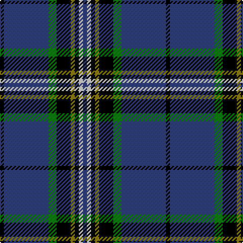

This page is one **sett** — a single exact thread-count. It belongs to the [tartan](/tartans/k2b22g4k7lg2k2ln2b2/)
(the same proportion at any scale), whose colour order is pattern [BWKGKGBK](/stripes/bwkgkgbk/).

Sourced from weddslist.  It is a [8 stripe tartan](/stripes/stripes8/).

Original link http://www.weddslist.com/cgi-bin/tartans/pg.pl?source=sts

## Thread count
K/4 B44 G8 K14 LG4 K4 LN4 B/4

## Palette
Each colour and the base-6 reference it is a variant of.

| Colour | Shade | Base |
|---|---|---|
| B | <code style="background-color:#304080;">#304080</code> `oklch(39.4% 0.109 270.2)` <small>#304080</small> | B <code style="background-color:#2A418A;">#2A418A</code> |
| G | <code style="background-color:#008000;">#008000</code> `oklch(52.0% 0.177 142.5)` <small>#008000</small> | G <code style="background-color:#006100;">#006100</code> |
| K | <code style="background-color:#000000;">#000000</code> `oklch(0.0% 0.000 0.0)` <small>#000000</small> | K <code style="background-color:#000000;">#000000</code> |
| LG | <code style="background-color:#908000;">#908000</code> `oklch(59.6% 0.124 100.6)` <small>#908000</small> | G <code style="background-color:#006100;">#006100</code> |
| LN | <code style="background-color:#E0E0E0;">#E0E0E0</code> `oklch(90.7% 0.000 89.9)` <small>#E0E0E0</small> | W <code style="background-color:#F7F7F7;">#F7F7F7</code> |

# Sample pattern

## Nearest tartans

The nearest existing variants by ΔTartan distance, with this tartan at the top so the swatches line up against it.

ΔTartan

Tartan

Sett

—

<a href="/ttd/edit/#slug=k2db22g4k7y2k2w2db2~x2">Glasgow, University of</a> <a class="nn-out" href="/setts/s8/k2db22g4k7y2k2w2db2~x2/" title="open its dictionary page">↗</a>

0.95

<a href="/ttd/edit/#slug=lo2w1db6w1ly2k17ly1~x2">East Tennessee State University</a> <a class="nn-out" href="/setts/s7/lo2w1db6w1ly2k17ly1~x2/" title="open its dictionary page">↗</a>

1.04

<a href="/ttd/edit/#slug=k2db22g4k7lo2k2w2db2~x2">Glasgow, University of</a> <a class="nn-out" href="/setts/s8/k2db22g4k7lo2k2w2db2~x2/" title="open its dictionary page">↗</a>

1.13

<a href="/ttd/edit/#slug=lo2db2w1db6w1ly2db17ly1~x2">East Tennessee State University</a> <a class="nn-out" href="/setts/s8/lo2db2w1db6w1ly2db17ly1~x2/" title="open its dictionary page">↗</a>

1.15

<a href="/ttd/edit/#slug=w2db40g22ly3g2r3g2w2~x2">Tartan Day SA (Corporate)</a> <a class="nn-out" href="/setts/s8/w2db40g22ly3g2r3g2w2~x2/" title="open its dictionary page">↗</a>

1.15

<a href="/ttd/edit/#slug=lb3k19db24r2db2ly2db2~x2">Mensa</a> <a class="nn-out" href="/setts/s7/lb3k19db24r2db2ly2db2~x2/" title="open its dictionary page">↗</a>

1.20

<a href="/ttd/edit/#slug=n10k7lt2lb2k27b7lt2b7~x2">Croy, Jake (Personal)</a> <a class="nn-out" href="/setts/s8/n10k7lt2lb2k27b7lt2b7~x2/" title="open its dictionary page">↗</a>

1.22

<a href="/ttd/edit/#slug=w2k40dg22lo3dg2r3dg2w2~x2">Tartan Day SA</a> <a class="nn-out" href="/setts/s8/w2k40dg22lo3dg2r3dg2w2~x2/" title="open its dictionary page">↗</a>

1.29

<a href="/ttd/edit/#slug=lo6db3lo3db15db7lo7db5lo17db46lo4">Rhys (Welsh Name)</a> <a class="nn-out" href="/setts/s10/lo6db3lo3db15db7lo7db5lo17db46lo4/" title="open its dictionary page">↗</a>

1.29

<a href="/ttd/edit/#slug=r4g2r2k5dt22w2~x4">Reese (Personal)</a> <a class="nn-out" href="/setts/s6/r4g2r2k5dt22w2~x4/" title="open its dictionary page">↗</a>

1.31

<a href="/ttd/edit/#slug=r3b14ly2k2b14k36ly2k2ly2~x2">Ewbank</a> <a class="nn-out" href="/setts/s9/r3b14ly2k2b14k36ly2k2ly2~x2/" title="open its dictionary page">↗</a>

## Neighbour map

Every grey dot is one of 14299 variants placed by the first two principal components of the ΔTartan feature space (44% of its variance). Red is this tartan; blue dots are its nearest — click one to open its page.

<svg viewBox="0 0 640 380" role="img" style="max-width:100%;height:auto;border:1px solid #e0e0e0;border-radius:4px;display:block" xmlns="http://www.w3.org/2000/svg"><image href="/nn/cloud.v1.png" width="640" height="380"/><a href="/setts/s7/lo2w1db6w1ly2k17ly1~x2/"><circle cx="283.2" cy="132.5" r="4" fill="#3465a4"><title>East Tennessee State University</title></circle></a><a href="/setts/s8/k2db22g4k7lo2k2w2db2~x2/"><circle cx="303.2" cy="166.3" r="4" fill="#3465a4"><title>Glasgow, University of</title></circle></a><a href="/setts/s8/lo2db2w1db6w1ly2db17ly1~x2/"><circle cx="301.7" cy="129.9" r="4" fill="#3465a4"><title>East Tennessee State University</title></circle></a><a href="/setts/s8/w2db40g22ly3g2r3g2w2~x2/"><circle cx="303.8" cy="124.7" r="4" fill="#3465a4"><title>Tartan Day SA (Corporate)</title></circle></a><a href="/setts/s7/lb3k19db24r2db2ly2db2~x2/"><circle cx="278.0" cy="165.4" r="4" fill="#3465a4"><title>Mensa</title></circle></a><a href="/setts/s8/n10k7lt2lb2k27b7lt2b7~x2/"><circle cx="267.0" cy="169.1" r="4" fill="#3465a4"><title>Croy, Jake (Personal)</title></circle></a><a href="/setts/s8/w2k40dg22lo3dg2r3dg2w2~x2/"><circle cx="302.7" cy="128.3" r="4" fill="#3465a4"><title>Tartan Day SA</title></circle></a><a href="/setts/s10/lo6db3lo3db15db7lo7db5lo17db46lo4/"><circle cx="285.4" cy="158.8" r="4" fill="#3465a4"><title>Rhys (Welsh Name)</title></circle></a><a href="/setts/s6/r4g2r2k5dt22w2~x4/"><circle cx="322.4" cy="176.9" r="4" fill="#3465a4"><title>Reese (Personal)</title></circle></a><a href="/setts/s9/r3b14ly2k2b14k36ly2k2ly2~x2/"><circle cx="308.8" cy="143.1" r="4" fill="#3465a4"><title>Ewbank</title></circle></a><circle cx="276.3" cy="154.5" r="5" fill="#c00000"/></svg>

ID: /setts/s8/k2db22g4k7y2k2w2db2~x2/
