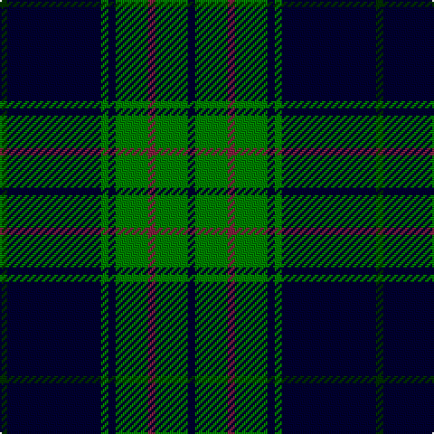

In pattern [GKGKGRGK](/stripes/gkgkgrgk/).

This was sourced from weddslist.  It is a [8 stripe tartan](/stripes/stripes8/).

Original link http://www.weddslist.com/cgi-bin/tartans/pg.pl?source=sts

## Also known as

This cloth is also recorded under:

- Land's End

## Thread count
DG/4 DB52 G4 DB4 G18 DR4 G18 DB/4

## Palette
Each colour and the base-6 reference it is a variant of.

| Colour | Shade | Base |
|---|---|---|
| DB | <code style="background-color:#000030;">#000030</code> `oklch(14.0% 0.097 264.1)` <small>#000030</small> | K <code style="background-color:#000000;">#000000</code> |
| DG | <code style="background-color:#003000;">#003000</code> `oklch(26.8% 0.091 142.5)` <small>#003000</small> | G <code style="background-color:#006100;">#006100</code> |
| DR | <code style="background-color:#802040;">#802040</code> `oklch(40.8% 0.132 5.2)` <small>#802040</small> | R <code style="background-color:#CC0000;">#CC0000</code> |
| G | <code style="background-color:#008000;">#008000</code> `oklch(52.0% 0.177 142.5)` <small>#008000</small> | G <code style="background-color:#006100;">#006100</code> |

# Sample pattern

## Nearest tartans

The nearest existing variants by ΔTartan distance, with this tartan at the top so the swatches line up against it.

ΔTartan

Tartan

Sett

—

<a href="/ttd/edit/#slug=k2g9m2g9k2g2k26dg2~x2">Land's End</a> <a class="nn-out" href="/setts/s8/k2g9m2g9k2g2k26dg2~x2/" title="open its dictionary page">↗</a>

1.05

<a href="/ttd/edit/#slug=db26g4db3g3ly2g24r2~x2">St Andrews Links</a> <a class="nn-out" href="/setts/s7/db26g4db3g3ly2g24r2~x2/" title="open its dictionary page">↗</a>

1.10

<a href="/ttd/edit/#slug=dg4k4dg23k11r2k2r2k20w4~x2">New Golf Club</a> <a class="nn-out" href="/setts/s9/dg4k4dg23k11r2k2r2k20w4~x2/" title="open its dictionary page">↗</a>

1.16

<a href="/ttd/edit/#slug=k4g13k4g8k44g8k4g13k4w3~x2">Childers</a> <a class="nn-out" href="/setts/s10/k4g13k4g8k44g8k4g13k4w3~x2/" title="open its dictionary page">↗</a>

1.22

<a href="/ttd/edit/#slug=dg4db12r3db12dg32lb4">MacIntyre L</a> <a class="nn-out" href="/setts/s6/dg4db12r3db12dg32lb4/" title="open its dictionary page">↗</a>

1.22

<a href="/ttd/edit/#slug=dg10r1dg1r2dg8db10dg1ly1~x4">Glen Esk</a> <a class="nn-out" href="/setts/s8/dg10r1dg1r2dg8db10dg1ly1~x4/" title="open its dictionary page">↗</a>

1.29

<a href="/ttd/edit/#slug=db24g3db3g3lo2g18r2~x2">Greenways Marketing Intl (Corporate)</a> <a class="nn-out" href="/setts/s7/db24g3db3g3lo2g18r2~x2/" title="open its dictionary page">↗</a>

1.30

<a href="/ttd/edit/#slug=r6k55db8g6db10g6db6g4~x2">Frederiction Police Force</a> <a class="nn-out" href="/setts/s8/r6k55db8g6db10g6db6g4~x2/" title="open its dictionary page">↗</a>

1.30

<a href="/ttd/edit/#slug=k17o2k3g2k3g2k24b8g4b4g3b8~x2">Kells Irish Pubs (Corporate)</a> <a class="nn-out" href="/setts/s12/k17o2k3g2k3g2k24b8g4b4g3b8~x2/" title="open its dictionary page">↗</a>

1.34

<a href="/ttd/edit/#slug=k36r3k3r3k9b36g3b2~x2">Home (Clan)</a> <a class="nn-out" href="/setts/s8/k36r3k3r3k9b36g3b2~x2/" title="open its dictionary page">↗</a>

1.35

<a href="/ttd/edit/#slug=k17lr2k3g2k3g2k24b8g4b4g3b8~x2">Kells Irish Pubs</a> <a class="nn-out" href="/setts/s12/k17lr2k3g2k3g2k24b8g4b4g3b8~x2/" title="open its dictionary page">↗</a>

## Neighbour map

Every grey dot is one of 14299 variants placed by the first two principal components of the ΔTartan feature space (44% of its variance). Red is this tartan; blue dots are its nearest — click one to open its page.

<svg viewBox="0 0 640 380" role="img" style="max-width:100%;height:auto;border:1px solid #e0e0e0;border-radius:4px;display:block" xmlns="http://www.w3.org/2000/svg"><image href="/nn/cloud.v1.png" width="640" height="380"/><a href="/setts/s7/db26g4db3g3ly2g24r2~x2/"><circle cx="288.7" cy="182.4" r="4" fill="#3465a4"><title>St Andrews Links</title></circle></a><a href="/setts/s9/dg4k4dg23k11r2k2r2k20w4~x2/"><circle cx="288.1" cy="193.2" r="4" fill="#3465a4"><title>New Golf Club</title></circle></a><a href="/setts/s10/k4g13k4g8k44g8k4g13k4w3~x2/"><circle cx="329.5" cy="171.1" r="4" fill="#3465a4"><title>Childers</title></circle></a><a href="/setts/s6/dg4db12r3db12dg32lb4/"><circle cx="301.3" cy="218.4" r="4" fill="#3465a4"><title>MacIntyre L</title></circle></a><a href="/setts/s8/dg10r1dg1r2dg8db10dg1ly1~x4/"><circle cx="324.8" cy="207.8" r="4" fill="#3465a4"><title>Glen Esk</title></circle></a><a href="/setts/s7/db24g3db3g3lo2g18r2~x2/"><circle cx="312.4" cy="196.9" r="4" fill="#3465a4"><title>Greenways Marketing Intl (Corporate)</title></circle></a><a href="/setts/s8/r6k55db8g6db10g6db6g4~x2/"><circle cx="321.7" cy="168.7" r="4" fill="#3465a4"><title>Frederiction Police Force</title></circle></a><a href="/setts/s12/k17o2k3g2k3g2k24b8g4b4g3b8~x2/"><circle cx="325.0" cy="180.4" r="4" fill="#3465a4"><title>Kells Irish Pubs (Corporate)</title></circle></a><a href="/setts/s8/k36r3k3r3k9b36g3b2~x2/"><circle cx="318.7" cy="160.7" r="4" fill="#3465a4"><title>Home (Clan)</title></circle></a><a href="/setts/s12/k17lr2k3g2k3g2k24b8g4b4g3b8~x2/"><circle cx="305.6" cy="167.4" r="4" fill="#3465a4"><title>Kells Irish Pubs</title></circle></a><circle cx="325.4" cy="180.0" r="5" fill="#c00000"/></svg>

ID: /setts/s8/k2g9m2g9k2g2k26dg2~x2/
