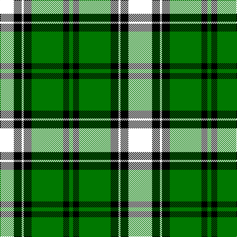

In pattern [GKGKKKKK](/stripes/gkgkkkkk/).

This was sourced from tartans-authority.  It is a [8 stripe tartan](/stripes/stripes8/).

Original link http://www.tartansauthority.com/tartan-ferret/display/4149/

## Thread count
R/8 A20 K16 Y4 K16 G64 K12 Ga/8

## Palette
Each colour and the base-6 reference it is a variant of.

| Colour | Shade | Base |
|---|---|---|
| G | <code style="background-color:#007800;">#007800</code> `oklch(49.6% 0.169 142.5)` <small>#007800</small> | G <code style="background-color:#006100;">#006100</code> |
| Ga | <code style="background-color:#007800;">#007800</code> `oklch(49.6% 0.169 142.5)` <small>#007800</small> | G <code style="background-color:#006100;">#006100</code> |
| K | <code style="background-color:#000000;">#000000</code> `oklch(0.0% 0.000 0.0)` <small>#000000</small> | K <code style="background-color:#000000;">#000000</code> |

# Sample pattern

## Nearest tartans

The nearest existing variants by ΔTartan distance.

1. [Cornish Htg (District)](/setts/s7/w5k26ly2dg24db8k4r3~x2/) — ΔT 1.27
1. [Cornish, hunting](/setts/s7/w5k26ly2dg24k7k3r3~x2/) — ΔT 1.32
1. [Webster](/setts/s10/g32r3dy12b3ly3b3k24k24lb2k4~x2/) — ΔT 1.37
1. [Abercrombie](/setts/s9/k12r1g14w1g14k14r1db8k2~x2/) — ΔT 1.43
1. [Princess Diana](/setts/s12/k14r2k2r2k2g18r2g18lb1db12t1r8~x2/) — ΔT 1.45
1. [Cornish Hunting](/setts/s12/k26ly2dg24db8k4r3k4db8dg24ly2k26w5~x2/) — ΔT 1.48
1. [Celtic F.C.](/setts/s14/dg6g3dg24k2dg4k16o5dg2w4dg2g21dg2k2ly3~x2/) — ΔT 1.50
1. [Jones, The](/setts/s7/r3w2dy10dg37k12db21w2~x2/) — ΔT 1.54
1. [PMMC](/setts/s7/r3k11dg29k28g19ly2b1~x2/) — ΔT 1.56
1. [Stephenson](/setts/s11/k6g20t2r5t2k20ly3db20g26r3db5~x2/) — ΔT 1.57

## Neighbour map

Every grey dot is one of 14299 variants placed by the first two principal components of the ΔTartan feature space (44% of its variance). Red is this tartan; blue dots are its nearest — click one to open its page.

<svg viewBox="0 0 640 380" role="img" style="max-width:100%;height:auto;border:1px solid #e0e0e0;border-radius:4px;display:block" xmlns="http://www.w3.org/2000/svg"><image href="/nn/cloud.v1.png" width="640" height="380"/><a href="/setts/s7/w5k26ly2dg24db8k4r3~x2/"><circle cx="165.9" cy="155.6" r="4" fill="#3465a4"><title>Cornish Htg (District)</title></circle></a><a href="/setts/s7/w5k26ly2dg24k7k3r3~x2/"><circle cx="175.9" cy="155.9" r="4" fill="#3465a4"><title>Cornish, hunting</title></circle></a><a href="/setts/s10/g32r3dy12b3ly3b3k24k24lb2k4~x2/"><circle cx="177.1" cy="113.2" r="4" fill="#3465a4"><title>Webster</title></circle></a><a href="/setts/s9/k12r1g14w1g14k14r1db8k2~x2/"><circle cx="188.1" cy="171.2" r="4" fill="#3465a4"><title>Abercrombie</title></circle></a><a href="/setts/s12/k14r2k2r2k2g18r2g18lb1db12t1r8~x2/"><circle cx="176.2" cy="117.6" r="4" fill="#3465a4"><title>Princess Diana</title></circle></a><a href="/setts/s12/k26ly2dg24db8k4r3k4db8dg24ly2k26w5~x2/"><circle cx="178.4" cy="144.8" r="4" fill="#3465a4"><title>Cornish Hunting</title></circle></a><a href="/setts/s14/dg6g3dg24k2dg4k16o5dg2w4dg2g21dg2k2ly3~x2/"><circle cx="155.2" cy="121.8" r="4" fill="#3465a4"><title>Celtic F.C.</title></circle></a><a href="/setts/s7/r3w2dy10dg37k12db21w2~x2/"><circle cx="199.4" cy="153.9" r="4" fill="#3465a4"><title>Jones, The</title></circle></a><a href="/setts/s7/r3k11dg29k28g19ly2b1~x2/"><circle cx="212.8" cy="141.8" r="4" fill="#3465a4"><title>PMMC</title></circle></a><a href="/setts/s11/k6g20t2r5t2k20ly3db20g26r3db5~x2/"><circle cx="140.2" cy="137.3" r="4" fill="#3465a4"><title>Stephenson</title></circle></a><circle cx="182.0" cy="147.9" r="5" fill="#c00000"/></svg>

ID: /setts/s8/k2k5k4k1k4g16k3g2~x4/
