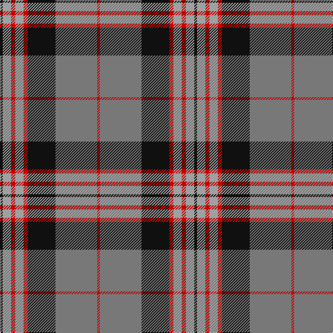

**Bands:** [KYRYRKGR](/stripes/kyryrkgr/) · **Stripes:** [K LR R LR R K Y R](/stripes/stripes8/) K LR R LR R K Y R

This was sourced from tartans-authority.  It is a [8 band tartan](/bands/bands8/).

Original link http://www.tartansauthority.com/tartan-ferret/display/7671/

## Attestations

This cloth appears in 2 source records; the oldest owns this page.

- June 2008 — Hermitage Academy (Corporate) (tartans-authority, [record](http://www.tartansauthority.com/tartan-ferret/display/7671/))
- undated — Hermitage Academy (register-of-tartans, [record](https://www.tartanregister.gov.uk/tartanDetails.aspx?ref=5674))

## Register references

External register numbers recorded for this tartan.

- Scottish Register of Tartans: [5674](https://www.tartanregister.gov.uk/tartanDetails.aspx?ref=5674)
- Scottish Tartans Authority (ITI): 7671

## Thread count
K/4 N12 R6 N12 R6 K40 Na60 R/4

## Palette
Each colour and its ΔE from the base-6 reference it is a variant of.

| Colour | Shade | Base | ΔE (OKLab) |
|---|---|---|---|
| K | <code style="background-color:#101010;">#101010</code> `#101010` | K <code style="background-color:#000000;">#000000</code> | 0.17 |
| N | <code style="background-color:#A0A0A0;">#A0A0A0</code> `#A0A0A0` | Y <code style="background-color:#F2BF00;">#F2BF00</code> | 0.21 |
| Na | <code style="background-color:#787878;">#787878</code> `#787878` | G <code style="background-color:#006100;">#006100</code> | 0.21 |
| R | <code style="background-color:#C80000;">#C80000</code> `#C80000` | R <code style="background-color:#CC0000;">#CC0000</code> | 0.01 |

# Sample pattern

## Nearest tartans

The nearest existing variants by ΔTartan distance.

1. [Confederate (Military)](/setts/s7/r12b18k1r4k1g6k2~x2/) — ΔT 0.66
1. [Confederate](/setts/s7/r12b18k1r4k1dg6k2~x2/) — ΔT 0.70
1. [Queen of Scots](/setts/s9/g22k3g1k3g2p8m1p8m16~x2/) — ΔT 0.85
1. [Blair Atholl (Fashion)](/setts/s8/do2lr2k6do3k2o14k1o1~x4/) — ΔT 0.91
1. [Private SA Club](/setts/s8/k3r8k3r8lo19r7dt36r3~x2/) — ΔT 0.96
1. [Logan #3](/setts/s7/dp9lr4dp1lr4g15r4dp1~x4/) — ΔT 0.98
1. [Buccleuch Weavers Tartan Tartan Number: 6009. Earliest known date: pre 2003 A Fashion tartan from Marton Mills See products available Copyright © Blair Urquhart, Comrie, 2015](/setts/s8/lo15k1lo2k1lo2k10dy14w2~x2/) — ΔT 0.98
1. [Logan Light](/setts/s7/dp9r4dp1r4g15r4dp1~x2/) — ΔT 1.02
1. [Braemar or Blair Atholl](/setts/s8/do2w2k6do3k2o14k1o1~x4/) — ΔT 1.03
1. [Unidentified Specimen #2](/setts/s10/w1dg1r1dg14r1db6r11dg1r1w1~x4/) — ΔT 1.03

## Neighbour map

Every grey dot is one of 14299 variants placed by the first two principal components of the ΔTartan feature space (44% of its variance). Red is this tartan; blue dots are its nearest — click one to open its page.

<svg viewBox="0 0 640 380" role="img" style="max-width:100%;height:auto;border:1px solid #e0e0e0;border-radius:4px;display:block" xmlns="http://www.w3.org/2000/svg"><image href="/nn/cloud.v1.png" width="640" height="380"/><a href="/setts/s7/r12b18k1r4k1g6k2~x2/"><circle cx="238.1" cy="162.6" r="4" fill="#3465a4"><title>Confederate (Military)</title></circle></a><a href="/setts/s7/r12b18k1r4k1dg6k2~x2/"><circle cx="238.6" cy="162.9" r="4" fill="#3465a4"><title>Confederate</title></circle></a><a href="/setts/s9/g22k3g1k3g2p8m1p8m16~x2/"><circle cx="231.4" cy="148.7" r="4" fill="#3465a4"><title>Queen of Scots</title></circle></a><a href="/setts/s8/do2lr2k6do3k2o14k1o1~x4/"><circle cx="268.1" cy="161.1" r="4" fill="#3465a4"><title>Blair Atholl (Fashion)</title></circle></a><a href="/setts/s8/k3r8k3r8lo19r7dt36r3~x2/"><circle cx="229.6" cy="173.0" r="4" fill="#3465a4"><title>Private SA Club</title></circle></a><a href="/setts/s7/dp9lr4dp1lr4g15r4dp1~x4/"><circle cx="211.1" cy="176.5" r="4" fill="#3465a4"><title>Logan #3</title></circle></a><a href="/setts/s8/lo15k1lo2k1lo2k10dy14w2~x2/"><circle cx="229.9" cy="169.1" r="4" fill="#3465a4"><title>Buccleuch Weavers Tartan Tartan Number: 6009. Earliest known date: pre 2003 A Fashion tartan from Marton Mills See products available Copyright © Blair Urquhart, Comrie, 2015</title></circle></a><a href="/setts/s7/dp9r4dp1r4g15r4dp1~x2/"><circle cx="210.7" cy="172.9" r="4" fill="#3465a4"><title>Logan Light</title></circle></a><a href="/setts/s8/do2w2k6do3k2o14k1o1~x4/"><circle cx="256.5" cy="154.6" r="4" fill="#3465a4"><title>Braemar or Blair Atholl</title></circle></a><a href="/setts/s10/w1dg1r1dg14r1db6r11dg1r1w1~x4/"><circle cx="260.0" cy="141.9" r="4" fill="#3465a4"><title>Unidentified Specimen #2</title></circle></a><circle cx="237.1" cy="158.1" r="5" fill="#c00000"/></svg>

ID: /setts/s8/k2lr6r3lr6r3k20y30r2~x2/
