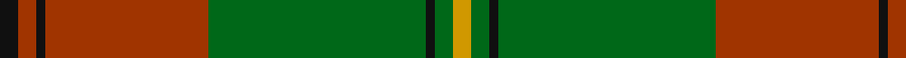
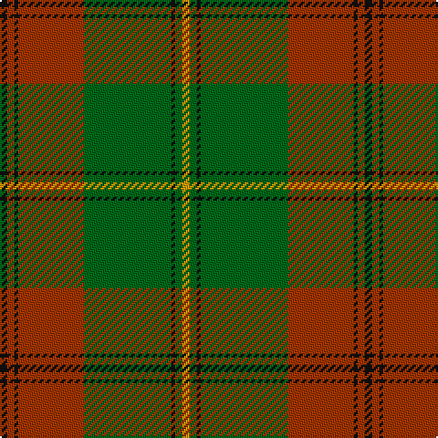

In pattern [KRKRGKGY](/stripes/krkrgkgy/).

This was sourced from register-of-tartans.  It is a [8 stripe tartan](/stripes/stripes8/).

Original link https://www.tartanregister.gov.uk/tartanDetails.aspx?ref=1414

## Attestations

This cloth appears in 3 source records; the oldest owns this page.

- 01/01/1996 — Gleneil (Spoof) (register-of-tartans, [record](https://www.tartanregister.gov.uk/tartanDetails.aspx?ref=1414))
- 1996 — Gleneil (Corporate) (tartans-authority, [record](http://www.tartansauthority.com/tartan-ferret/display/2545/))
- undated — Gleneil Corporate Tartan Tartan Number: 2545. Earliest known date: 1996 The STS calls this a spoof tartan. Designed by J B Renwick of Lochcarron for Gleneil Publishers to accompany their fictional book by Michael Brander on the bogus Gleneil clan. The tartan is Johnston with blue changed to red. See products available Copyright © Blair Urquhart, Comrie, 2015 (house-of-tartan, [record](http://www.house-of-tartan.scotland.net/house/TartanViewjs.asp?colr=Def&tnam=2545))

## Register references

External register numbers recorded for this tartan.

- Scottish Register of Tartans: [1414](https://www.tartanregister.gov.uk/tartanDetails.aspx?ref=1414)
- Scottish Tartans Authority (ITI): 2545
- Scottish Tartans World Register: 2545

## Thread count
K/4 R4 K2 R36 G48 K2 G4 DY/4

## Palette
Each colour and its ΔE from the base-6 reference it is a variant of.

| Colour | Shade | Base | ΔE (OKLab) |
|---|---|---|---|
| DY | <code style="background-color:#D09800;">#D09800</code> `#D09800` | Y <code style="background-color:#F2BF00;">#F2BF00</code> | 0.12 |
| G | <code style="background-color:#006818;">#006818</code> `#006818` | G <code style="background-color:#006100;">#006100</code> | 0.02 |
| K | <code style="background-color:#101010;">#101010</code> `#101010` | K <code style="background-color:#000000;">#000000</code> | 0.17 |
| R | <code style="background-color:#A03400;">#A03400</code> `#A03400` | R <code style="background-color:#CC0000;">#CC0000</code> | 0.09 |

# Sample pattern

## Nearest tartans

The nearest existing variants by ΔTartan distance.

1. [MacFie](/setts/s9/lr2r12dg2r1dg32r1dg2r12ly2/) — ΔT 1.20
1. [Unidentified #62](/setts/s10/r32lo1g8lo1g8lo1~x2/) — ΔT 1.27
1. [Abadia Da Cova (Corporate)](/setts/s6/g30g1g3r30k1ly3~x2/) — ΔT 1.29
1. [Seton Htg (Clan)](/setts/s10/dy3g1dy15r2dy1r2dy1g7w1g2~x4/) — ΔT 1.34
1. [Midpac Tissue (non woven)](/setts/s8/r5k2dg1k2r5k2dg18lo3~x2/) — ΔT 1.35
1. [Beard](/setts/s8/lo4r4k2r10g30lo2g3r2~x2/) — ΔT 1.44
1. [McKirgan (Name)](/setts/s11/dg2n2w1r2w1n3dg1n12dg18w1r2~x2/) — ΔT 1.45
1. [Glendronach](/setts/s12/g21r2w1y3r2g5r21y1ly1y1r1g8~x2/) — ΔT 1.50
1. [MacFie Hunting (Clan?)](/setts/s9/lr1do12g2r2g16r2g2do12lo1~x4/) — ΔT 1.50
1. [McNee (Name)](/setts/s7/k9w2r50g42r16g17k4/) — ΔT 1.51

## Neighbour map

Every grey dot is one of 14299 variants placed by the first two principal components of the ΔTartan feature space (44% of its variance). Red is this tartan; blue dots are its nearest — click one to open its page.

<svg viewBox="0 0 640 380" role="img" style="max-width:100%;height:auto;border:1px solid #e0e0e0;border-radius:4px;display:block" xmlns="http://www.w3.org/2000/svg"><image href="/nn/cloud.v1.png" width="640" height="380"/><a href="/setts/s9/lr2r12dg2r1dg32r1dg2r12ly2/"><circle cx="413.2" cy="136.3" r="4" fill="#3465a4"><title>MacFie</title></circle></a><a href="/setts/s10/r32lo1g8lo1g8lo1~x2/"><circle cx="399.3" cy="150.2" r="4" fill="#3465a4"><title>Unidentified #62</title></circle></a><a href="/setts/s6/g30g1g3r30k1ly3~x2/"><circle cx="362.5" cy="148.4" r="4" fill="#3465a4"><title>Abadia Da Cova (Corporate)</title></circle></a><a href="/setts/s10/dy3g1dy15r2dy1r2dy1g7w1g2~x4/"><circle cx="391.9" cy="175.8" r="4" fill="#3465a4"><title>Seton Htg (Clan)</title></circle></a><a href="/setts/s8/r5k2dg1k2r5k2dg18lo3~x2/"><circle cx="309.2" cy="163.9" r="4" fill="#3465a4"><title>Midpac Tissue (non woven)</title></circle></a><a href="/setts/s8/lo4r4k2r10g30lo2g3r2~x2/"><circle cx="361.3" cy="165.1" r="4" fill="#3465a4"><title>Beard</title></circle></a><a href="/setts/s11/dg2n2w1r2w1n3dg1n12dg18w1r2~x2/"><circle cx="328.6" cy="155.7" r="4" fill="#3465a4"><title>McKirgan (Name)</title></circle></a><a href="/setts/s12/g21r2w1y3r2g5r21y1ly1y1r1g8~x2/"><circle cx="326.8" cy="117.0" r="4" fill="#3465a4"><title>Glendronach</title></circle></a><a href="/setts/s9/lr1do12g2r2g16r2g2do12lo1~x4/"><circle cx="321.2" cy="176.7" r="4" fill="#3465a4"><title>MacFie Hunting (Clan?)</title></circle></a><a href="/setts/s7/k9w2r50g42r16g17k4/"><circle cx="339.6" cy="185.0" r="4" fill="#3465a4"><title>McNee (Name)</title></circle></a><circle cx="376.9" cy="158.0" r="5" fill="#c00000"/></svg>

ID: /setts/s8/k2o2k1o18g24k1g2lo2~x2/
