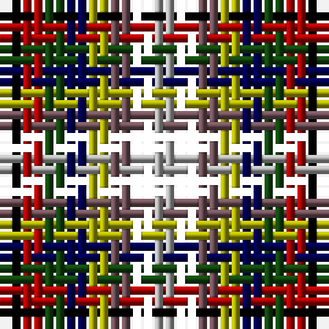

In pattern [KRGBYBKY](/patterns/krgbybky/).

This was sourced from weddslist.  It is a [8 stripes tartan](/stripes/stripes8/).

Original link http://www.weddslist.com/cgi-bin/tartans/pg.pl?source=x

## Thread count
K/2 DR2 DG2 DB2 LG2 N2 D2 Na/2

## Palette
Each colour and its ΔE from the base-6 reference it is a variant of.

| Colour | Shade | Base | ΔE (OKLab) |
|---|---|---|---|
| B | <code style="background-color:#00AAAA;">#00AAAA</code> `#00AAAA` | G <code style="background-color:#006400;">#006400</code> | 0.26 |
| DB | <code style="background-color:#000052;">#000052</code> `#000052` | B <code style="background-color:#2C4084;">#2C4084</code> | 0.20 |
| DG | <code style="background-color:#11450D;">#11450D</code> `#11450D` | G <code style="background-color:#006400;">#006400</code> | 0.10 |
| DR | <code style="background-color:#AA0000;">#AA0000</code> `#AA0000` | R <code style="background-color:#C80000;">#C80000</code> | 0.06 |
| K | <code style="background-color:#000000;">#000000</code> `#000000` | K <code style="background-color:#000000;">#000000</code> | 0.00 |
| LG | <code style="background-color:#AAAA00;">#AAAA00</code> `#AAAA00` | Y <code style="background-color:#E8C000;">#E8C000</code> | 0.11 |
| N | <code style="background-color:#6E5058;">#6E5058</code> `#6E5058` | B <code style="background-color:#2C4084;">#2C4084</code> | 0.14 |
| Na | <code style="background-color:#AAAAAA;">#AAAAAA</code> `#AAAAAA` | Y <code style="background-color:#E8C000;">#E8C000</code> | 0.19 |

# Sample pattern

## Nearest tartans

The nearest existing variants by ΔTartan distance.

1. [Krifa-Jean (Personal)](/setts/s7/g40r50y40b40ga20k40ra40-b0000cd-g003c14-ga603800-k1c1714-re87878-rac8002c-yfccc00/) — ΔT 2.96
1. [Krifa-Jean (Personal)](/setts/s7/g20r25b20y20ba10ra20r20-b2c2c80-ba441800-g003820-rc80000-ra888888-yfccc00/) — ΔT 3.25
1. [Antonelli (Oklahoma), John (Personal)](/setts/s6/b25g25b25r25w25k25-b000080-g008b00-k101010-rff0000-w82cffd/) — ΔT 3.49
1. [Antonello (Personal)](/setts/s6/b24g24b24r24ba24k24-b202060-ba2888c4-g006818-k101010-rc80000/) — ΔT 3.52
1. [Reid (Mill City) (Name)](/setts/s8/b22ba22bb22g22ga22gb22w6r10-b1c0070-ba1c1c50-bb2c2c80-g289c18-ga006818-gb285800-rc80000-we0e0e0/) — ΔT 3.82
1. [Williams, Edmund (Personal)](/setts/s6/b30ba30g30ga30k16w10-b440044-ba780078-g289c18-ga003820-k101010-wfcfcfc/) — ΔT 3.92
1. [Welly (Personal)](/setts/s18/b10r10b10g10b10w10r10g10w10r10g10ra10r10b10ba10r10g10w10-b666666-ba2f4f4f-g008080-rda70d6-rac71585-wffffff/) — ΔT 3.99
1. [Reid (Mill City)](/setts/s8/b22ba22bb22y22g22ga22w6r10-b27408b-ba000080-bb0000cd-g008b00-ga006400-rff0000-wffffff-y86c67c/) — ΔT 4.01
1. [Stirling Millennium](/setts/s9/w40wa20g20ga20gb20gc20g20ga20gc20-g8c7038-ga289c18-gb006818-gc003820-wc49cd8-wae0e0e0/) — ΔT 4.03
1. [Becker (Name)](/setts/s6/w24wa16b24r24k24y8-b2c2c80-k101010-rc80000-w98c8e8-waa8ace8-yfccc00/) — ΔT 4.06

## Neighbour map

Every grey dot is one of 15726 variants placed by the first two principal components of the ΔTartan feature space (44% of its variance). Red is this tartan; blue dots are its nearest — click one to open its page.

<svg viewBox="0 0 640 380" role="img" style="max-width:100%;height:auto;border:1px solid #e0e0e0;border-radius:4px;display:block" xmlns="http://www.w3.org/2000/svg"><image href="/nn/cloud.v1.png" width="640" height="380"/><a href="/setts/s7/g40r50y40b40ga20k40ra40-b0000cd-g003c14-ga603800-k1c1714-re87878-rac8002c-yfccc00/"><circle cx="14.0" cy="257.3" r="4" fill="#3465a4"><title>Krifa-Jean (Personal)</title></circle></a><a href="/setts/s7/g20r25b20y20ba10ra20r20-b2c2c80-ba441800-g003820-rc80000-ra888888-yfccc00/"><circle cx="14.0" cy="261.2" r="4" fill="#3465a4"><title>Krifa-Jean (Personal)</title></circle></a><a href="/setts/s6/b25g25b25r25w25k25-b000080-g008b00-k101010-rff0000-w82cffd/"><circle cx="14.0" cy="366.0" r="4" fill="#3465a4"><title>Antonelli (Oklahoma), John (Personal)</title></circle></a><a href="/setts/s6/b24g24b24r24ba24k24-b202060-ba2888c4-g006818-k101010-rc80000/"><circle cx="14.0" cy="366.0" r="4" fill="#3465a4"><title>Antonello (Personal)</title></circle></a><a href="/setts/s8/b22ba22bb22g22ga22gb22w6r10-b1c0070-ba1c1c50-bb2c2c80-g289c18-ga006818-gb285800-rc80000-we0e0e0/"><circle cx="14.0" cy="228.3" r="4" fill="#3465a4"><title>Reid (Mill City) (Name)</title></circle></a><a href="/setts/s6/b30ba30g30ga30k16w10-b440044-ba780078-g289c18-ga003820-k101010-wfcfcfc/"><circle cx="14.0" cy="265.5" r="4" fill="#3465a4"><title>Williams, Edmund (Personal)</title></circle></a><a href="/setts/s18/b10r10b10g10b10w10r10g10w10r10g10ra10r10b10ba10r10g10w10-b666666-ba2f4f4f-g008080-rda70d6-rac71585-wffffff/"><circle cx="14.0" cy="323.2" r="4" fill="#3465a4"><title>Welly (Personal)</title></circle></a><a href="/setts/s8/b22ba22bb22y22g22ga22w6r10-b27408b-ba000080-bb0000cd-g008b00-ga006400-rff0000-wffffff-y86c67c/"><circle cx="14.0" cy="215.5" r="4" fill="#3465a4"><title>Reid (Mill City)</title></circle></a><a href="/setts/s9/w40wa20g20ga20gb20gc20g20ga20gc20-g8c7038-ga289c18-gb006818-gc003820-wc49cd8-wae0e0e0/"><circle cx="14.0" cy="273.5" r="4" fill="#3465a4"><title>Stirling Millennium</title></circle></a><a href="/setts/s6/w24wa16b24r24k24y8-b2c2c80-k101010-rc80000-w98c8e8-waa8ace8-yfccc00/"><circle cx="14.0" cy="256.2" r="4" fill="#3465a4"><title>Becker (Name)</title></circle></a><circle cx="14.0" cy="327.6" r="5" fill="#c00000"/></svg>

ID: /setts/s8/k2r2g2b2y2ba2k2ya2-b000052-ba6e5058-g11450d-k000000-raa0000-yaaaa00-yaaaaaaa/
