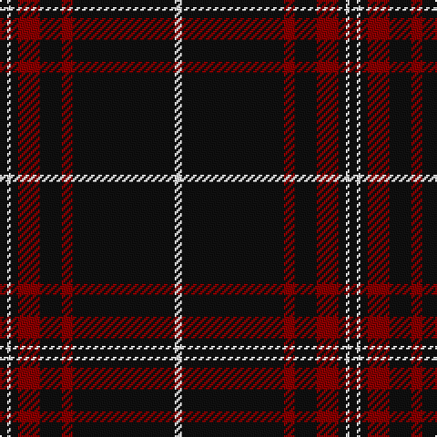

**Bands:** [KWKRKRKW](/stripes/kwkrkrkw/) · **Stripes:** [K W K R K R K W](/stripes/stripes8/) K W K R K R K W

This was sourced from register-of-tartans.  It is a [8 band tartan](/bands/bands8/).

Original link https://www.tartanregister.gov.uk/tartanDetails.aspx?ref=366

## Attestations

This cloth appears in 2 source records; the oldest owns this page.

- 01/10/2004 — Brockton (register-of-tartans, [record](https://www.tartanregister.gov.uk/tartanDetails.aspx?ref=366))
- 2004, October — Brockton (Corporate) (tartans-authority, [record](http://www.tartansauthority.com/tartan-ferret/display/6444/))

## Register references

External register numbers recorded for this tartan.

- Scottish Register of Tartans: [366](https://www.tartanregister.gov.uk/tartanDetails.aspx?ref=366)
- Scottish Tartans Authority (ITI): 6444

## Thread count
K/4 W2 K4 DR12 K12 DR6 K56 W/4

## Palette
Each colour and its ΔE from the base-6 reference it is a variant of.

| Colour | Shade | Base | ΔE (OKLab) |
|---|---|---|---|
| DR | <code style="background-color:#880000;">#880000</code> `#880000` | R <code style="background-color:#CC0000;">#CC0000</code> | 0.15 |
| K | <code style="background-color:#101010;">#101010</code> `#101010` | K <code style="background-color:#000000;">#000000</code> | 0.17 |
| W | <code style="background-color:#FFFFFF;">#FFFFFF</code> `#FFFFFF` | W <code style="background-color:#F7F7F7;">#F7F7F7</code> | 0.02 |

# Sample pattern

## Nearest tartans

The nearest existing variants by ΔTartan distance.

1. [Royal Army PTC Assoc. (Military)](/setts/s8/k59r3k6r3k8r15k2ly3~x2/) — ΔT 0.56
1. [Knights Templar Dress (Corporate)](/setts/s12/k50w4k10r2k2w2r2k14r11k2r4w2~x2/) — ΔT 1.11
1. [Maier (Personal)](/setts/s10/r7k3r3k22r3k3r3k37ly2k4~x2/) — ΔT 1.13
1. [Sunderland of Scotland (Fashion)](/setts/s7/o1k21o5k3o5k9r1~x4/) — ΔT 1.18
1. [Clergy #3](/setts/s12/k10y5k2y5k10w1k26w1y4w1k5w1~x2/) — ΔT 1.20
1. [Menzies Hunting](/setts/s8/k48r4k2r4k6r2k3r9~x2/) — ΔT 1.25
1. [Brand Ambassador](/setts/s9/r4k16w4k16r4k42r20k83r2/) — ΔT 1.26
1. [Harvie](/setts/s5/k4r11k32ly1k4~x2/) — ΔT 1.28
1. [Whitaker (2014)](/setts/s8/k60r3k15r3lb2r5b3r2~x2/) — ΔT 1.28
1. [Erck, Georges van (Personal),](/setts/s8/k38lo1w7lo1k4lo2k3lo2~x2/) — ΔT 1.29

## Neighbour map

Every grey dot is one of 14313 variants placed by the first two principal components of the ΔTartan feature space (44% of its variance). Red is this tartan; blue dots are its nearest — click one to open its page.

<svg viewBox="0 0 640 380" role="img" style="max-width:100%;height:auto;border:1px solid #e0e0e0;border-radius:4px;display:block" xmlns="http://www.w3.org/2000/svg"><image href="/nn/cloud.v1.png" width="640" height="380"/><a href="/setts/s8/k59r3k6r3k8r15k2ly3~x2/"><circle cx="540.2" cy="149.5" r="4" fill="#3465a4"><title>Royal Army PTC Assoc. (Military)</title></circle></a><a href="/setts/s12/k50w4k10r2k2w2r2k14r11k2r4w2~x2/"><circle cx="487.8" cy="124.8" r="4" fill="#3465a4"><title>Knights Templar Dress (Corporate)</title></circle></a><a href="/setts/s10/r7k3r3k22r3k3r3k37ly2k4~x2/"><circle cx="542.9" cy="172.7" r="4" fill="#3465a4"><title>Maier (Personal)</title></circle></a><a href="/setts/s7/o1k21o5k3o5k9r1~x4/"><circle cx="480.2" cy="194.5" r="4" fill="#3465a4"><title>Sunderland of Scotland (Fashion)</title></circle></a><a href="/setts/s12/k10y5k2y5k10w1k26w1y4w1k5w1~x2/"><circle cx="479.3" cy="150.7" r="4" fill="#3465a4"><title>Clergy #3</title></circle></a><a href="/setts/s8/k48r4k2r4k6r2k3r9~x2/"><circle cx="567.3" cy="175.4" r="4" fill="#3465a4"><title>Menzies Hunting</title></circle></a><a href="/setts/s9/r4k16w4k16r4k42r20k83r2/"><circle cx="574.5" cy="146.6" r="4" fill="#3465a4"><title>Brand Ambassador</title></circle></a><a href="/setts/s5/k4r11k32ly1k4~x2/"><circle cx="539.8" cy="185.5" r="4" fill="#3465a4"><title>Harvie</title></circle></a><a href="/setts/s8/k60r3k15r3lb2r5b3r2~x2/"><circle cx="568.4" cy="133.9" r="4" fill="#3465a4"><title>Whitaker (2014)</title></circle></a><a href="/setts/s8/k38lo1w7lo1k4lo2k3lo2~x2/"><circle cx="531.1" cy="120.6" r="4" fill="#3465a4"><title>Erck, Georges van (Personal),</title></circle></a><circle cx="522.1" cy="156.5" r="5" fill="#c00000"/></svg>

ID: /setts/s8/k2w1k2r6k6r3k28w2~x2/
