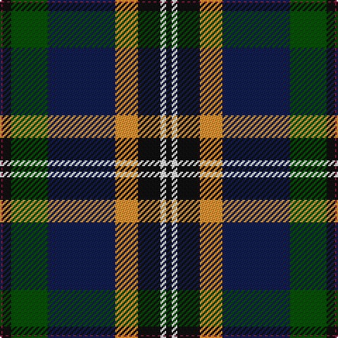

This page is one **sett** — a single exact thread-count. It belongs to the [tartan](/tartans/k2w2k8lo8db24dg13k3m1/)
(the same proportion at any scale), whose colour order is pattern [KWKYBGKR](/stripes/kwkybgkr/).

Sourced from register-of-tartans.  It is a [8 stripe tartan](/stripes/stripes8/).

Original link https://www.tartanregister.gov.uk/tartanDetails.aspx?ref=11053

## Register references

External register numbers recorded for this tartan.

- Scottish Register of Tartans: [11053](https://www.tartanregister.gov.uk/tartanDetails.aspx?ref=11053)

## Thread count
K/4 W4 K16 O16 DB48 G26 K6 DR/2

## Palette

Palette: <strong>Tartan Register</strong> <small style="color:#888">(5 of 6 colours)</small>
<table><thead><tr><th>Colour</th><th>Threads</th><th>Shade</th><th>Base</th><th>OKLCh</th></tr></thead><tbody><tr><td>K/</td><td style="text-align:right;font-variant-numeric:tabular-nums">4</td><td><code style="background-color:#101010;">#101010</code> <small style="color:#888">#101010</small></td><td>K <code style="background-color:#000000;">#000000</code></td><td><small style="color:#888">oklch(17.3% 0.000 89.9)</small></td></tr><tr><td>W</td><td style="text-align:right;font-variant-numeric:tabular-nums">4</td><td><code style="background-color:#FCFCFC;">#FCFCFC</code> <small style="color:#888">#FCFCFC</small></td><td>W <code style="background-color:#F7F7F7;">#F7F7F7</code></td><td><small style="color:#888">oklch(99.1% 0.000 89.9)</small></td></tr><tr><td>K</td><td style="text-align:right;font-variant-numeric:tabular-nums">16</td><td><code style="background-color:#101010;">#101010</code> <small style="color:#888">#101010</small></td><td>K <code style="background-color:#000000;">#000000</code></td><td><small style="color:#888">oklch(17.3% 0.000 89.9)</small></td></tr><tr><td>O</td><td style="text-align:right;font-variant-numeric:tabular-nums">16</td><td><code style="background-color:#DC9436;">#DC9436</code> <small style="color:#888">#DC9436</small></td><td>Y <code style="background-color:#F2BF00;">#F2BF00</code></td><td><small style="color:#888">oklch(72.3% 0.136 69.1)</small></td></tr><tr><td>DB</td><td style="text-align:right;font-variant-numeric:tabular-nums">48</td><td><code style="background-color:#141E46;">#141E46</code> <small style="color:#888">#141E46</small></td><td>B <code style="background-color:#2A418A;">#2A418A</code></td><td><small style="color:#888">oklch(25.2% 0.076 269.7)</small></td></tr><tr><td>G</td><td style="text-align:right;font-variant-numeric:tabular-nums">26</td><td><code style="background-color:#004C00;">#004C00</code> <small style="color:#888">#004C00</small></td><td>G <code style="background-color:#006100;">#006100</code></td><td><small style="color:#888">oklch(36.1% 0.123 142.5)</small></td></tr><tr><td>K</td><td style="text-align:right;font-variant-numeric:tabular-nums">6</td><td><code style="background-color:#101010;">#101010</code> <small style="color:#888">#101010</small></td><td>K <code style="background-color:#000000;">#000000</code></td><td><small style="color:#888">oklch(17.3% 0.000 89.9)</small></td></tr><tr><td>DR/</td><td style="text-align:right;font-variant-numeric:tabular-nums">2</td><td><code style="background-color:#781C38;">#781C38</code> <small style="color:#888">#781C38</small></td><td>R <code style="background-color:#CC0000;">#CC0000</code></td><td><small style="color:#888">oklch(38.7% 0.127 7.4)</small></td></tr></tbody></table>

# Sample pattern

## Nearest tartans

The nearest existing variants by ΔTartan distance, with this tartan at the top so the swatches line up against it.

ΔTartan

Tartan

Sett

—

<a href="/ttd/edit/#slug=k2w2k8lo8db24dg13k3m1~x2">Froben, Christian (Personal)</a> <a class="nn-out" href="/setts/s8/k2w2k8lo8db24dg13k3m1~x2/" title="open its dictionary page">↗</a>

0.72

<a href="/ttd/edit/#slug=lo3k2o15k10dt23r2dt1w2~x2">Vienna Highlander (Fashion)</a> <a class="nn-out" href="/setts/s8/lo3k2o15k10dt23r2dt1w2~x2/" title="open its dictionary page">↗</a>

0.79

<a href="/ttd/edit/#slug=k2w2k8ly8db24g13k3r1~x2">Froben, Christian (Personal)</a> <a class="nn-out" href="/setts/s8/k2w2k8ly8db24g13k3r1~x2/" title="open its dictionary page">↗</a>

0.83

<a href="/ttd/edit/#slug=dbi5w3r12g37k12db21w2~x2">Bergen Scottish</a> <a class="nn-out" href="/setts/s7/dbi5w3r12g37k12db21w2~x2/" title="open its dictionary page">↗</a>

0.87

<a href="/ttd/edit/#slug=r3w2dy10dg37k12db21w2~x2">Jones, The</a> <a class="nn-out" href="/setts/s7/r3w2dy10dg37k12db21w2~x2/" title="open its dictionary page">↗</a>

0.92

<a href="/ttd/edit/#slug=w1k6b9r12k12g32k6ly1~x2">McGeachie (Personal)</a> <a class="nn-out" href="/setts/s8/w1k6b9r12k12g32k6ly1~x2/" title="open its dictionary page">↗</a>

0.95

<a href="/ttd/edit/#slug=n12r2n3r4n15k24dg18ly1k3dg3w3~x2">Groen (Personal)</a> <a class="nn-out" href="/setts/s11/n12r2n3r4n15k24dg18ly1k3dg3w3~x2/" title="open its dictionary page">↗</a>

0.97

<a href="/ttd/edit/#slug=w2r3db33k33g33k6ly2~x2">MacNeil - 1840 (Chief's sett)</a> <a class="nn-out" href="/setts/s7/w2r3db33k33g33k6ly2~x2/" title="open its dictionary page">↗</a>

0.99

<a href="/ttd/edit/#slug=ly3y14k9r2k9db18k3w1~x2">Ayre (Personal)</a> <a class="nn-out" href="/setts/s8/ly3y14k9r2k9db18k3w1~x2/" title="open its dictionary page">↗</a>

1.03

<a href="/ttd/edit/#slug=g3dp4g23k10r2k10t18k1w3~x2">Birch Family Tartan Tartan Number: 2157. Earliest known date: 1993 The Birch family tartan was designed and produced by Mr Robin Birch of Connell Reid kiltmaker, Blairgowrie. The new sett has been recorded by the Scottish Tartans Society. See products available Copyright © Blair Urquhart, Comrie, 2015</a> <a class="nn-out" href="/setts/s9/g3dp4g23k10r2k10t18k1w3~x2/" title="open its dictionary page">↗</a>

1.08

<a href="/ttd/edit/#slug=dg19w2dg5k4db21k4w2dg5w1ly1w1dr14~x2">Womack (2014)</a> <a class="nn-out" href="/setts/s12/dg19w2dg5k4db21k4w2dg5w1ly1w1dr14~x2/" title="open its dictionary page">↗</a>

## Neighbour map

Every grey dot is one of 14359 variants placed by the first two principal components of the ΔTartan feature space (44% of its variance). Red is this tartan; blue dots are its nearest — click one to open its page.

<svg viewBox="0 0 640 380" role="img" style="max-width:100%;height:auto;border:1px solid #e0e0e0;border-radius:4px;display:block" xmlns="http://www.w3.org/2000/svg"><image href="/nn/cloud.v1.png" width="640" height="380"/><a href="/setts/s8/lo3k2o15k10dt23r2dt1w2~x2/"><circle cx="201.4" cy="120.0" r="4" fill="#3465a4"><title>Vienna Highlander (Fashion)</title></circle></a><a href="/setts/s8/k2w2k8ly8db24g13k3r1~x2/"><circle cx="167.1" cy="119.1" r="4" fill="#3465a4"><title>Froben, Christian (Personal)</title></circle></a><a href="/setts/s7/dbi5w3r12g37k12db21w2~x2/"><circle cx="169.7" cy="147.0" r="4" fill="#3465a4"><title>Bergen Scottish</title></circle></a><a href="/setts/s7/r3w2dy10dg37k12db21w2~x2/"><circle cx="199.2" cy="154.7" r="4" fill="#3465a4"><title>Jones, The</title></circle></a><a href="/setts/s8/w1k6b9r12k12g32k6ly1~x2/"><circle cx="211.7" cy="120.3" r="4" fill="#3465a4"><title>McGeachie (Personal)</title></circle></a><a href="/setts/s11/n12r2n3r4n15k24dg18ly1k3dg3w3~x2/"><circle cx="175.8" cy="121.5" r="4" fill="#3465a4"><title>Groen (Personal)</title></circle></a><a href="/setts/s7/w2r3db33k33g33k6ly2~x2/"><circle cx="182.3" cy="161.3" r="4" fill="#3465a4"><title>MacNeil - 1840 (Chief's sett)</title></circle></a><a href="/setts/s8/ly3y14k9r2k9db18k3w1~x2/"><circle cx="159.3" cy="154.5" r="4" fill="#3465a4"><title>Ayre (Personal)</title></circle></a><a href="/setts/s9/g3dp4g23k10r2k10t18k1w3~x2/"><circle cx="160.6" cy="129.2" r="4" fill="#3465a4"><title>Birch Family Tartan Tartan Number: 2157. Earliest known date: 1993 The Birch family tartan was designed and produced by Mr Robin Birch of Connell Reid kiltmaker, Blairgowrie. The new sett has been recorded by the Scottish Tartans Society. See products available Copyright © Blair Urquhart, Comrie, 2015</title></circle></a><a href="/setts/s12/dg19w2dg5k4db21k4w2dg5w1ly1w1dr14~x2/"><circle cx="178.6" cy="118.6" r="4" fill="#3465a4"><title>Womack (2014)</title></circle></a><circle cx="187.6" cy="131.2" r="5" fill="#c00000"/></svg>

ID: /setts/s8/k2w2k8lo8db24dg13k3m1~x2/
