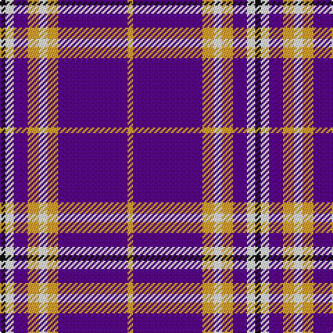

In pattern [KWBYWYBY](/patterns/kwbywyby/).

This was sourced from register-of-tartans.  It is a [8 stripes tartan](/stripes/stripes8/).

Original link https://www.tartanregister.gov.uk/tartanDetails.aspx?ref=11391

## Thread count
K/4 W6 P10 Y8 W6 Y8 P50 Y/4

## Palette
Each colour and its ΔE from the base-6 reference it is a variant of.

| Colour | Shade | Base | ΔE (OKLab) |
|---|---|---|---|
| K | <code style="background-color:#101010;">#101010</code> `#101010` | K <code style="background-color:#000000;">#000000</code> | 0.17 |
| P | <code style="background-color:#5A008C;">#5A008C</code> `#5A008C` | B <code style="background-color:#2A418A;">#2A418A</code> | 0.13 |
| W | <code style="background-color:#FFFFFF;">#FFFFFF</code> `#FFFFFF` | W <code style="background-color:#F7F7F7;">#F7F7F7</code> | 0.02 |
| Y | <code style="background-color:#E0A126;">#E0A126</code> `#E0A126` | Y <code style="background-color:#F2BF00;">#F2BF00</code> | 0.08 |

# Sample pattern

## Nearest tartans

The nearest existing variants by ΔTartan distance.

1. [Good Morning America (Corporate)](/setts/s11/b2w2r2w2r2b2r2b12y1b2w2~b2c2c80-rc8002c-wf8f8f8-ye8c000~x4/) — ΔT 1.14
1. [Yudo (Corporate)](/setts/s9/k2r9w2b2w4b2w2b20w2~b2c2c80-k101010-rc80000-wf8f8f8~x4/) — ΔT 1.32
1. [Ayllu Thuban](/setts/s5/b46k6g9y9r4~b820bbb-g009900-k000000-ree0000-yffcc11/) — ΔT 1.37
1. [Cramer (Personal)](/setts/s6/b24k4w10ba3b3wa2~b780078-ba2c2c80-k101010-wc0c0c0-wafcfcfc~x2/) — ΔT 1.40
1. [Laing of Archiestown](/setts/s8/k1r1w1r1b8r1w1r1~b2c2c80-k101010-rc80000-wfcfcfc~x8/) — ΔT 1.42
1. [Loughborough Sport](/setts/s7/k15b3w10b7ba40w3ba6~b646464-ba5a008c-k000000-wfcfcfc~x2/) — ΔT 1.53
1. [Loughborough Sport](/setts/s7/r15b3w10b7ba40w3ba6~b5c5c5c-ba780078-re87878-wfcfcfc~x2/) — ΔT 1.53
1. [Longniddry Dress District Tartan Tartan Number: 88. Earliest known date: pre 2003 A dancers tartan from D.C. Dalgleish weavers of Selkirk See products available Copyright © Blair Urquhart, Comrie, 2015](/setts/s8/b42ba2w2ba2b5bb12w32b4~b780078-ba2c2c80-bb2888c4-we0e0e0~x2/) — ΔT 1.53
1. [Frame Family Tartan Tartan Number: 1777. Earliest known date: 1983 Designed around 1982 by Donald B. Frame of 15584 Cornell Trail, Rosemont, MN 55068. USA and registered with Scottish Tartans Society. Other STS notes say 'Robert Frame' and Archie Frame from Ayrshire.. Sindex notes add "Mr Frame wrote of the design, 'arrived at after years of doodling ... the flag colours of Britain, Scotland and the US. B&W stripes in the red: R&W in the blue with St Andrews cross in the blue. A tartan is lines and stripes at right angles to each other.'!!" See products available Copyright © Blair Urquhart, Comrie, 2015](/setts/s12/w4b14r1b1w1b1r1b14r14b1r1w1~b2c2c80-rc80000-we0e0e0~x2/) — ΔT 1.54
1. [Longniddry Dress (Dance)](/setts/s8/b42w2wa2w2b5ba12wa32b4~b780078-ba2888c4-wa8ace8-wae0e0e0~x2/) — ΔT 1.60

## Neighbour map

Every grey dot is one of 15726 variants placed by the first two principal components of the ΔTartan feature space (44% of its variance). Red is this tartan; blue dots are its nearest — click one to open its page.

<svg viewBox="0 0 640 380" role="img" style="max-width:100%;height:auto;border:1px solid #e0e0e0;border-radius:4px;display:block" xmlns="http://www.w3.org/2000/svg"><image href="/nn/cloud.v1.png" width="640" height="380"/><a href="/setts/s11/b2w2r2w2r2b2r2b12y1b2w2~b2c2c80-rc8002c-wf8f8f8-ye8c000~x4/"><circle cx="284.1" cy="146.6" r="4" fill="#3465a4"><title>Good Morning America (Corporate)</title></circle></a><a href="/setts/s9/k2r9w2b2w4b2w2b20w2~b2c2c80-k101010-rc80000-wf8f8f8~x4/"><circle cx="256.9" cy="151.6" r="4" fill="#3465a4"><title>Yudo (Corporate)</title></circle></a><a href="/setts/s5/b46k6g9y9r4~b820bbb-g009900-k000000-ree0000-yffcc11/"><circle cx="308.3" cy="163.1" r="4" fill="#3465a4"><title>Ayllu Thuban</title></circle></a><a href="/setts/s6/b24k4w10ba3b3wa2~b780078-ba2c2c80-k101010-wc0c0c0-wafcfcfc~x2/"><circle cx="297.7" cy="160.2" r="4" fill="#3465a4"><title>Cramer (Personal)</title></circle></a><a href="/setts/s8/k1r1w1r1b8r1w1r1~b2c2c80-k101010-rc80000-wfcfcfc~x8/"><circle cx="268.0" cy="163.5" r="4" fill="#3465a4"><title>Laing of Archiestown</title></circle></a><a href="/setts/s7/k15b3w10b7ba40w3ba6~b646464-ba5a008c-k000000-wfcfcfc~x2/"><circle cx="267.8" cy="165.4" r="4" fill="#3465a4"><title>Loughborough Sport</title></circle></a><a href="/setts/s7/r15b3w10b7ba40w3ba6~b5c5c5c-ba780078-re87878-wfcfcfc~x2/"><circle cx="290.7" cy="159.0" r="4" fill="#3465a4"><title>Loughborough Sport</title></circle></a><a href="/setts/s8/b42ba2w2ba2b5bb12w32b4~b780078-ba2c2c80-bb2888c4-we0e0e0~x2/"><circle cx="290.9" cy="126.9" r="4" fill="#3465a4"><title>Longniddry Dress District Tartan Tartan Number: 88. Earliest known date: pre 2003 A dancers tartan from D.C. Dalgleish weavers of Selkirk See products available Copyright © Blair Urquhart, Comrie, 2015</title></circle></a><a href="/setts/s12/w4b14r1b1w1b1r1b14r14b1r1w1~b2c2c80-rc80000-we0e0e0~x2/"><circle cx="348.8" cy="149.7" r="4" fill="#3465a4"><title>Frame Family Tartan Tartan Number: 1777. Earliest known date: 1983 Designed around 1982 by Donald B. Frame of 15584 Cornell Trail, Rosemont, MN 55068. USA and registered with Scottish Tartans Society. Other STS notes say 'Robert Frame' and Archie Frame from Ayrshire.. Sindex notes add &quot;Mr Frame wrote of the design, 'arrived at after years of doodling ... the flag colours of Britain, Scotland and the US. B&amp;W stripes in the red: R&amp;W in the blue with St Andrews cross in the blue. A tartan is lines and stripes at right angles to each other.'!!&quot; See products available Copyright © Blair Urquhart, Comrie, 2015</title></circle></a><a href="/setts/s8/b42w2wa2w2b5ba12wa32b4~b780078-ba2888c4-wa8ace8-wae0e0e0~x2/"><circle cx="291.3" cy="126.2" r="4" fill="#3465a4"><title>Longniddry Dress (Dance)</title></circle></a><circle cx="335.2" cy="147.1" r="5" fill="#c00000"/></svg>

ID: /setts/s8/k2w3b5y4w3y4b25y2~b5a008c-k101010-wffffff-ye0a126~x2/
