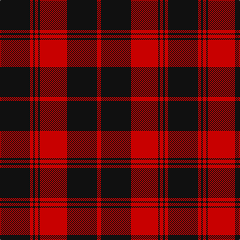

**Bands:** [KRKRKRKR](/stripes/krkrkrkr/) · **Stripes:** [K R K R K R K R](/stripes/stripes8/) K R K R K R K R

This was sourced from tartans-authority.  It is a [8 band tartan](/bands/bands8/).

Original link http://www.tartansauthority.com/tartan-ferret/display/8415/

## Variants

Other setts woven to the same stripe pattern.

- [MacLeod #2](/setts/s8/k12r3k2r16k8r12k2r3~x2/)
- [Menzies Hunting](/setts/s8/k48r4k2r4k6r2k3r9~x2/)

## Thread count
K/60 R6 K4 R6 K4 R54 K60 R/8

## Palette
Each colour and its ΔE from the base-6 reference it is a variant of.

| Colour | Shade | Base | ΔE (OKLab) |
|---|---|---|---|
| K | <code style="background-color:#101010;">#101010</code> `#101010` | K <code style="background-color:#000000;">#000000</code> | 0.17 |
| R | <code style="background-color:#C80000;">#C80000</code> `#C80000` | R <code style="background-color:#CC0000;">#CC0000</code> | 0.01 |

# Sample pattern

## Nearest tartans

The nearest existing variants by ΔTartan distance.

1. [Cameron Black & Red (Dress)](/setts/s6/k2r12k2r12k33r2~x2/) — ΔT 1.19
1. [Ewing](/setts/s6/k23r3k1r12~x4/) — ΔT 1.20
1. [Cameron, Black & Red (dress)](/setts/s6/k1r4k1r4k13r1~x4/) — ΔT 1.44
1. [The Mary Erskine](/setts/s6/k3r1k16r16k1r3~x4/) — ΔT 1.58
1. [Erskine, Black & Red (Clan)](/setts/s6/k6r3k28r28k3r6~x2/) — ΔT 1.64
1. [Lougheed](/setts/s8/lb3r3k4lb2r18k1r2k2~x4/) — ΔT 1.65
1. [MacQueen](/setts/s6/k2r6k2r6k12ly1~x4/) — ΔT 1.65
1. [Inverness, Augustus](/setts/s7/m18g1k5g1k1g1m9~x2/) — ΔT 1.66
1. [Auburn University (Alabama) (Corp)](/setts/s6/db3o3db24o30db3o2~x2/) — ΔT 1.67
1. [University of South Carolina (Corp)](/setts/s10/r4k4r3k8w3r3k20r40w2r4/) — ΔT 1.67

## Neighbour map

Every grey dot is one of 14299 variants placed by the first two principal components of the ΔTartan feature space (44% of its variance). Red is this tartan; blue dots are its nearest — click one to open its page.

<svg viewBox="0 0 640 380" role="img" style="max-width:100%;height:auto;border:1px solid #e0e0e0;border-radius:4px;display:block" xmlns="http://www.w3.org/2000/svg"><image href="/nn/cloud.v1.png" width="640" height="380"/><a href="/setts/s6/k2r12k2r12k33r2~x2/"><circle cx="454.6" cy="224.8" r="4" fill="#3465a4"><title>Cameron Black &amp; Red (Dress)</title></circle></a><a href="/setts/s6/k23r3k1r12~x4/"><circle cx="431.0" cy="183.7" r="4" fill="#3465a4"><title>Ewing</title></circle></a><a href="/setts/s6/k1r4k1r4k13r1~x4/"><circle cx="417.0" cy="213.1" r="4" fill="#3465a4"><title>Cameron, Black &amp; Red (dress)</title></circle></a><a href="/setts/s6/k3r1k16r16k1r3~x4/"><circle cx="376.1" cy="205.0" r="4" fill="#3465a4"><title>The Mary Erskine</title></circle></a><a href="/setts/s6/k6r3k28r28k3r6~x2/"><circle cx="361.6" cy="231.6" r="4" fill="#3465a4"><title>Erskine, Black &amp; Red (Clan)</title></circle></a><a href="/setts/s8/lb3r3k4lb2r18k1r2k2~x4/"><circle cx="423.4" cy="155.6" r="4" fill="#3465a4"><title>Lougheed</title></circle></a><a href="/setts/s6/k2r6k2r6k12ly1~x4/"><circle cx="342.4" cy="216.7" r="4" fill="#3465a4"><title>MacQueen</title></circle></a><a href="/setts/s7/m18g1k5g1k1g1m9~x2/"><circle cx="508.5" cy="180.1" r="4" fill="#3465a4"><title>Inverness, Augustus</title></circle></a><a href="/setts/s6/db3o3db24o30db3o2~x2/"><circle cx="411.9" cy="211.4" r="4" fill="#3465a4"><title>Auburn University (Alabama) (Corp)</title></circle></a><a href="/setts/s10/r4k4r3k8w3r3k20r40w2r4/"><circle cx="402.7" cy="141.4" r="4" fill="#3465a4"><title>University of South Carolina (Corp)</title></circle></a><circle cx="438.1" cy="204.6" r="5" fill="#c00000"/></svg>

ID: /setts/s8/k30r3k2r3k2r27k30r4~x2/
