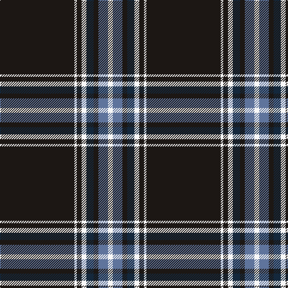

In pattern [KWKWBKBW](/stripes/kwkwbkbw/).

This was sourced from register-of-tartans.  It is a [8 stripe tartan](/stripes/stripes8/).

Original link https://www.tartanregister.gov.uk/tartanDetails.aspx?ref=11380

## Register references

External register numbers recorded for this tartan.

- Scottish Register of Tartans: [11380](https://www.tartanregister.gov.uk/tartanDetails.aspx?ref=11380)

## Thread count
K/124 W4 K8 W8 DN12 K8 B16 W/8

## Palette
Each colour and its ΔE from the base-6 reference it is a variant of.

| Colour | Shade | Base | ΔE (OKLab) |
|---|---|---|---|
| B | <code style="background-color:#5F749C;">#5F749C</code> `#5F749C` | B <code style="background-color:#2A418A;">#2A418A</code> | 0.17 |
| DN | <code style="background-color:#14283C;">#14283C</code> `#14283C` | B <code style="background-color:#2A418A;">#2A418A</code> | 0.15 |
| K | <code style="background-color:#1C1714;">#1C1714</code> `#1C1714` | K <code style="background-color:#000000;">#000000</code> | 0.21 |
| W | <code style="background-color:#F8F8F8;">#F8F8F8</code> `#F8F8F8` | W <code style="background-color:#F7F7F7;">#F7F7F7</code> | 0.00 |

# Sample pattern

## Nearest tartans

The nearest existing variants by ΔTartan distance.

1. [State University of New York College at Buffalo](/setts/s8/k70r5k3lb4dp4lb4k3r12/) — ΔT 0.93
1. [Washington County Sheriff’s Office (Oregon)](/setts/s8/t6k6t6db3w1k39ly3k3~x2/) — ΔT 1.09
1. [Washington County Sheriff's Office](/setts/s8/lb6k6lb6b3w1k39lo3k3~x2/) — ΔT 1.09
1. [Marine Harvest Scotland (Corporate)](/setts/s8/b10lb2k2b1k6lb1k45lo2~x2/) — ΔT 1.10
1. [degli Uberti, Baron of Cartsburn (Personal)](/setts/s8/db8r1k6r1lo8r1k45lo1~x2/) — ΔT 1.11
1. [Crane of Cluny Mourning](/setts/s8/k83w6k3w9r2w5k2lo2~x2/) — ΔT 1.12
1. [Brooks Brothers Signature](/setts/s9/db5ly1g7r1db45r5ly3db4ly3~x2/) — ΔT 1.15
1. [Erck, Georges van (Personal),](/setts/s8/k38lo1w7lo1k4lo2k3lo2~x2/) — ΔT 1.22
1. [Montrose Football Club](/setts/s6/w6r13dt80w4dt2w4/) — ΔT 1.30
1. [Black Country (District)](/setts/s8/k21r1k1ly1k1r1k3w3~x6/) — ΔT 1.31

## Neighbour map

Every grey dot is one of 14299 variants placed by the first two principal components of the ΔTartan feature space (44% of its variance). Red is this tartan; blue dots are its nearest — click one to open its page.

<svg viewBox="0 0 640 380" role="img" style="max-width:100%;height:auto;border:1px solid #e0e0e0;border-radius:4px;display:block" xmlns="http://www.w3.org/2000/svg"><image href="/nn/cloud.v1.png" width="640" height="380"/><a href="/setts/s8/k70r5k3lb4dp4lb4k3r12/"><circle cx="464.0" cy="120.3" r="4" fill="#3465a4"><title>State University of New York College at Buffalo</title></circle></a><a href="/setts/s8/t6k6t6db3w1k39ly3k3~x2/"><circle cx="447.3" cy="105.5" r="4" fill="#3465a4"><title>Washington County Sheriff’s Office (Oregon)</title></circle></a><a href="/setts/s8/lb6k6lb6b3w1k39lo3k3~x2/"><circle cx="438.3" cy="99.0" r="4" fill="#3465a4"><title>Washington County Sheriff's Office</title></circle></a><a href="/setts/s8/b10lb2k2b1k6lb1k45lo2~x2/"><circle cx="539.6" cy="118.1" r="4" fill="#3465a4"><title>Marine Harvest Scotland (Corporate)</title></circle></a><a href="/setts/s8/db8r1k6r1lo8r1k45lo1~x2/"><circle cx="499.8" cy="118.3" r="4" fill="#3465a4"><title>degli Uberti, Baron of Cartsburn (Personal)</title></circle></a><a href="/setts/s8/k83w6k3w9r2w5k2lo2~x2/"><circle cx="527.8" cy="91.4" r="4" fill="#3465a4"><title>Crane of Cluny Mourning</title></circle></a><a href="/setts/s9/db5ly1g7r1db45r5ly3db4ly3~x2/"><circle cx="481.9" cy="103.5" r="4" fill="#3465a4"><title>Brooks Brothers Signature</title></circle></a><a href="/setts/s8/k38lo1w7lo1k4lo2k3lo2~x2/"><circle cx="530.8" cy="120.2" r="4" fill="#3465a4"><title>Erck, Georges van (Personal),</title></circle></a><a href="/setts/s6/w6r13dt80w4dt2w4/"><circle cx="524.1" cy="137.0" r="4" fill="#3465a4"><title>Montrose Football Club</title></circle></a><a href="/setts/s8/k21r1k1ly1k1r1k3w3~x6/"><circle cx="528.7" cy="133.7" r="4" fill="#3465a4"><title>Black Country (District)</title></circle></a><circle cx="484.1" cy="117.0" r="5" fill="#c00000"/></svg>

ID: /setts/s8/k31w1k2w2dt3k2t4w2~x4/
