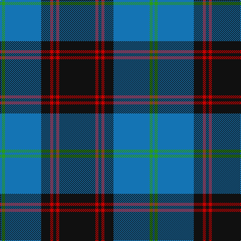

In pattern [BGBKRKRK](/patterns/bgbkrkrk/).

This was sourced from tartans-authority.  It is a [8 stripes tartan](/stripes/stripes8/).

Original link http://www.tartansauthority.com/tartan-ferret/display/128/

## Thread count
B/4 G6 B72 K18 R6 K6 R6 K/72

## Palette
Each colour and its ΔE from the base-6 reference it is a variant of.

| Colour | Shade | Base | ΔE (OKLab) |
|---|---|---|---|
| B | <code style="background-color:#1474B4;">#1474B4</code> `#1474B4` | B <code style="background-color:#2A418A;">#2A418A</code> | 0.15 |
| G | <code style="background-color:#289C18;">#289C18</code> `#289C18` | G <code style="background-color:#006100;">#006100</code> | 0.19 |
| K | <code style="background-color:#101010;">#101010</code> `#101010` | K <code style="background-color:#000000;">#000000</code> | 0.17 |
| R | <code style="background-color:#C80000;">#C80000</code> `#C80000` | R <code style="background-color:#CC0000;">#CC0000</code> | 0.01 |

# Sample pattern

## Nearest tartans

The nearest existing variants by ΔTartan distance.

1. [Ewbank](/setts/s9/r3b14y2k2b14k36y2k2y2x2~b1474b4-k101010-rc80000-ye8c000/) — ΔT 0.60
1. [Sorbie (Name)](/setts/s6/r1b1k17b17k1w1x4~b1474b4-k101010-rc80000-wfcfcfc/) — ΔT 0.83
1. [Sorbie](/setts/s10/k1b17k17b1r1b1k17b17k1w1x4~b1474b4-k101010-rc80000-wfcfcfc/) — ΔT 0.89
1. [Rhys (Welsh Name)](/setts/s10/y6b3y3b15ba7y7ba5y17ba46y4~b202060-ba000048-ya08858/) — ΔT 0.92
1. [Gracie](/setts/s8/g47r3g6b35y3b35g6r3x2~b1c0070-g006818-r880000-yd09800/) — ΔT 0.93
1. [Colvin](/setts/s8/b36w4b4w4b16g64r9b6x2~b00008c-g004c00-r8c0000-wc8c8c8/) — ΔT 0.97
1. [Greenways Marketing Intl (Corporate)](/setts/s7/b24g3b3g3y2g18r2x2~b1c0070-g006818-r880000-yd09800/) — ΔT 1.00
1. [Frederiction Police Force](/setts/s8/r6k55b8g6b10g6b6g4x2~b2c2c80-g289c18-k101010-rc80000/) — ΔT 1.03
1. [MacRobart](/setts/s6/b72k21g16ba3g17ba3x2~b304080-ba5480b0-g008000-k000000/) — ΔT 1.04
1. [Kunbi](/setts/s8/k76b11k3y6k3b13k11r76~b003c64-k101010-r888888-ye8c000/) — ΔT 1.05

## Neighbour map

Every grey dot is one of 15726 variants placed by the first two principal components of the ΔTartan feature space (44% of its variance). Red is this tartan; blue dots are its nearest — click one to open its page.

<svg viewBox="0 0 640 380" role="img" style="max-width:100%;height:auto;border:1px solid #e0e0e0;border-radius:4px;display:block" xmlns="http://www.w3.org/2000/svg"><image href="/nn/cloud.v1.png" width="640" height="380"/><a href="/setts/s9/r3b14y2k2b14k36y2k2y2x2~b1474b4-k101010-rc80000-ye8c000/"><circle cx="305.6" cy="144.7" r="4" fill="#3465a4"><title>Ewbank</title></circle></a><a href="/setts/s6/r1b1k17b17k1w1x4~b1474b4-k101010-rc80000-wfcfcfc/"><circle cx="312.5" cy="173.7" r="4" fill="#3465a4"><title>Sorbie (Name)</title></circle></a><a href="/setts/s10/k1b17k17b1r1b1k17b17k1w1x4~b1474b4-k101010-rc80000-wfcfcfc/"><circle cx="312.1" cy="164.0" r="4" fill="#3465a4"><title>Sorbie</title></circle></a><a href="/setts/s10/y6b3y3b15ba7y7ba5y17ba46y4~b202060-ba000048-ya08858/"><circle cx="282.1" cy="158.6" r="4" fill="#3465a4"><title>Rhys (Welsh Name)</title></circle></a><a href="/setts/s8/g47r3g6b35y3b35g6r3x2~b1c0070-g006818-r880000-yd09800/"><circle cx="323.1" cy="187.8" r="4" fill="#3465a4"><title>Gracie</title></circle></a><a href="/setts/s8/b36w4b4w4b16g64r9b6x2~b00008c-g004c00-r8c0000-wc8c8c8/"><circle cx="286.7" cy="174.9" r="4" fill="#3465a4"><title>Colvin</title></circle></a><a href="/setts/s7/b24g3b3g3y2g18r2x2~b1c0070-g006818-r880000-yd09800/"><circle cx="309.1" cy="195.4" r="4" fill="#3465a4"><title>Greenways Marketing Intl (Corporate)</title></circle></a><a href="/setts/s8/r6k55b8g6b10g6b6g4x2~b2c2c80-g289c18-k101010-rc80000/"><circle cx="318.8" cy="168.1" r="4" fill="#3465a4"><title>Frederiction Police Force</title></circle></a><a href="/setts/s6/b72k21g16ba3g17ba3x2~b304080-ba5480b0-g008000-k000000/"><circle cx="324.5" cy="172.4" r="4" fill="#3465a4"><title>MacRobart</title></circle></a><a href="/setts/s8/k76b11k3y6k3b13k11r76~b003c64-k101010-r888888-ye8c000/"><circle cx="295.8" cy="140.3" r="4" fill="#3465a4"><title>Kunbi</title></circle></a><circle cx="315.4" cy="160.9" r="5" fill="#c00000"/></svg>

ID: /setts/s8/k36r3k3r3k9b36g3b2x2~b1474b4-g289c18-k101010-rc80000/
