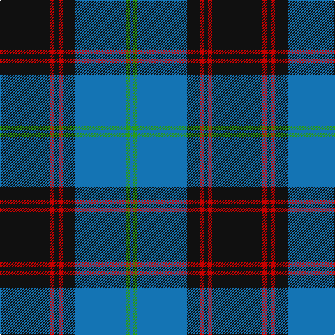

**Bands:** [KRKRKBGB](/stripes/krkrkbgb/) · **Stripes:** [K R K R K B G B](/stripes/stripes8/) K R K R K B G B

This was sourced from tartans-authority.  It is a [8 band tartan](/bands/bands8/).

Original link http://www.tartansauthority.com/tartan-ferret/display/128/

## Thread count
K/72 R6 K6 R6 K18 B72 G6 B/4

## Palette
Each colour and its ΔE from the base-6 reference it is a variant of.

| Colour | Shade | Base | ΔE (OKLab) |
|---|---|---|---|
| B | <code style="background-color:#1474B4;">#1474B4</code> `#1474B4` | B <code style="background-color:#2A418A;">#2A418A</code> | 0.15 |
| G | <code style="background-color:#289C18;">#289C18</code> `#289C18` | G <code style="background-color:#006100;">#006100</code> | 0.19 |
| K | <code style="background-color:#101010;">#101010</code> `#101010` | K <code style="background-color:#000000;">#000000</code> | 0.17 |
| R | <code style="background-color:#C80000;">#C80000</code> `#C80000` | R <code style="background-color:#CC0000;">#CC0000</code> | 0.01 |

# Sample pattern

## Nearest tartans

The nearest existing variants by ΔTartan distance.

1. [Ewbank](/setts/s9/r3b14ly2k2b14k36ly2k2ly2~x2/) — ΔT 0.60
1. [Sorbie (Name)](/setts/s6/r1b1k17b17k1w1~x4/) — ΔT 0.83
1. [Sorbie](/setts/s10/k1b17k17b1r1b1k17b17k1w1~x4/) — ΔT 0.89
1. [Rhys (Welsh Name)](/setts/s10/lo6db3lo3db15db7lo7db5lo17db46lo4/) — ΔT 0.92
1. [Gracie](/setts/s8/g47r3g6db35lo3~x2/) — ΔT 0.93
1. [Colvin](/setts/s8/db36lb4db4lb4db16dg64r9db6~x2/) — ΔT 0.97
1. [Greenways Marketing Intl (Corporate)](/setts/s7/db24g3db3g3lo2g18r2~x2/) — ΔT 1.00
1. [Frederiction Police Force](/setts/s8/r6k55db8g6db10g6db6g4~x2/) — ΔT 1.03
1. [MacRobart](/setts/s6/db72k21g16t3g17t3~x2/) — ΔT 1.04
1. [Kunbi](/setts/s8/k76dt11k3ly6k3dt13k11o76/) — ΔT 1.05

## Neighbour map

Every grey dot is one of 14299 variants placed by the first two principal components of the ΔTartan feature space (44% of its variance). Red is this tartan; blue dots are its nearest — click one to open its page.

<svg viewBox="0 0 640 380" role="img" style="max-width:100%;height:auto;border:1px solid #e0e0e0;border-radius:4px;display:block" xmlns="http://www.w3.org/2000/svg"><image href="/nn/cloud.v1.png" width="640" height="380"/><a href="/setts/s9/r3b14ly2k2b14k36ly2k2ly2~x2/"><circle cx="308.8" cy="143.1" r="4" fill="#3465a4"><title>Ewbank</title></circle></a><a href="/setts/s6/r1b1k17b17k1w1~x4/"><circle cx="316.0" cy="172.5" r="4" fill="#3465a4"><title>Sorbie (Name)</title></circle></a><a href="/setts/s10/k1b17k17b1r1b1k17b17k1w1~x4/"><circle cx="315.6" cy="163.9" r="4" fill="#3465a4"><title>Sorbie</title></circle></a><a href="/setts/s10/lo6db3lo3db15db7lo7db5lo17db46lo4/"><circle cx="285.4" cy="158.8" r="4" fill="#3465a4"><title>Rhys (Welsh Name)</title></circle></a><a href="/setts/s8/g47r3g6db35lo3~x2/"><circle cx="326.3" cy="189.7" r="4" fill="#3465a4"><title>Gracie</title></circle></a><a href="/setts/s8/db36lb4db4lb4db16dg64r9db6~x2/"><circle cx="290.6" cy="177.4" r="4" fill="#3465a4"><title>Colvin</title></circle></a><a href="/setts/s7/db24g3db3g3lo2g18r2~x2/"><circle cx="312.4" cy="196.9" r="4" fill="#3465a4"><title>Greenways Marketing Intl (Corporate)</title></circle></a><a href="/setts/s8/r6k55db8g6db10g6db6g4~x2/"><circle cx="321.7" cy="168.7" r="4" fill="#3465a4"><title>Frederiction Police Force</title></circle></a><a href="/setts/s6/db72k21g16t3g17t3~x2/"><circle cx="327.8" cy="172.8" r="4" fill="#3465a4"><title>MacRobart</title></circle></a><a href="/setts/s8/k76dt11k3ly6k3dt13k11o76/"><circle cx="298.7" cy="139.4" r="4" fill="#3465a4"><title>Kunbi</title></circle></a><circle cx="318.7" cy="160.7" r="5" fill="#c00000"/></svg>

ID: /setts/s8/k36r3k3r3k9b36g3b2~x2/
