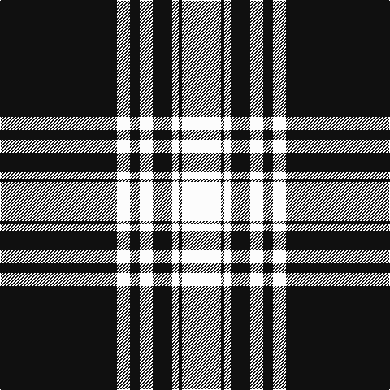

**Bands:** [KWKWKWKW](/stripes/kwkwkwkw/) · **Stripes:** [K W K W K W K W](/stripes/stripes8/) K W K W K W K W

This was sourced from register-of-tartans.  It is a [8 band tartan](/bands/bands8/).

Original link https://www.tartanregister.gov.uk/tartanDetails.aspx?ref=2924

## Attestations

This cloth appears in 2 source records; the oldest owns this page.

- 01/01/1934 — Menzies (1938) (register-of-tartans, [record](https://www.tartanregister.gov.uk/tartanDetails.aspx?ref=2924))
- pre 1934 — Menzies 1938 - Mourning (Clan) (tartans-authority, [record](http://www.tartansauthority.com/tartan-ferret/display/1244/))

## Register references

External register numbers recorded for this tartan.

- Scottish Register of Tartans: [2924](https://www.tartanregister.gov.uk/tartanDetails.aspx?ref=2924)
- Scottish Tartans Authority (ITI): 1244
- Scottish Tartans World Register: 1244

## Variants

Other setts woven to the same stripe pattern.

- [Menzies](/setts/s8/k32w4k2w4k4w2k1w6~x2/)

## Thread count
K/144 W16 K12 W16 K24 W8 K4 W/48

## Palette
Each colour and its ΔE from the base-6 reference it is a variant of.

| Colour | Shade | Base | ΔE (OKLab) |
|---|---|---|---|
| K | <code style="background-color:#101010;">#101010</code> `#101010` | K <code style="background-color:#000000;">#000000</code> | 0.17 |
| W | <code style="background-color:#FCFCFC;">#FCFCFC</code> `#FCFCFC` | W <code style="background-color:#F7F7F7;">#F7F7F7</code> | 0.01 |

# Sample pattern

## Nearest tartans

The nearest existing variants by ΔTartan distance.

1. [Moonlight Glen (Fashion)](/setts/s9/lr3k40lr4w6k10w10k3lr1w3~x2/) — ΔT 1.08
1. [University of Cincinnati](/setts/s8/k66w1r8k14w14k6r11w8~x4/) — ΔT 1.44
1. [University of Cincinnati](/setts/s8/k66w1r8k14w14k6r11w8~x2/) — ΔT 1.44
1. [MacPhee MacFee or MacIver](/setts/s5/k22w3k3w11k1~x2/) — ΔT 1.46
1. [Gretna Football Club](/setts/s12/w36k8w36k95w4k4r6k4w4k95w36k8/) — ΔT 1.48
1. [Stuart/Stewart Mourning](/setts/s12/k43w4k6w2k3w2k3w9k5w3k3w3~x2/) — ΔT 1.51
1. [Menzies](/setts/s8/k32w4k2w4k4w2k1w6~x2/) — ΔT 1.54
1. [Myles, Lee (Name)](/setts/s10/r2lb3r1lb9k4lb13k33lb1k4r1~x2/) — ΔT 1.55
1. [Bargain Booze](/setts/s7/k75lb6k5lb18k2lb2k3~x2/) — ΔT 1.64
1. [Menzies Navy design Tartan Tartan Number: 12424. Earliest known date: See products available Copyright © Blair Urquhart, Comrie, 2015](/setts/s8/dt32w4dt2w4dt4w2dt1w6~x2/) — ΔT 1.65

## Neighbour map

Every grey dot is one of 14313 variants placed by the first two principal components of the ΔTartan feature space (44% of its variance). Red is this tartan; blue dots are its nearest — click one to open its page.

<svg viewBox="0 0 640 380" role="img" style="max-width:100%;height:auto;border:1px solid #e0e0e0;border-radius:4px;display:block" xmlns="http://www.w3.org/2000/svg"><image href="/nn/cloud.v1.png" width="640" height="380"/><a href="/setts/s9/lr3k40lr4w6k10w10k3lr1w3~x2/"><circle cx="416.5" cy="117.6" r="4" fill="#3465a4"><title>Moonlight Glen (Fashion)</title></circle></a><a href="/setts/s8/k66w1r8k14w14k6r11w8~x4/"><circle cx="432.6" cy="117.3" r="4" fill="#3465a4"><title>University of Cincinnati</title></circle></a><a href="/setts/s8/k66w1r8k14w14k6r11w8~x2/"><circle cx="433.6" cy="118.5" r="4" fill="#3465a4"><title>University of Cincinnati</title></circle></a><a href="/setts/s5/k22w3k3w11k1~x2/"><circle cx="413.2" cy="197.3" r="4" fill="#3465a4"><title>MacPhee MacFee or MacIver</title></circle></a><a href="/setts/s12/w36k8w36k95w4k4r6k4w4k95w36k8/"><circle cx="378.1" cy="126.1" r="4" fill="#3465a4"><title>Gretna Football Club</title></circle></a><a href="/setts/s12/k43w4k6w2k3w2k3w9k5w3k3w3~x2/"><circle cx="481.2" cy="138.0" r="4" fill="#3465a4"><title>Stuart/Stewart Mourning</title></circle></a><a href="/setts/s8/k32w4k2w4k4w2k1w6~x2/"><circle cx="479.6" cy="150.0" r="4" fill="#3465a4"><title>Menzies</title></circle></a><a href="/setts/s10/r2lb3r1lb9k4lb13k33lb1k4r1~x2/"><circle cx="374.1" cy="116.3" r="4" fill="#3465a4"><title>Myles, Lee (Name)</title></circle></a><a href="/setts/s7/k75lb6k5lb18k2lb2k3~x2/"><circle cx="548.6" cy="148.5" r="4" fill="#3465a4"><title>Bargain Booze</title></circle></a><a href="/setts/s8/dt32w4dt2w4dt4w2dt1w6~x2/"><circle cx="484.2" cy="148.2" r="4" fill="#3465a4"><title>Menzies Navy design Tartan Tartan Number: 12424. Earliest known date: See products available Copyright © Blair Urquhart, Comrie, 2015</title></circle></a><circle cx="452.4" cy="140.6" r="5" fill="#c00000"/></svg>

ID: /setts/s8/k36w4k3w4k6w2k1w12~x4/
