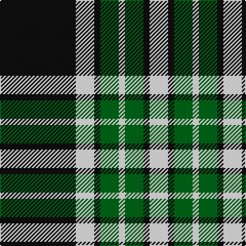

In pattern [KWKGWGKW](/stripes/kwkgwgkw/).

This was sourced from register-of-tartans.  It is a [8 stripe tartan](/stripes/stripes8/).

Original link https://www.tartanregister.gov.uk/tartanDetails.aspx?ref=1372

## Also known as

This cloth is also recorded under:

- Glen Coe #1
- Glen Coe #2

## Register references

External register numbers recorded for this tartan.

- Scottish Register of Tartans: [1372](https://www.tartanregister.gov.uk/tartanDetails.aspx?ref=1372)
- Scottish Tartans Authority (ITI): 1243
- Scottish Tartans World Register: 1243

## Thread count
K/74 W18 K6 G18 W6 G18 K6 W/18

## Palette
Each colour and its ΔE from the base-6 reference it is a variant of.

| Colour | Shade | Base | ΔE (OKLab) |
|---|---|---|---|
| G | <code style="background-color:#006818;">#006818</code> `#006818` | G <code style="background-color:#006100;">#006100</code> | 0.02 |
| K | <code style="background-color:#101010;">#101010</code> `#101010` | K <code style="background-color:#000000;">#000000</code> | 0.17 |
| W | <code style="background-color:#FCFCFC;">#FCFCFC</code> `#FCFCFC` | W <code style="background-color:#F7F7F7;">#F7F7F7</code> | 0.01 |

# Sample pattern

## Nearest tartans

The nearest existing variants by ΔTartan distance.

1. [Utah Valley University](/setts/s8/k3w7dg3k16dg17w1dg8k1~x2/) — ΔT 1.09
1. [Gordon Dress (MacGregor-Hastie)](/setts/s9/w4k2w16k4w4k37dg12k4ly4~x2/) — ΔT 1.13
1. [Glasgow Warriors](/setts/s7/k16w30lb36k10lb10k83lb6/) — ΔT 1.19
1. [Nowell/Noel 1951 (Name)](/setts/s8/lr3k24lr6k8w4k8lr35k2~x2/) — ΔT 1.19
1. [Indian Pipe Band (Corporate)](/setts/s6/w4k26t26k2t5w2~x2/) — ΔT 1.28
1. [Stutterheim (Corporate)](/setts/s6/k4ly18db44k3ly10k4/) — ΔT 1.28
1. [Bannockbane Grey #3](/setts/s8/k4ly2k13ly1y8y13ly2y4~x2/) — ΔT 1.30
1. [Virginia Commonwealth University](/setts/s7/k30w2lr4lo10w9k3lr5~x2/) — ΔT 1.31
1. [Gordon, dress 1](/setts/s9/w4k2w16k4w4k37g12k4ly4~x2/) — ΔT 1.33
1. [Menzies Dress Tartan Tartan Number: 12444. Earliest known date: See products available Copyright © Blair Urquhart, Comrie, 2015](/setts/s9/w6k1w2k4w4k2w4k15r1~x2/) — ΔT 1.34

## Neighbour map

Every grey dot is one of 14299 variants placed by the first two principal components of the ΔTartan feature space (44% of its variance). Red is this tartan; blue dots are its nearest — click one to open its page.

<svg viewBox="0 0 640 380" role="img" style="max-width:100%;height:auto;border:1px solid #e0e0e0;border-radius:4px;display:block" xmlns="http://www.w3.org/2000/svg"><image href="/nn/cloud.v1.png" width="640" height="380"/><a href="/setts/s8/k3w7dg3k16dg17w1dg8k1~x2/"><circle cx="276.2" cy="189.6" r="4" fill="#3465a4"><title>Utah Valley University</title></circle></a><a href="/setts/s9/w4k2w16k4w4k37dg12k4ly4~x2/"><circle cx="276.2" cy="136.0" r="4" fill="#3465a4"><title>Gordon Dress (MacGregor-Hastie)</title></circle></a><a href="/setts/s7/k16w30lb36k10lb10k83lb6/"><circle cx="291.1" cy="186.0" r="4" fill="#3465a4"><title>Glasgow Warriors</title></circle></a><a href="/setts/s8/lr3k24lr6k8w4k8lr35k2~x2/"><circle cx="305.1" cy="169.2" r="4" fill="#3465a4"><title>Nowell/Noel 1951 (Name)</title></circle></a><a href="/setts/s6/w4k26t26k2t5w2~x2/"><circle cx="281.2" cy="193.7" r="4" fill="#3465a4"><title>Indian Pipe Band (Corporate)</title></circle></a><a href="/setts/s6/k4ly18db44k3ly10k4/"><circle cx="298.4" cy="176.7" r="4" fill="#3465a4"><title>Stutterheim (Corporate)</title></circle></a><a href="/setts/s8/k4ly2k13ly1y8y13ly2y4~x2/"><circle cx="290.8" cy="199.9" r="4" fill="#3465a4"><title>Bannockbane Grey #3</title></circle></a><a href="/setts/s7/k30w2lr4lo10w9k3lr5~x2/"><circle cx="248.2" cy="152.4" r="4" fill="#3465a4"><title>Virginia Commonwealth University</title></circle></a><a href="/setts/s9/w4k2w16k4w4k37g12k4ly4~x2/"><circle cx="271.0" cy="137.7" r="4" fill="#3465a4"><title>Gordon, dress 1</title></circle></a><a href="/setts/s9/w6k1w2k4w4k2w4k15r1~x2/"><circle cx="316.1" cy="166.3" r="4" fill="#3465a4"><title>Menzies Dress Tartan Tartan Number: 12444. Earliest known date: See products available Copyright © Blair Urquhart, Comrie, 2015</title></circle></a><circle cx="266.6" cy="174.9" r="5" fill="#c00000"/></svg>

ID: /setts/s8/k37w9k3g9w3~x2/
