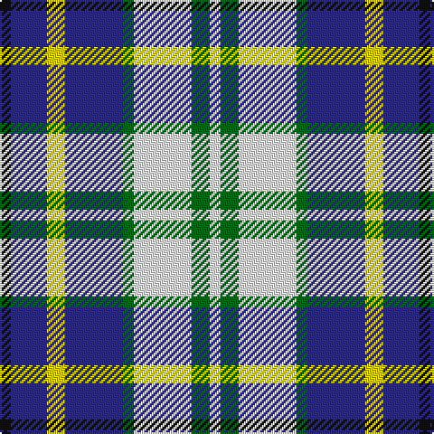

In pattern [KBYBGWGW](/patterns/kbybgwgw/).

This was sourced from tartans-authority.  It is a [8 stripes tartan](/stripes/stripes8/).

Original link http://www.tartansauthority.com/tartan-ferret/display/2597/

## Thread count
K/6 DB20 Y10 DB32 G6 W32 G10 W/6

## Palette
Each colour and its ΔE from the base-6 reference it is a variant of.

| Colour | Shade | Base | ΔE (OKLab) |
|---|---|---|---|
| DB | <code style="background-color:#2C2C80;">#2C2C80</code> `#2C2C80` | B <code style="background-color:#2A418A;">#2A418A</code> | 0.06 |
| G | <code style="background-color:#006818;">#006818</code> `#006818` | G <code style="background-color:#006100;">#006100</code> | 0.02 |
| K | <code style="background-color:#101010;">#101010</code> `#101010` | K <code style="background-color:#000000;">#000000</code> | 0.17 |
| W | <code style="background-color:#FCFCFC;">#FCFCFC</code> `#FCFCFC` | W <code style="background-color:#F7F7F7;">#F7F7F7</code> | 0.01 |
| Y | <code style="background-color:#FCCC00;">#FCCC00</code> `#FCCC00` | Y <code style="background-color:#F2BF00;">#F2BF00</code> | 0.04 |

# Sample pattern

## Nearest tartans

The nearest existing variants by ΔTartan distance.

1. [Ship Hector](/setts/s8/k4b9y6b22g4w20g6w4~b304080-g008000-k000000-we0e0e0-yf0c000/) — ΔT 0.50
1. [Unidentified (Winterbottom)](/setts/s6/b13w13b4y2g8r3~b2c2c80-g006818-rc80000-we0e0e0-yd4c028~x2/) — ΔT 0.89
1. [Mitsukoshi (Corporate)](/setts/s8/w12k3wa3k3w13b6k17r3~b5c8ca8-k101010-rc80000-wc0c0c0-wae8ccb8~x2/) — ΔT 1.01
1. [Strakan](/setts/s9/b18r5b18y14k3w3k3y14r3~b000064-k000000-r8c8c8c-wfcfcfc-yfccc00~x2/) — ΔT 1.07
1. [Sibbald Blue (2014)](/setts/s9/g4b22ba6w10b3w6bb4ba3w4~b141e46-ba003c64-bb64008c-g003c14-wfcfcfc~x2/) — ΔT 1.08
1. [Kile (Red line) (Personal)](/setts/s8/b18w3b3w3r3w3k5y12~b1c0070-k101010-r880000-wfcfcfc-yd8b000~x2/) — ΔT 1.09
1. [Investors Group](/setts/s10/w7k2wa2k2wa2k2w7b4k10wa2~b2888c4-k101010-wa8ace8-waf8f8f8~x4/) — ΔT 1.11
1. [U.S. Postal Service (Corporate)](/setts/s7/k2b10r5w2ba2w2r2~b2888c4-ba1c0070-k101010-rc80000-wfcfcfc~x6/) — ΔT 1.12
1. [Earl of St. Andrews Dress](/setts/s7/w20b14ba14w4bb2bc2ba7~b003478-ba3c3c64-bb000064-bc6478b0-wf8f8f8~x2/) — ΔT 1.18
1. [U.S. Postal Service](/setts/s12/b10r5w2ba2w2r2w2ba2w2r5b10k2~b2888c4-ba1c0070-k101010-rc80000-wfcfcfc~x6/) — ΔT 1.26

## Neighbour map

Every grey dot is one of 15726 variants placed by the first two principal components of the ΔTartan feature space (44% of its variance). Red is this tartan; blue dots are its nearest — click one to open its page.

<svg viewBox="0 0 640 380" role="img" style="max-width:100%;height:auto;border:1px solid #e0e0e0;border-radius:4px;display:block" xmlns="http://www.w3.org/2000/svg"><image href="/nn/cloud.v1.png" width="640" height="380"/><a href="/setts/s8/k4b9y6b22g4w20g6w4~b304080-g008000-k000000-we0e0e0-yf0c000/"><circle cx="112.1" cy="190.1" r="4" fill="#3465a4"><title>Ship Hector</title></circle></a><a href="/setts/s6/b13w13b4y2g8r3~b2c2c80-g006818-rc80000-we0e0e0-yd4c028~x2/"><circle cx="110.6" cy="207.8" r="4" fill="#3465a4"><title>Unidentified (Winterbottom)</title></circle></a><a href="/setts/s8/w12k3wa3k3w13b6k17r3~b5c8ca8-k101010-rc80000-wc0c0c0-wae8ccb8~x2/"><circle cx="128.8" cy="193.0" r="4" fill="#3465a4"><title>Mitsukoshi (Corporate)</title></circle></a><a href="/setts/s9/b18r5b18y14k3w3k3y14r3~b000064-k000000-r8c8c8c-wfcfcfc-yfccc00~x2/"><circle cx="127.4" cy="185.7" r="4" fill="#3465a4"><title>Strakan</title></circle></a><a href="/setts/s9/g4b22ba6w10b3w6bb4ba3w4~b141e46-ba003c64-bb64008c-g003c14-wfcfcfc~x2/"><circle cx="119.9" cy="167.0" r="4" fill="#3465a4"><title>Sibbald Blue (2014)</title></circle></a><a href="/setts/s8/b18w3b3w3r3w3k5y12~b1c0070-k101010-r880000-wfcfcfc-yd8b000~x2/"><circle cx="118.4" cy="174.2" r="4" fill="#3465a4"><title>Kile (Red line) (Personal)</title></circle></a><a href="/setts/s10/w7k2wa2k2wa2k2w7b4k10wa2~b2888c4-k101010-wa8ace8-waf8f8f8~x4/"><circle cx="116.1" cy="203.1" r="4" fill="#3465a4"><title>Investors Group</title></circle></a><a href="/setts/s7/k2b10r5w2ba2w2r2~b2888c4-ba1c0070-k101010-rc80000-wfcfcfc~x6/"><circle cx="116.5" cy="191.5" r="4" fill="#3465a4"><title>U.S. Postal Service (Corporate)</title></circle></a><a href="/setts/s7/w20b14ba14w4bb2bc2ba7~b003478-ba3c3c64-bb000064-bc6478b0-wf8f8f8~x2/"><circle cx="125.8" cy="173.9" r="4" fill="#3465a4"><title>Earl of St. Andrews Dress</title></circle></a><a href="/setts/s12/b10r5w2ba2w2r2w2ba2w2r5b10k2~b2888c4-ba1c0070-k101010-rc80000-wfcfcfc~x6/"><circle cx="123.0" cy="171.2" r="4" fill="#3465a4"><title>U.S. Postal Service</title></circle></a><circle cx="106.7" cy="192.1" r="5" fill="#c00000"/></svg>

ID: /setts/s8/k3b10y5b16g3w16g5w3~b2c2c80-g006818-k101010-wfcfcfc-yfccc00~x2/
