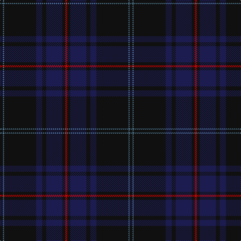

In pattern [KBKBKBKR](/patterns/kbkbkbkr/).

This was sourced from register-of-tartans.  It is a [8 stripes tartan](/stripes/stripes8/).

Original link https://www.tartanregister.gov.uk/tartanDetails.aspx?ref=2128

## Attestations

This cloth appears in 2 source records; the oldest owns this page.

- 01/06/2007 — Little of Morton Rigg Red (Personal) (register-of-tartans, [record](https://www.tartanregister.gov.uk/tartanDetails.aspx?ref=2128))
- June 2007 — Little of Morton Rigg Red (Personal (tartans-authority, [record](http://www.tartansauthority.com/tartan-ferret/display/7238/))

## Thread count
K/6 B2 K64 DB12 K8 DB32 K6 R/4

## Palette
Each colour and its ΔE from the base-6 reference it is a variant of.

| Colour | Shade | Base | ΔE (OKLab) |
|---|---|---|---|
| B | <code style="background-color:#5C8CA8;">#5C8CA8</code> `#5C8CA8` | B <code style="background-color:#2A418A;">#2A418A</code> | 0.23 |
| DB | <code style="background-color:#1C1C50;">#1C1C50</code> `#1C1C50` | B <code style="background-color:#2A418A;">#2A418A</code> | 0.14 |
| K | <code style="background-color:#101010;">#101010</code> `#101010` | K <code style="background-color:#000000;">#000000</code> | 0.17 |
| R | <code style="background-color:#C80000;">#C80000</code> `#C80000` | R <code style="background-color:#CC0000;">#CC0000</code> | 0.01 |

# Sample pattern

## Nearest tartans

The nearest existing variants by ΔTartan distance.

1. [Comme Ça Il Principe](/setts/s10/b3k53b4k4b4k4b24ba10b1r1~b003c64-ba141e46-k101010-rb03000/) — ΔT 1.36
1. [Finnie (Personal)](/setts/s8/b4g4b37k20g1ba5g1k4~b141e46-ba280032-g808080-k101010~x2/) — ΔT 1.39
1. [Scottish Heritage](/setts/s8/k2b6k1ba7g13k11ba42r2~b2c4084-ba141e46-g005020-k101010-rdc0000~x2/) — ΔT 1.61
1. [Ata?, H.M. & I.C. (Personal)](/setts/s8/k9g5w1g15ka2g1ka44r1~g003820-k00002c-ka101010-rc80000-we0e0e0~x2/) — ΔT 1.62
1. [Little Hunting](/setts/s8/b5ba3b4ba3b4k28b8r1~b1c1c50-ba2c2c80-k101010-rc80000~x2/) — ΔT 1.70
1. [St Andrews Old Course Hotel, Golf Course and Spa](/setts/s6/g45b14k3b2ga2b5~b000048-g002814-ga604000-k101010~x2/) — ΔT 1.71
1. [Potts (Personal)](/setts/s6/g1b36ba28b3g3k1~b202060-ba441800-g74846c-k000000~x2/) — ΔT 1.76
1. [Blue Spirit Fashion Tartan Tartan Number: 7001. Earliest known date: 01/08/2006 Designed by Kirsty Anderson of The House of Edgar for ACS Clothing of Glasgow. See products available Copyright © Blair Urquhart, Comrie, 2015](/setts/s8/b3k12b3k17b40k2b2w1~b1b056a-k1e1a10-we0e0e0~x2/) — ΔT 1.79
1. [Scottish Thistle](/setts/s10/b2k3b33ka11k3b3ba15b4r1b2~b003c64-ba181034-k080020-ka101010-r8c90b0~x2/) — ΔT 1.82
1. [Llewellen of Wales](/setts/s9/b74k4b7k4b9k40w2k4r2~b541020-k101010-r888888-we0e0e0/) — ΔT 1.85

## Neighbour map

Every grey dot is one of 15726 variants placed by the first two principal components of the ΔTartan feature space (44% of its variance). Red is this tartan; blue dots are its nearest — click one to open its page.

<svg viewBox="0 0 640 380" role="img" style="max-width:100%;height:auto;border:1px solid #e0e0e0;border-radius:4px;display:block" xmlns="http://www.w3.org/2000/svg"><image href="/nn/cloud.v1.png" width="640" height="380"/><a href="/setts/s10/b3k53b4k4b4k4b24ba10b1r1~b003c64-ba141e46-k101010-rb03000/"><circle cx="524.9" cy="165.5" r="4" fill="#3465a4"><title>Comme Ça Il Principe</title></circle></a><a href="/setts/s8/b4g4b37k20g1ba5g1k4~b141e46-ba280032-g808080-k101010~x2/"><circle cx="464.8" cy="183.5" r="4" fill="#3465a4"><title>Finnie (Personal)</title></circle></a><a href="/setts/s8/k2b6k1ba7g13k11ba42r2~b2c4084-ba141e46-g005020-k101010-rdc0000~x2/"><circle cx="459.8" cy="164.8" r="4" fill="#3465a4"><title>Scottish Heritage</title></circle></a><a href="/setts/s8/k9g5w1g15ka2g1ka44r1~g003820-k00002c-ka101010-rc80000-we0e0e0~x2/"><circle cx="487.1" cy="156.1" r="4" fill="#3465a4"><title>Ata?, H.M. &amp; I.C. (Personal)</title></circle></a><a href="/setts/s8/b5ba3b4ba3b4k28b8r1~b1c1c50-ba2c2c80-k101010-rc80000~x2/"><circle cx="473.1" cy="212.1" r="4" fill="#3465a4"><title>Little Hunting</title></circle></a><a href="/setts/s6/g45b14k3b2ga2b5~b000048-g002814-ga604000-k101010~x2/"><circle cx="560.5" cy="236.8" r="4" fill="#3465a4"><title>St Andrews Old Course Hotel, Golf Course and Spa</title></circle></a><a href="/setts/s6/g1b36ba28b3g3k1~b202060-ba441800-g74846c-k000000~x2/"><circle cx="471.4" cy="188.0" r="4" fill="#3465a4"><title>Potts (Personal)</title></circle></a><a href="/setts/s8/b3k12b3k17b40k2b2w1~b1b056a-k1e1a10-we0e0e0~x2/"><circle cx="535.5" cy="195.6" r="4" fill="#3465a4"><title>Blue Spirit Fashion Tartan Tartan Number: 7001. Earliest known date: 01/08/2006 Designed by Kirsty Anderson of The House of Edgar for ACS Clothing of Glasgow. See products available Copyright © Blair Urquhart, Comrie, 2015</title></circle></a><a href="/setts/s10/b2k3b33ka11k3b3ba15b4r1b2~b003c64-ba181034-k080020-ka101010-r8c90b0~x2/"><circle cx="456.4" cy="169.3" r="4" fill="#3465a4"><title>Scottish Thistle</title></circle></a><a href="/setts/s9/b74k4b7k4b9k40w2k4r2~b541020-k101010-r888888-we0e0e0/"><circle cx="534.1" cy="159.1" r="4" fill="#3465a4"><title>Llewellen of Wales</title></circle></a><circle cx="538.3" cy="202.2" r="5" fill="#c00000"/></svg>

ID: /setts/s8/k3b1k32ba6k4ba16k3r2~b5c8ca8-ba1c1c50-k101010-rc80000~x2/
