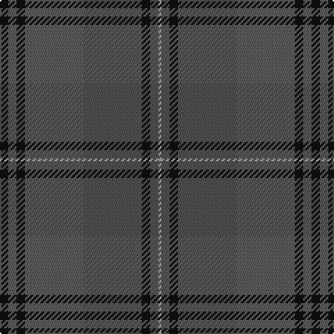

In pattern [KBKBBKBY](/patterns/kbkbbkby/).

This was sourced from tartans-authority.  It is a [8 stripes tartan](/stripes/stripes8/).

Original link http://www.tartansauthority.com/tartan-ferret/display/7459/

## Attestations

This cloth appears in 2 source records; the oldest owns this page.

- pre 2007 — Granite City (Fashion) (tartans-authority, [record](http://www.tartansauthority.com/tartan-ferret/display/7459/))
- undated — Silver Granite (register-of-tartans, [record](https://www.tartanregister.gov.uk/tartanDetails.aspx?ref=5505))

## Thread count
K/6 N6 K6 N42 Nb42 K6 Nb6 Na/2

## Palette
Each colour and its ΔE from the base-6 reference it is a variant of.

| Colour | Shade | Base | ΔE (OKLab) |
|---|---|---|---|
| K | <code style="background-color:#101010;">#101010</code> `#101010` | K <code style="background-color:#000000;">#000000</code> | 0.17 |
| N | <code style="background-color:#5C5C5C;">#5C5C5C</code> `#5C5C5C` | B <code style="background-color:#2A418A;">#2A418A</code> | 0.15 |
| Na | <code style="background-color:#A0A0A0;">#A0A0A0</code> `#A0A0A0` | Y <code style="background-color:#F2BF00;">#F2BF00</code> | 0.21 |
| Nb | <code style="background-color:#505050;">#505050</code> `#505050` | B <code style="background-color:#2A418A;">#2A418A</code> | 0.13 |

# Sample pattern

## Nearest tartans

The nearest existing variants by ΔTartan distance.

1. [Isle of Cumbrae (Corporate)](/setts/s7/k3g3r3g28b28w2b2~b5c5c5c-g787468-k101010-r901c38-wbcc8c4~x2/) — ΔT 1.45
1. [Highland Granite](/setts/s10/b8g2b27k10ba4k2ba3k2ba16b2~b343434-ba585858-g7c7c7c-k101010~x2/) — ΔT 1.55
1. [Alasdair Dhana](/setts/s12/g3b20g16r2g2r3g3r5g16b20y1k2~b14283c-g003820-k101010-r880000-ye8c000~x2/) — ΔT 1.68
1. [Brave for Men (Fashion)](/setts/s8/k5g5k5g34b33k6b5r2~b5c5c5c-g604000-k101010-r888888/) — ΔT 1.70
1. [Scottish Borderland (Fashion)](/setts/s9/w2g2b1g30ba10b20g1b2y1~b405460-ba646464-g005020-wc8c8c8-yc88c00~x2/) — ΔT 1.71
1. [Clyde](/setts/s10/r5b3r22ra3b6ba17ra2ba4ra2ba4~b646464-ba5c5c5c-r8c8c8c-ra8c0000~x2/) — ΔT 1.71
1. [MacNaughton Htg](/setts/s9/g1r1ga22gb21g12r11ga22r1g1~g003820-ga145024-gb604000-ra40800~x2/) — ΔT 1.74
1. [John Telfar Dunbar Hunting](/setts/s7/g5k2g28k10ga26b4g4~b2c4084-g005020-ga503c14-k101010~x2/) — ΔT 1.77
1. [Hanna of Leith (yellow line)](/setts/s10/g9b4g2b4g2b30g9b4ba14y2~b5c5c5c-ba2888c4-g603800-yd09800~x2/) — ΔT 1.79
1. [Calais (Fashion)](/setts/s7/g11b4g6ga11b1k1ga4~b306084-g085454-ga604000-k000000~x4/) — ΔT 1.81

## Neighbour map

Every grey dot is one of 15726 variants placed by the first two principal components of the ΔTartan feature space (44% of its variance). Red is this tartan; blue dots are its nearest — click one to open its page.

<svg viewBox="0 0 640 380" role="img" style="max-width:100%;height:auto;border:1px solid #e0e0e0;border-radius:4px;display:block" xmlns="http://www.w3.org/2000/svg"><image href="/nn/cloud.v1.png" width="640" height="380"/><a href="/setts/s7/k3g3r3g28b28w2b2~b5c5c5c-g787468-k101010-r901c38-wbcc8c4~x2/"><circle cx="395.8" cy="205.6" r="4" fill="#3465a4"><title>Isle of Cumbrae (Corporate)</title></circle></a><a href="/setts/s10/b8g2b27k10ba4k2ba3k2ba16b2~b343434-ba585858-g7c7c7c-k101010~x2/"><circle cx="384.8" cy="216.8" r="4" fill="#3465a4"><title>Highland Granite</title></circle></a><a href="/setts/s12/g3b20g16r2g2r3g3r5g16b20y1k2~b14283c-g003820-k101010-r880000-ye8c000~x2/"><circle cx="381.0" cy="199.8" r="4" fill="#3465a4"><title>Alasdair Dhana</title></circle></a><a href="/setts/s8/k5g5k5g34b33k6b5r2~b5c5c5c-g604000-k101010-r888888/"><circle cx="355.4" cy="203.8" r="4" fill="#3465a4"><title>Brave for Men (Fashion)</title></circle></a><a href="/setts/s9/w2g2b1g30ba10b20g1b2y1~b405460-ba646464-g005020-wc8c8c8-yc88c00~x2/"><circle cx="413.5" cy="167.1" r="4" fill="#3465a4"><title>Scottish Borderland (Fashion)</title></circle></a><a href="/setts/s10/r5b3r22ra3b6ba17ra2ba4ra2ba4~b646464-ba5c5c5c-r8c8c8c-ra8c0000~x2/"><circle cx="337.8" cy="220.3" r="4" fill="#3465a4"><title>Clyde</title></circle></a><a href="/setts/s9/g1r1ga22gb21g12r11ga22r1g1~g003820-ga145024-gb604000-ra40800~x2/"><circle cx="401.4" cy="224.0" r="4" fill="#3465a4"><title>MacNaughton Htg</title></circle></a><a href="/setts/s7/g5k2g28k10ga26b4g4~b2c4084-g005020-ga503c14-k101010~x2/"><circle cx="390.9" cy="251.5" r="4" fill="#3465a4"><title>John Telfar Dunbar Hunting</title></circle></a><a href="/setts/s10/g9b4g2b4g2b30g9b4ba14y2~b5c5c5c-ba2888c4-g603800-yd09800~x2/"><circle cx="396.1" cy="203.2" r="4" fill="#3465a4"><title>Hanna of Leith (yellow line)</title></circle></a><a href="/setts/s7/g11b4g6ga11b1k1ga4~b306084-g085454-ga604000-k000000~x4/"><circle cx="368.7" cy="274.8" r="4" fill="#3465a4"><title>Calais (Fashion)</title></circle></a><circle cx="394.3" cy="208.3" r="5" fill="#c00000"/></svg>

ID: /setts/s8/k3b3k3b21ba21k3ba3y1~b5c5c5c-ba505050-k101010-ya0a0a0~x2/
