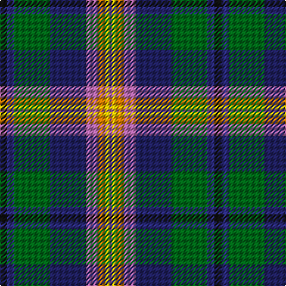

This page is one **sett** — a single exact thread-count. It belongs to the [tartan](/tartans/k3db3g15dba15p5o3y2p1/)
(the same proportion at any scale), whose colour order is pattern [KBGBRYYR](/stripes/kbgbryyr/).

Sourced from house-of-tartan.  It is a [8 stripe tartan](/stripes/stripes8/).

Original link http://www.house-of-tartan.scotland.net/house/TartanViewjs.asp?colr=Def&tnam=2048

## Thread count
K/6 DB6 G30 DBa30 P10 O6 Y4 P/2

## Palette
Each colour and the base-6 reference it is a variant of.

| Colour | Shade | Base |
|---|---|---|
| DB | <code style="background-color:#2C2C80;">#2C2C80</code> `oklch(35.0% 0.138 276.6)` <small>#2C2C80</small> | B <code style="background-color:#2A418A;">#2A418A</code> |
| DBa | <code style="background-color:#202060;">#202060</code> `oklch(28.9% 0.111 276.9)` <small>#202060</small> | B <code style="background-color:#2A418A;">#2A418A</code> |
| G | <code style="background-color:#006818;">#006818</code> `oklch(45.0% 0.142 145.0)` <small>#006818</small> | G <code style="background-color:#006100;">#006100</code> |
| K | <code style="background-color:#101010;">#101010</code> `oklch(17.3% 0.000 89.9)` <small>#101010</small> | K <code style="background-color:#000000;">#000000</code> |
| O | <code style="background-color:#D87C00;">#D87C00</code> `oklch(67.3% 0.155 61.8)` <small>#D87C00</small> | Y <code style="background-color:#F2BF00;">#F2BF00</code> |
| P | <code style="background-color:#B468AC;">#B468AC</code> `oklch(62.5% 0.131 330.9)` <small>#B468AC</small> | R <code style="background-color:#CC0000;">#CC0000</code> |
| Y | <code style="background-color:#E8C000;">#E8C000</code> `oklch(81.9% 0.168 93.7)` <small>#E8C000</small> | Y <code style="background-color:#F2BF00;">#F2BF00</code> |

# Sample pattern

## Nearest tartans

The nearest existing variants by ΔTartan distance, with this tartan at the top so the swatches line up against it.

ΔTartan

Tartan

Sett

—

<a href="/ttd/edit/#slug=k3db3g15db15m5lo3ly2m1~x2">Young Family Tartan Tartan Number: 2048. Earliest known date: 1991 Based on the Christina Young blanket dating from 1726 and preserved at the Scottish Tartans Society museum in Keith, Banffshire. The design retains the unusual purple - yellow - orange box check of the original blanket and changes only the ground colour to the greens and blues of the Douglas tartan. There are 7 colours. Black is normally replaced by dark blue in commercial weaving. See products available Copyright © Blair Urquhart, Comrie, 2015</a> <a class="nn-out" href="/setts/s8/k3db3g15db15m5lo3ly2m1~x2/" title="open its dictionary page">↗</a>

0.78

<a href="/ttd/edit/#slug=k3db3g15db15dp5o3y2dp1~x2">Young</a> <a class="nn-out" href="/setts/s8/k3db3g15db15dp5o3y2dp1~x2/" title="open its dictionary page">↗</a>

0.85

<a href="/ttd/edit/#slug=k40n15o10ly3t5w5db10t20">Julien Pigeut Tartan Tartan Number: 6574. Earliest known date: 2004 For the wedding of Julien and Sylvia Piguet. Also worn by Roland Mathez best man of Julien. See products available Copyright © Blair Urquhart, Comrie, 2015</a> <a class="nn-out" href="/setts/s8/k40n15o10ly3t5w5db10t20/" title="open its dictionary page">↗</a>

0.92

<a href="/ttd/edit/#slug=w3db5lt2db9dp10k2dp5k5dg9g31w2~x2">Carnegie of Skibo Corporate Tartan Tartan Number: 8314. Earliest known date: December 2001 Only available from Robert Mathieson, The Kilt Centre, 1 Campbell Lane, Hamilton. ML3 6DB. Scotland. Tel: +44 (0)1698 200 234. e-mail: kiltcentre@btconnect.com Lochcarron swatch. A corporate tartan for use in kilt hire. The name was chosen to imbue the tartan with some relevant provenance - Andrew Carnegie's retirement residence. See products available Copyright © Blair Urquhart, Comrie, 2015</a> <a class="nn-out" href="/setts/s11/w3db5lt2db9dp10k2dp5k5dg9g31w2~x2/" title="open its dictionary page">↗</a>

0.94

<a href="/ttd/edit/#slug=w3db5t2db9dp10k2dp5k2dg8g29w2~x2">Carnegie of Skibo (Corporate)</a> <a class="nn-out" href="/setts/s11/w3db5t2db9dp10k2dp5k2dg8g29w2~x2/" title="open its dictionary page">↗</a>

0.98

<a href="/ttd/edit/#slug=r4ly3g12k16dy5db20k4w2~x2">Iowa (District)</a> <a class="nn-out" href="/setts/s8/r4ly3g12k16dy5db20k4w2~x2/" title="open its dictionary page">↗</a>

1.06

<a href="/ttd/edit/#slug=dt8ly4w2db25dy25db2r5~x2">Kildrummie (Name)</a> <a class="nn-out" href="/setts/s7/dt8ly4w2db25dy25db2r5~x2/" title="open its dictionary page">↗</a>

1.08

<a href="/ttd/edit/#slug=g2ly1g13y2g1k12db10r1db1w2~x2">Bullman (Name)</a> <a class="nn-out" href="/setts/s10/g2ly1g13y2g1k12db10r1db1w2~x2/" title="open its dictionary page">↗</a>

1.14

<a href="/ttd/edit/#slug=r4dy12k12dy1o12ly1k3w2k1b4~x2">Campbell Hunting</a> <a class="nn-out" href="/setts/s10/r4dy12k12dy1o12ly1k3w2k1b4~x2/" title="open its dictionary page">↗</a>

1.20

<a href="/ttd/edit/#slug=r3dt20dt20g2lr4lr17w3~x2">Silversea</a> <a class="nn-out" href="/setts/s7/r3dt20dt20g2lr4lr17w3~x2/" title="open its dictionary page">↗</a>

1.21

<a href="/ttd/edit/#slug=ly3k2r3db20k24g20r3k2lb3~x2">Loch Awe</a> <a class="nn-out" href="/setts/s9/ly3k2r3db20k24g20r3k2lb3~x2/" title="open its dictionary page">↗</a>

## Neighbour map

Every grey dot is one of 14299 variants placed by the first two principal components of the ΔTartan feature space (44% of its variance). Red is this tartan; blue dots are its nearest — click one to open its page.

<svg viewBox="0 0 640 380" role="img" style="max-width:100%;height:auto;border:1px solid #e0e0e0;border-radius:4px;display:block" xmlns="http://www.w3.org/2000/svg"><image href="/nn/cloud.v1.png" width="640" height="380"/><a href="/setts/s8/k3db3g15db15dp5o3y2dp1~x2/"><circle cx="102.5" cy="127.3" r="4" fill="#3465a4"><title>Young</title></circle></a><a href="/setts/s8/k40n15o10ly3t5w5db10t20/"><circle cx="108.5" cy="135.7" r="4" fill="#3465a4"><title>Julien Pigeut Tartan Tartan Number: 6574. Earliest known date: 2004 For the wedding of Julien and Sylvia Piguet. Also worn by Roland Mathez best man of Julien. See products available Copyright © Blair Urquhart, Comrie, 2015</title></circle></a><a href="/setts/s11/w3db5lt2db9dp10k2dp5k5dg9g31w2~x2/"><circle cx="134.2" cy="108.7" r="4" fill="#3465a4"><title>Carnegie of Skibo Corporate Tartan Tartan Number: 8314. Earliest known date: December 2001 Only available from Robert Mathieson, The Kilt Centre, 1 Campbell Lane, Hamilton. ML3 6DB. Scotland. Tel: +44 (0)1698 200 234. e-mail: kiltcentre@btconnect.com Lochcarron swatch. A corporate tartan for use in kilt hire. The name was chosen to imbue the tartan with some relevant provenance - Andrew Carnegie's retirement residence. See products available Copyright © Blair Urquhart, Comrie, 2015</title></circle></a><a href="/setts/s11/w3db5t2db9dp10k2dp5k2dg8g29w2~x2/"><circle cx="141.4" cy="111.5" r="4" fill="#3465a4"><title>Carnegie of Skibo (Corporate)</title></circle></a><a href="/setts/s8/r4ly3g12k16dy5db20k4w2~x2/"><circle cx="81.9" cy="156.7" r="4" fill="#3465a4"><title>Iowa (District)</title></circle></a><a href="/setts/s7/dt8ly4w2db25dy25db2r5~x2/"><circle cx="149.0" cy="142.8" r="4" fill="#3465a4"><title>Kildrummie (Name)</title></circle></a><a href="/setts/s10/g2ly1g13y2g1k12db10r1db1w2~x2/"><circle cx="137.7" cy="122.4" r="4" fill="#3465a4"><title>Bullman (Name)</title></circle></a><a href="/setts/s10/r4dy12k12dy1o12ly1k3w2k1b4~x2/"><circle cx="89.3" cy="122.2" r="4" fill="#3465a4"><title>Campbell Hunting</title></circle></a><a href="/setts/s7/r3dt20dt20g2lr4lr17w3~x2/"><circle cx="77.1" cy="151.1" r="4" fill="#3465a4"><title>Silversea</title></circle></a><a href="/setts/s9/ly3k2r3db20k24g20r3k2lb3~x2/"><circle cx="145.2" cy="144.4" r="4" fill="#3465a4"><title>Loch Awe</title></circle></a><circle cx="118.6" cy="132.1" r="5" fill="#c00000"/></svg>

ID: /setts/s8/k3db3g15db15m5lo3ly2m1~x2/
