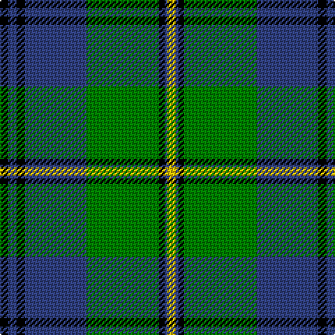

This page is one **sett** — a single exact thread-count. It belongs to the [tartan](/tartans/k3db3k3db22g26k2db1ly3/)
(the same proportion at any scale), whose colour order is pattern [KBKBGKBY](/stripes/kbkbgkby/).

Sourced from weddslist.  It is a [8 stripe tartan](/stripes/stripes8/).

Original link http://www.weddslist.com/cgi-bin/tartans/pg.pl?source=sts

## Also known as

This cloth is also recorded under:

- Johnstone / Johnston

2 attestations — the source records this cloth was collapsed from (oldest owns this page)

<ul>
<li>undated — Johnstone / Johnston (weddslist, <a href="http://www.weddslist.com/cgi-bin/tartans/pg.pl?source=sts">record</a>)</li>
<li>undated — Johnstone Clan Tartan Tartan Number: 1062. Earliest known date: pre 2003 This sett appears in Paton's collection which is housed at the Scottish Tartans Museum, Comrie in Perthshire, Scotland. The samples are undated but the collection is known to have been put together around the 1830's, with some additions during the Victorian period. See products available Copyright © Blair Urquhart, Comrie, 2015 (house-of-tartan, <a href="http://www.house-of-tartan.scotland.net/house/TartanViewjs.asp?colr=Def&tnam=1062">record</a>)</li>
</ul>

## Thread count
K/6 B6 K6 B44 G52 K4 B2 Y/6

## Palette

Palette: <strong>Ingles Buchan</strong> <small style="color:#888">(1 of 4 colours)</small>
<table><thead><tr><th>Colour</th><th>Threads</th><th>Shade</th><th>Base</th><th>OKLCh</th></tr></thead><tbody><tr><td>K/</td><td style="text-align:right;font-variant-numeric:tabular-nums">6</td><td><code style="background-color:#000000;">#000000</code> <small style="color:#888">#000000</small></td><td>K <code style="background-color:#000000;">#000000</code></td><td><small style="color:#888">oklch(0.0% 0.000 0.0)</small></td></tr><tr><td>B</td><td style="text-align:right;font-variant-numeric:tabular-nums">6</td><td><code style="background-color:#304080;">#304080</code> <small style="color:#888">#304080</small></td><td>B <code style="background-color:#2A418A;">#2A418A</code></td><td><small style="color:#888">oklch(39.4% 0.109 270.2)</small></td></tr><tr><td>K</td><td style="text-align:right;font-variant-numeric:tabular-nums">6</td><td><code style="background-color:#000000;">#000000</code> <small style="color:#888">#000000</small></td><td>K <code style="background-color:#000000;">#000000</code></td><td><small style="color:#888">oklch(0.0% 0.000 0.0)</small></td></tr><tr><td>B</td><td style="text-align:right;font-variant-numeric:tabular-nums">44</td><td><code style="background-color:#304080;">#304080</code> <small style="color:#888">#304080</small></td><td>B <code style="background-color:#2A418A;">#2A418A</code></td><td><small style="color:#888">oklch(39.4% 0.109 270.2)</small></td></tr><tr><td>G</td><td style="text-align:right;font-variant-numeric:tabular-nums">52</td><td><code style="background-color:#008000;">#008000</code> <small style="color:#888">#008000</small></td><td>G <code style="background-color:#006100;">#006100</code></td><td><small style="color:#888">oklch(52.0% 0.177 142.5)</small></td></tr><tr><td>K</td><td style="text-align:right;font-variant-numeric:tabular-nums">4</td><td><code style="background-color:#000000;">#000000</code> <small style="color:#888">#000000</small></td><td>K <code style="background-color:#000000;">#000000</code></td><td><small style="color:#888">oklch(0.0% 0.000 0.0)</small></td></tr><tr><td>B</td><td style="text-align:right;font-variant-numeric:tabular-nums">2</td><td><code style="background-color:#304080;">#304080</code> <small style="color:#888">#304080</small></td><td>B <code style="background-color:#2A418A;">#2A418A</code></td><td><small style="color:#888">oklch(39.4% 0.109 270.2)</small></td></tr><tr><td>Y/</td><td style="text-align:right;font-variant-numeric:tabular-nums">6</td><td><code style="background-color:#F0C000;">#F0C000</code> <small style="color:#888">#F0C000</small></td><td>Y <code style="background-color:#F2BF00;">#F2BF00</code></td><td><small style="color:#888">oklch(82.7% 0.169 90.5)</small></td></tr></tbody></table>

# Sample pattern

## Nearest tartans

The nearest existing variants by ΔTartan distance, with this tartan at the top so the swatches line up against it.

ΔTartan

Tartan

Sett

—

<a href="/ttd/edit/#slug=k3db3k3db22g26k2db1ly3~x2">Johnstone / Johnston</a> <a class="nn-out" href="/setts/s8/k3db3k3db22g26k2db1ly3~x2/" title="open its dictionary page">↗</a>

0.91

<a href="/ttd/edit/#slug=ly3g2k1g30db24k2db2k2~x2">Johnston / Johnstone</a> <a class="nn-out" href="/setts/s8/ly3g2k1g30db24k2db2k2~x2/" title="open its dictionary page">↗</a>

1.01

<a href="/ttd/edit/#slug=r3g2k1g20k9t20k1t2r3~x2">Ayrton</a> <a class="nn-out" href="/setts/s9/r3g2k1g20k9t20k1t2r3~x2/" title="open its dictionary page">↗</a>

1.04

<a href="/ttd/edit/#slug=g30db4g2k20db18r1db4~x2">MacTaggert</a> <a class="nn-out" href="/setts/s7/g30db4g2k20db18r1db4~x2/" title="open its dictionary page">↗</a>

1.04

<a href="/ttd/edit/#slug=g2r1g16k12r1t16g1t2~x2">Lochaber District</a> <a class="nn-out" href="/setts/s8/g2r1g16k12r1t16g1t2~x2/" title="open its dictionary page">↗</a>

1.13

<a href="/ttd/edit/#slug=g45w2r3k15r3db15r3db15~x2">MacNeil 3</a> <a class="nn-out" href="/setts/s8/g45w2r3k15r3db15r3db15~x2/" title="open its dictionary page">↗</a>

1.16

<a href="/ttd/edit/#slug=db24ly2k8g16k1g3k1g3r4~x2">Ogilvie 1</a> <a class="nn-out" href="/setts/s9/db24ly2k8g16k1g3k1g3r4~x2/" title="open its dictionary page">↗</a>

1.19

<a href="/ttd/edit/#slug=r1g16db2g10db22ly4r2ly1~x2">New Mexico</a> <a class="nn-out" href="/setts/s8/r1g16db2g10db22ly4r2ly1~x2/" title="open its dictionary page">↗</a>

1.22

<a href="/ttd/edit/#slug=r2w1g18db12g1db3w1r2w1db2g2~x2">McKirgan/Mackirgan</a> <a class="nn-out" href="/setts/s11/r2w1g18db12g1db3w1r2w1db2g2~x2/" title="open its dictionary page">↗</a>

1.25

<a href="/ttd/edit/#slug=db5ly2db17g14w1g1w1g4ly2~x2">MacOrrell</a> <a class="nn-out" href="/setts/s9/db5ly2db17g14w1g1w1g4ly2~x2/" title="open its dictionary page">↗</a>

1.25

<a href="/ttd/edit/#slug=b10k6g42k2g1k2r1k24r2~x2">Black Thistle</a> <a class="nn-out" href="/setts/s9/b10k6g42k2g1k2r1k24r2~x2/" title="open its dictionary page">↗</a>

## Neighbour map

Every grey dot is one of 14359 variants placed by the first two principal components of the ΔTartan feature space (44% of its variance). Red is this tartan; blue dots are its nearest — click one to open its page.

<svg viewBox="0 0 640 380" role="img" style="max-width:100%;height:auto;border:1px solid #e0e0e0;border-radius:4px;display:block" xmlns="http://www.w3.org/2000/svg"><image href="/nn/cloud.v1.png" width="640" height="380"/><a href="/setts/s8/ly3g2k1g30db24k2db2k2~x2/"><circle cx="323.9" cy="135.8" r="4" fill="#3465a4"><title>Johnston / Johnstone</title></circle></a><a href="/setts/s9/r3g2k1g20k9t20k1t2r3~x2/"><circle cx="203.4" cy="143.3" r="4" fill="#3465a4"><title>Ayrton</title></circle></a><a href="/setts/s7/g30db4g2k20db18r1db4~x2/"><circle cx="243.7" cy="161.5" r="4" fill="#3465a4"><title>MacTaggert</title></circle></a><a href="/setts/s8/g2r1g16k12r1t16g1t2~x2/"><circle cx="208.8" cy="167.4" r="4" fill="#3465a4"><title>Lochaber District</title></circle></a><a href="/setts/s8/g45w2r3k15r3db15r3db15~x2/"><circle cx="229.9" cy="135.7" r="4" fill="#3465a4"><title>MacNeil 3</title></circle></a><a href="/setts/s9/db24ly2k8g16k1g3k1g3r4~x2/"><circle cx="210.1" cy="127.2" r="4" fill="#3465a4"><title>Ogilvie 1</title></circle></a><a href="/setts/s8/r1g16db2g10db22ly4r2ly1~x2/"><circle cx="289.2" cy="164.7" r="4" fill="#3465a4"><title>New Mexico</title></circle></a><a href="/setts/s11/r2w1g18db12g1db3w1r2w1db2g2~x2/"><circle cx="269.4" cy="133.1" r="4" fill="#3465a4"><title>McKirgan/Mackirgan</title></circle></a><a href="/setts/s9/db5ly2db17g14w1g1w1g4ly2~x2/"><circle cx="281.9" cy="161.4" r="4" fill="#3465a4"><title>MacOrrell</title></circle></a><a href="/setts/s9/b10k6g42k2g1k2r1k24r2~x2/"><circle cx="336.0" cy="119.1" r="4" fill="#3465a4"><title>Black Thistle</title></circle></a><circle cx="266.6" cy="143.3" r="5" fill="#c00000"/></svg>

ID: /setts/s8/k3db3k3db22g26k2db1ly3~x2/
