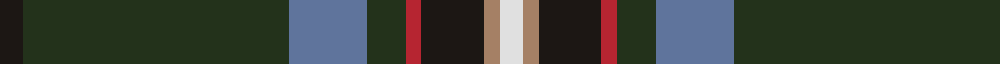
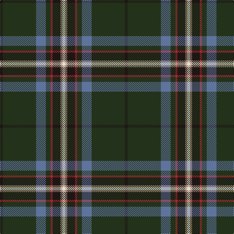

**Bands:** [KGBGRKRW](/stripes/kgbgrkrw/) · **Stripes:** [K DG T DG R K O W](/stripes/stripes8/) K DG T DG R K O W

This was sourced from register-of-tartans.  It is a [8 band tartan](/bands/bands8/).

Original link https://www.tartanregister.gov.uk/tartanDetails.aspx?ref=10670

## Attestations

This cloth appears in 2 source records; the oldest owns this page.

- 30/07/2012 — Lambert (Front Royal) Kai (register-of-tartans, [record](https://www.tartanregister.gov.uk/tartanDetails.aspx?ref=10670))
- undated — Lambert (Front Royal) Kai Name Tartan Tartan Number: 10670. Earliest known date: 13 August 2012 Designed by Charles Lambert, using the Scotweb Tartan Designer, for his family, to celebrate their Irish ancestry. Mr Lambert has also designed the Lambert (Front Royal) Greer tartan (STR #10673) using the same geometry. See products available Copyright © Blair Urquhart, Comrie, 2015 (house-of-tartan, [record](http://www.house-of-tartan.scotland.net/house/TartanViewjs.asp?colr=Def&tnam=10670))

## Register references

External register numbers recorded for this tartan.

- Scottish Register of Tartans: [10670](https://www.tartanregister.gov.uk/tartanDetails.aspx?ref=10670)

## Thread count
Ka/6 K68 B20 K10 R4 Ka16 LT4 LN/6

## Palette
Each colour and its ΔE from the base-6 reference it is a variant of.

| Colour | Shade | Base | ΔE (OKLab) |
|---|---|---|---|
| B | <code style="background-color:#5F749C;">#5F749C</code> `#5F749C` | B <code style="background-color:#2A418A;">#2A418A</code> | 0.17 |
| K | <code style="background-color:#23321B;">#23321B</code> `#23321B` | G <code style="background-color:#006100;">#006100</code> | 0.16 |
| Ka | <code style="background-color:#1C1714;">#1C1714</code> `#1C1714` | K <code style="background-color:#000000;">#000000</code> | 0.21 |
| LN | <code style="background-color:#E0E0E0;">#E0E0E0</code> `#E0E0E0` | W <code style="background-color:#F7F7F7;">#F7F7F7</code> | 0.07 |
| LT | <code style="background-color:#A58065;">#A58065</code> `#A58065` | R <code style="background-color:#CC0000;">#CC0000</code> | 0.19 |
| R | <code style="background-color:#B62531;">#B62531</code> `#B62531` | R <code style="background-color:#CC0000;">#CC0000</code> | 0.05 |

# Sample pattern

## Nearest tartans

The nearest existing variants by ΔTartan distance.

1. [Woodward, R Glenn (Personal)](/setts/s6/dt25k84w5dg23lo5dp8~x2/) — ΔT 1.03
1. [State Seal of Maine (Fashion)](/setts/s10/dg49k8lo20lo3dg23r6k5t3dg10lo10~x2/) — ΔT 1.10
1. [Zorra Caledonian Society](/setts/s10/dg3w2dg39k3g3k3dg3k20g10r2~x2/) — ΔT 1.21
1. [Canadian Caledonian Hunting](/setts/s11/db3k1dg16lo1r1lb1r6dg3r1dg3lb1~x4/) — ΔT 1.25
1. [New York Caledonian Club Day](/setts/s11/g9o1g2r3g28k16lb1g8lb1db8r1~x2/) — ΔT 1.28
1. [Heneghan (Personal)](/setts/s14/dg16r3o1db2dg4r2db4dg2r1lo1ly1lo1db6dg12~x4/) — ΔT 1.28
1. [Scotland’s Golf Coast](/setts/s9/lg2w1db16dp2db2dp3db8dg20lo2~x2/) — ΔT 1.28
1. [Glencross, Tynron (Name)](/setts/s6/r3y13db13ly2dg34w3~x2/) — ΔT 1.29
1. [Pienaar (Personal)](/setts/s9/ly3g6dg32r4ly2r2dp7dg2w2~x2/) — ΔT 1.30
1. [State Seal of Ohio (Fashion)](/setts/s9/db60lo3db5lo5db9do20lo4g32lb4~x2/) — ΔT 1.31

## Neighbour map

Every grey dot is one of 14313 variants placed by the first two principal components of the ΔTartan feature space (44% of its variance). Red is this tartan; blue dots are its nearest — click one to open its page.

<svg viewBox="0 0 640 380" role="img" style="max-width:100%;height:auto;border:1px solid #e0e0e0;border-radius:4px;display:block" xmlns="http://www.w3.org/2000/svg"><image href="/nn/cloud.v1.png" width="640" height="380"/><a href="/setts/s6/dt25k84w5dg23lo5dp8~x2/"><circle cx="309.4" cy="165.7" r="4" fill="#3465a4"><title>Woodward, R Glenn (Personal)</title></circle></a><a href="/setts/s10/dg49k8lo20lo3dg23r6k5t3dg10lo10~x2/"><circle cx="313.7" cy="147.1" r="4" fill="#3465a4"><title>State Seal of Maine (Fashion)</title></circle></a><a href="/setts/s10/dg3w2dg39k3g3k3dg3k20g10r2~x2/"><circle cx="316.7" cy="140.6" r="4" fill="#3465a4"><title>Zorra Caledonian Society</title></circle></a><a href="/setts/s11/db3k1dg16lo1r1lb1r6dg3r1dg3lb1~x4/"><circle cx="319.2" cy="121.0" r="4" fill="#3465a4"><title>Canadian Caledonian Hunting</title></circle></a><a href="/setts/s11/g9o1g2r3g28k16lb1g8lb1db8r1~x2/"><circle cx="345.8" cy="114.6" r="4" fill="#3465a4"><title>New York Caledonian Club Day</title></circle></a><a href="/setts/s14/dg16r3o1db2dg4r2db4dg2r1lo1ly1lo1db6dg12~x4/"><circle cx="337.1" cy="134.9" r="4" fill="#3465a4"><title>Heneghan (Personal)</title></circle></a><a href="/setts/s9/lg2w1db16dp2db2dp3db8dg20lo2~x2/"><circle cx="258.8" cy="135.7" r="4" fill="#3465a4"><title>Scotland’s Golf Coast</title></circle></a><a href="/setts/s6/r3y13db13ly2dg34w3~x2/"><circle cx="259.6" cy="164.7" r="4" fill="#3465a4"><title>Glencross, Tynron (Name)</title></circle></a><a href="/setts/s9/ly3g6dg32r4ly2r2dp7dg2w2~x2/"><circle cx="286.8" cy="112.0" r="4" fill="#3465a4"><title>Pienaar (Personal)</title></circle></a><a href="/setts/s9/db60lo3db5lo5db9do20lo4g32lb4~x2/"><circle cx="286.0" cy="131.7" r="4" fill="#3465a4"><title>State Seal of Ohio (Fashion)</title></circle></a><circle cx="326.9" cy="144.0" r="5" fill="#c00000"/></svg>

ID: /setts/s8/k3dg34t10dg5r2k8o2w3~x2/
