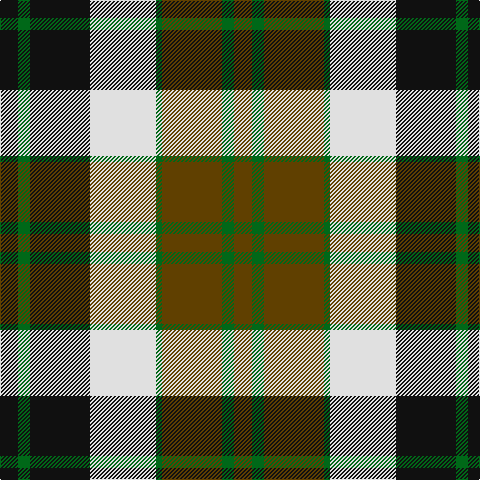

This page is one **sett** — a single exact thread-count. It belongs to the [tartan](/tartans/k3g2k10w11g1dy10g2dy3/)
(the same proportion at any scale), whose colour order is pattern [GGGGWKGK](/stripes/ggggwkgk/).

Sourced from register-of-tartans.  It is a [8 stripe tartan](/stripes/stripes8/).

Original link https://www.tartanregister.gov.uk/tartanDetails.aspx?ref=882

## Register references

External register numbers recorded for this tartan.

- Scottish Register of Tartans: [882](https://www.tartanregister.gov.uk/tartanDetails.aspx?ref=882)
- Scottish Tartans Authority (ITI): 6126

## Thread count
K/18 G12 K60 LN66 G6 T60 G12 T/18

## Palette

Palette: <strong>Tartan Register</strong>
<table><thead><tr><th>Colour</th><th>Threads</th><th>Shade</th><th>Base</th><th>OKLCh</th></tr></thead><tbody><tr><td>K/</td><td style="text-align:right;font-variant-numeric:tabular-nums">18</td><td><code style="background-color:#101010;">#101010</code> <small style="color:#888">#101010</small></td><td>K <code style="background-color:#000000;">#000000</code></td><td><small style="color:#888">oklch(17.3% 0.000 89.9)</small></td></tr><tr><td>G</td><td style="text-align:right;font-variant-numeric:tabular-nums">12</td><td><code style="background-color:#006818;">#006818</code> <small style="color:#888">#006818</small></td><td>G <code style="background-color:#006100;">#006100</code></td><td><small style="color:#888">oklch(45.0% 0.142 145.0)</small></td></tr><tr><td>K</td><td style="text-align:right;font-variant-numeric:tabular-nums">60</td><td><code style="background-color:#101010;">#101010</code> <small style="color:#888">#101010</small></td><td>K <code style="background-color:#000000;">#000000</code></td><td><small style="color:#888">oklch(17.3% 0.000 89.9)</small></td></tr><tr><td>LN</td><td style="text-align:right;font-variant-numeric:tabular-nums">66</td><td><code style="background-color:#E0E0E0;">#E0E0E0</code> <small style="color:#888">#E0E0E0</small></td><td>W <code style="background-color:#F7F7F7;">#F7F7F7</code></td><td><small style="color:#888">oklch(90.7% 0.000 89.9)</small></td></tr><tr><td>G</td><td style="text-align:right;font-variant-numeric:tabular-nums">6</td><td><code style="background-color:#006818;">#006818</code> <small style="color:#888">#006818</small></td><td>G <code style="background-color:#006100;">#006100</code></td><td><small style="color:#888">oklch(45.0% 0.142 145.0)</small></td></tr><tr><td>T</td><td style="text-align:right;font-variant-numeric:tabular-nums">60</td><td><code style="background-color:#604000;">#604000</code> <small style="color:#888">#604000</small></td><td>G <code style="background-color:#006100;">#006100</code></td><td><small style="color:#888">oklch(39.8% 0.083 76.8)</small></td></tr><tr><td>G</td><td style="text-align:right;font-variant-numeric:tabular-nums">12</td><td><code style="background-color:#006818;">#006818</code> <small style="color:#888">#006818</small></td><td>G <code style="background-color:#006100;">#006100</code></td><td><small style="color:#888">oklch(45.0% 0.142 145.0)</small></td></tr><tr><td>T/</td><td style="text-align:right;font-variant-numeric:tabular-nums">18</td><td><code style="background-color:#604000;">#604000</code> <small style="color:#888">#604000</small></td><td>G <code style="background-color:#006100;">#006100</code></td><td><small style="color:#888">oklch(39.8% 0.083 76.8)</small></td></tr></tbody></table>

# Sample pattern

## Nearest tartans

The nearest existing variants by ΔTartan distance, with this tartan at the top so the swatches line up against it.

ΔTartan

Tartan

Sett

—

<a href="/ttd/edit/#slug=k3g2k10w11g1dy10g2dy3~x6">Dalveen (1981)</a> <a class="nn-out" href="/setts/s8/k3g2k10w11g1dy10g2dy3~x6/" title="open its dictionary page">↗</a>

0.51

<a href="/ttd/edit/#slug=dg2dr8dg8o3dr1w12dg2dr1~x2">National Trust</a> <a class="nn-out" href="/setts/s8/dg2dr8dg8o3dr1w12dg2dr1~x2/" title="open its dictionary page">↗</a>

0.84

<a href="/ttd/edit/#slug=k4ly2k13ly1w8lo13ly2lo4~x2">Bannockbane Light Tan</a> <a class="nn-out" href="/setts/s8/k4ly2k13ly1w8lo13ly2lo4~x2/" title="open its dictionary page">↗</a>

0.96

<a href="/ttd/edit/#slug=k4ly2k13ly1w8o13ly2o4~x2">Bannockbane Grey #1</a> <a class="nn-out" href="/setts/s8/k4ly2k13ly1w8o13ly2o4~x2/" title="open its dictionary page">↗</a>

0.98

<a href="/ttd/edit/#slug=ly5k5g17k6y24k6ly3~x2">Cape Breton</a> <a class="nn-out" href="/setts/s7/ly5k5g17k6y24k6ly3~x2/" title="open its dictionary page">↗</a>

0.99

<a href="/ttd/edit/#slug=ly6k6y30k8lb18k6ly3~x2">Cape Breton (yellow stripes)</a> <a class="nn-out" href="/setts/s7/ly6k6y30k8lb18k6ly3~x2/" title="open its dictionary page">↗</a>

0.99

<a href="/ttd/edit/#slug=dg3o2dg14o1w10y14o2y3~x2">Bannockbane Hunting (MacBean and Bishop)</a> <a class="nn-out" href="/setts/s8/dg3o2dg14o1w10y14o2y3~x2/" title="open its dictionary page">↗</a>

1.00

<a href="/ttd/edit/#slug=g2do8g8lo3do1w12g2do1~x2">National Trust</a> <a class="nn-out" href="/setts/s8/g2do8g8lo3do1w12g2do1~x2/" title="open its dictionary page">↗</a>

1.04

<a href="/ttd/edit/#slug=dg2do8dg8r3do1w12dg2y1~x2">National Trust Corporate Tartan Tartan Number: 2117. Earliest known date: pre 1991 Sent in by Tweedmill for information. See products available Copyright © Blair Urquhart, Comrie, 2015</a> <a class="nn-out" href="/setts/s8/dg2do8dg8r3do1w12dg2y1~x2/" title="open its dictionary page">↗</a>

1.05

<a href="/ttd/edit/#slug=g12k2r12k3w7k16w7k3w6~x2">Borthwick Dress</a> <a class="nn-out" href="/setts/s9/g12k2r12k3w7k16w7k3w6~x2/" title="open its dictionary page">↗</a>

1.06

<a href="/ttd/edit/#slug=k4g23k23g2w23b4~x2">MacKay Dress</a> <a class="nn-out" href="/setts/s6/k4g23k23g2w23b4~x2/" title="open its dictionary page">↗</a>

## Neighbour map

Every grey dot is one of 14359 variants placed by the first two principal components of the ΔTartan feature space (44% of its variance). Red is this tartan; blue dots are its nearest — click one to open its page.

<svg viewBox="0 0 640 380" role="img" style="max-width:100%;height:auto;border:1px solid #e0e0e0;border-radius:4px;display:block" xmlns="http://www.w3.org/2000/svg"><image href="/nn/cloud.v1.png" width="640" height="380"/><a href="/setts/s8/dg2dr8dg8o3dr1w12dg2dr1~x2/"><circle cx="143.4" cy="169.9" r="4" fill="#3465a4"><title>National Trust</title></circle></a><a href="/setts/s8/k4ly2k13ly1w8lo13ly2lo4~x2/"><circle cx="156.6" cy="169.1" r="4" fill="#3465a4"><title>Bannockbane Light Tan</title></circle></a><a href="/setts/s8/k4ly2k13ly1w8o13ly2o4~x2/"><circle cx="151.5" cy="168.0" r="4" fill="#3465a4"><title>Bannockbane Grey #1</title></circle></a><a href="/setts/s7/ly5k5g17k6y24k6ly3~x2/"><circle cx="132.4" cy="201.2" r="4" fill="#3465a4"><title>Cape Breton</title></circle></a><a href="/setts/s7/ly6k6y30k8lb18k6ly3~x2/"><circle cx="147.5" cy="180.6" r="4" fill="#3465a4"><title>Cape Breton (yellow stripes)</title></circle></a><a href="/setts/s8/dg3o2dg14o1w10y14o2y3~x2/"><circle cx="167.2" cy="168.1" r="4" fill="#3465a4"><title>Bannockbane Hunting (MacBean and Bishop)</title></circle></a><a href="/setts/s8/g2do8g8lo3do1w12g2do1~x2/"><circle cx="144.5" cy="170.5" r="4" fill="#3465a4"><title>National Trust</title></circle></a><a href="/setts/s8/dg2do8dg8r3do1w12dg2y1~x2/"><circle cx="122.4" cy="152.9" r="4" fill="#3465a4"><title>National Trust Corporate Tartan Tartan Number: 2117. Earliest known date: pre 1991 Sent in by Tweedmill for information. See products available Copyright © Blair Urquhart, Comrie, 2015</title></circle></a><a href="/setts/s9/g12k2r12k3w7k16w7k3w6~x2/"><circle cx="99.0" cy="196.1" r="4" fill="#3465a4"><title>Borthwick Dress</title></circle></a><a href="/setts/s6/k4g23k23g2w23b4~x2/"><circle cx="144.1" cy="196.0" r="4" fill="#3465a4"><title>MacKay Dress</title></circle></a><circle cx="125.8" cy="182.7" r="5" fill="#c00000"/></svg>

ID: /setts/s8/k3g2k10w11g1dy10g2dy3~x6/
