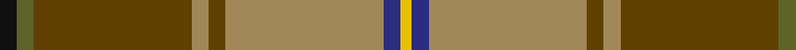

In pattern [KGGYGYBY](/patterns/kggygyby/).

This was sourced from tartans-authority.  It is a [8 stripes tartan](/stripes/stripes8/).

Original link http://www.tartansauthority.com/tartan-ferret/display/3786/

## Attestations

This cloth appears in 2 source records; the oldest owns this page.

- 1991 — California Highway Patrol (Corporate (tartans-authority, [record](http://www.tartansauthority.com/tartan-ferret/display/3786/))
- 01/01/1992 — California Highway Patrol (Corporate) (register-of-tartans, [record](https://www.tartanregister.gov.uk/tartanDetails.aspx?ref=5330))

## Register references

External register numbers recorded for this tartan.

- Scottish Register of Tartans: [5330](https://www.tartanregister.gov.uk/tartanDetails.aspx?ref=5330)
- Scottish Tartans Authority (ITI): 3786

## Thread count
K/6 G6 T56 LT6 T6 LT56 DB6 Y/4

## Palette
Each colour and its ΔE from the base-6 reference it is a variant of.

| Colour | Shade | Base | ΔE (OKLab) |
|---|---|---|---|
| DB | <code style="background-color:#2C2C80;">#2C2C80</code> `#2C2C80` | B <code style="background-color:#2A418A;">#2A418A</code> | 0.06 |
| G | <code style="background-color:#5C6428;">#5C6428</code> `#5C6428` | G <code style="background-color:#006100;">#006100</code> | 0.10 |
| K | <code style="background-color:#101010;">#101010</code> `#101010` | K <code style="background-color:#000000;">#000000</code> | 0.17 |
| LT | <code style="background-color:#A08858;">#A08858</code> `#A08858` | Y <code style="background-color:#F2BF00;">#F2BF00</code> | 0.21 |
| T | <code style="background-color:#604000;">#604000</code> `#604000` | G <code style="background-color:#006100;">#006100</code> | 0.14 |
| Y | <code style="background-color:#E8C000;">#E8C000</code> `#E8C000` | Y <code style="background-color:#F2BF00;">#F2BF00</code> | 0.02 |

# Sample pattern

## Nearest tartans

The nearest existing variants by ΔTartan distance.

1. [Red Rum](/setts/s7/k2r30g4w2g14ra13y2~g008000-k000000-r806050-ra802040-we0e0e0-yf0c000~x2/) — ΔT 0.95
1. [Snelgrove Htg (Name)](/setts/s7/k3r12g8y2ga36g10b2~b2888c4-g642000-ga006818-k101010-rc80000-ybc8c00~x2/) — ΔT 1.11
1. [Harmony 1](/setts/s12/b11g3b4y3b3y4b3ga13r34g3r4ba3~b401000-ba506060-g008000-ga908000-r906030-yf0c000~x2/) — ΔT 1.37
1. [Spragg, Andrew](/setts/s7/r2g16ra1r2ra12y1ga1~g165041-ga547c73-ra62a2a-racc1100-yffe600~x2/) — ΔT 1.43
1. [Spragg (Name)](/setts/s7/r2g16ra1r2ra12y1b1~b5c8ca8-g048888-r901c38-rac80000-ye8c000~x2/) — ΔT 1.44
1. [Glen Nevis #2 (Personal)](/setts/s12/g14y1g1y1g2k3g3k3b3ba1b9y1~b4c3428-ba441800-g8c7038-k101010-ydc943c~x4/) — ΔT 1.46
1. [Hutcheson (Name)](/setts/s6/b8g4r30ga30y3ga4~b003c64-g789484-ga00643c-rcc4438-ydc943c~x2/) — ΔT 1.48
1. [Hutcheson](/setts/s10/g30y3g4y3g30r30ga4b8ga4r30~b003c64-g00643c-ga789484-rcc4438-ydc943c~x2/) — ΔT 1.48
1. [Ogg of Tarragann Hunting (Personal)](/setts/s12/r2b6r1g14r1g14r1k6ga10y1ga2y2~b5c8ca8-g604000-ga006818-k101010-rc80000-ybc8c00~x2/) — ΔT 1.50
1. [Pubcrawlers, The](/setts/s7/w3r4g2r22b5ra16y3~b1e1e1e-g1b3b1d-r846247-ra680d0d-wdfdfdf-ydfaf00~x2/) — ΔT 1.50

## Neighbour map

Every grey dot is one of 15726 variants placed by the first two principal components of the ΔTartan feature space (44% of its variance). Red is this tartan; blue dots are its nearest — click one to open its page.

<svg viewBox="0 0 640 380" role="img" style="max-width:100%;height:auto;border:1px solid #e0e0e0;border-radius:4px;display:block" xmlns="http://www.w3.org/2000/svg"><image href="/nn/cloud.v1.png" width="640" height="380"/><a href="/setts/s7/k2r30g4w2g14ra13y2~g008000-k000000-r806050-ra802040-we0e0e0-yf0c000~x2/"><circle cx="242.9" cy="150.3" r="4" fill="#3465a4"><title>Red Rum</title></circle></a><a href="/setts/s7/k3r12g8y2ga36g10b2~b2888c4-g642000-ga006818-k101010-rc80000-ybc8c00~x2/"><circle cx="286.1" cy="148.5" r="4" fill="#3465a4"><title>Snelgrove Htg (Name)</title></circle></a><a href="/setts/s12/b11g3b4y3b3y4b3ga13r34g3r4ba3~b401000-ba506060-g008000-ga908000-r906030-yf0c000~x2/"><circle cx="217.0" cy="121.8" r="4" fill="#3465a4"><title>Harmony 1</title></circle></a><a href="/setts/s7/r2g16ra1r2ra12y1ga1~g165041-ga547c73-ra62a2a-racc1100-yffe600~x2/"><circle cx="301.8" cy="151.9" r="4" fill="#3465a4"><title>Spragg, Andrew</title></circle></a><a href="/setts/s7/r2g16ra1r2ra12y1b1~b5c8ca8-g048888-r901c38-rac80000-ye8c000~x2/"><circle cx="298.3" cy="149.9" r="4" fill="#3465a4"><title>Spragg (Name)</title></circle></a><a href="/setts/s12/g14y1g1y1g2k3g3k3b3ba1b9y1~b4c3428-ba441800-g8c7038-k101010-ydc943c~x4/"><circle cx="274.0" cy="142.3" r="4" fill="#3465a4"><title>Glen Nevis #2 (Personal)</title></circle></a><a href="/setts/s6/b8g4r30ga30y3ga4~b003c64-g789484-ga00643c-rcc4438-ydc943c~x2/"><circle cx="254.7" cy="196.1" r="4" fill="#3465a4"><title>Hutcheson (Name)</title></circle></a><a href="/setts/s10/g30y3g4y3g30r30ga4b8ga4r30~b003c64-g00643c-ga789484-rcc4438-ydc943c~x2/"><circle cx="255.8" cy="178.3" r="4" fill="#3465a4"><title>Hutcheson</title></circle></a><a href="/setts/s12/r2b6r1g14r1g14r1k6ga10y1ga2y2~b5c8ca8-g604000-ga006818-k101010-rc80000-ybc8c00~x2/"><circle cx="242.2" cy="142.5" r="4" fill="#3465a4"><title>Ogg of Tarragann Hunting (Personal)</title></circle></a><a href="/setts/s7/w3r4g2r22b5ra16y3~b1e1e1e-g1b3b1d-r846247-ra680d0d-wdfdfdf-ydfaf00~x2/"><circle cx="237.0" cy="161.8" r="4" fill="#3465a4"><title>Pubcrawlers, The</title></circle></a><circle cx="276.1" cy="140.6" r="5" fill="#c00000"/></svg>

ID: /setts/s8/k3g3ga28y3ga3y28b3ya2~b2c2c80-g5c6428-ga604000-k101010-ya08858-yae8c000~x2/
