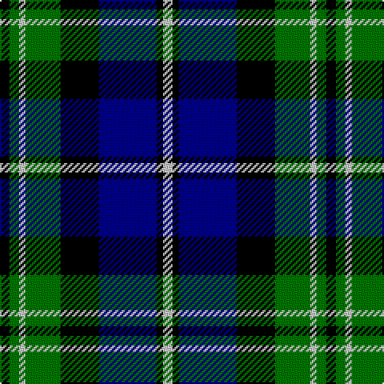

In pattern [KGWGKBKW](/patterns/kgwgkbkw/).

This was sourced from register-of-tartans.  It is a [8 stripes tartan](/stripes/stripes8/).

Original link https://www.tartanregister.gov.uk/tartanDetails.aspx?ref=2233

## Attestations

This cloth appears in 2 source records; the oldest owns this page.

- 01/01/2001 — Louisiana (register-of-tartans, [record](https://www.tartanregister.gov.uk/tartanDetails.aspx?ref=2233))
- 2001 — Louisiana (District (tartans-authority, [record](http://www.tartansauthority.com/tartan-ferret/display/1945/))

## Thread count
K/6 G6 N4 G22 K24 DB36 K4 N/6

## Palette
Each colour and its ΔE from the base-6 reference it is a variant of.

| Colour | Shade | Base | ΔE (OKLab) |
|---|---|---|---|
| DB | <code style="background-color:#00008C;">#00008C</code> `#00008C` | B <code style="background-color:#2A418A;">#2A418A</code> | 0.13 |
| G | <code style="background-color:#007800;">#007800</code> `#007800` | G <code style="background-color:#006100;">#006100</code> | 0.07 |
| K | <code style="background-color:#000000;">#000000</code> `#000000` | K <code style="background-color:#000000;">#000000</code> | 0.00 |
| N | <code style="background-color:#C8C8C8;">#C8C8C8</code> `#C8C8C8` | W <code style="background-color:#F7F7F7;">#F7F7F7</code> | 0.14 |

# Sample pattern

## Nearest tartans

The nearest existing variants by ΔTartan distance.

1. [Lamont](/setts/s8/b10k1b1k1b2k8g10w1~b304080-g008000-k000000-we0e0e0~x2/) — ΔT 0.93
1. [Forbes](/setts/s9/b8k2b2k2b2k8g7k1w1~b304080-g008000-k000000-we0e0e0~x2/) — ΔT 0.96
1. [Baird](/setts/s8/b3k2b8k8g8ba1g1ba3~b304080-ba800080-g008000-k000000~x2/) — ΔT 0.99
1. [Reid Taylor, "House Check"](/setts/s7/b2k1r1b9k9g10k2~b304080-g008000-k000000-rc00000~x2/) — ΔT 1.00
1. [Forbes](/setts/s7/b1k1b6k6g6k1w1~b304080-g008000-k000000-we0e0e0~x2/) — ΔT 1.05
1. [Unnamed, No 59](/setts/s6/b1ba11k11g11k2b1~b5480b0-ba304080-g008000-k000000~x2/) — ΔT 1.06
1. [Brabender](/setts/s8/g1b7k1b1k4r1g4k1~b304080-g008000-k000000-rc00000~x6/) — ΔT 1.07
1. [MacNeil 1](/setts/s6/w1b9k9g9k2w1~b304080-g008000-k000000-we0e0e0~x4/) — ΔT 1.10
1. [Unnamed, No 115](/setts/s8/b10k6ba1g6k1g6ba1k6~b304080-ba5480b0-g008000-k000000~x2/) — ΔT 1.14
1. [Colgan (Personal)](/setts/s9/r7b2g5k24b2g10b28g10w3~b00008c-g007800-k000000-r8c0000-wc8c8c8~x2/) — ΔT 1.17

## Neighbour map

Every grey dot is one of 15726 variants placed by the first two principal components of the ΔTartan feature space (44% of its variance). Red is this tartan; blue dots are its nearest — click one to open its page.

<svg viewBox="0 0 640 380" role="img" style="max-width:100%;height:auto;border:1px solid #e0e0e0;border-radius:4px;display:block" xmlns="http://www.w3.org/2000/svg"><image href="/nn/cloud.v1.png" width="640" height="380"/><a href="/setts/s8/b10k1b1k1b2k8g10w1~b304080-g008000-k000000-we0e0e0~x2/"><circle cx="180.6" cy="189.4" r="4" fill="#3465a4"><title>Lamont</title></circle></a><a href="/setts/s9/b8k2b2k2b2k8g7k1w1~b304080-g008000-k000000-we0e0e0~x2/"><circle cx="167.4" cy="206.7" r="4" fill="#3465a4"><title>Forbes</title></circle></a><a href="/setts/s8/b3k2b8k8g8ba1g1ba3~b304080-ba800080-g008000-k000000~x2/"><circle cx="125.7" cy="215.8" r="4" fill="#3465a4"><title>Baird</title></circle></a><a href="/setts/s7/b2k1r1b9k9g10k2~b304080-g008000-k000000-rc00000~x2/"><circle cx="166.2" cy="207.6" r="4" fill="#3465a4"><title>Reid Taylor, &quot;House Check&quot;</title></circle></a><a href="/setts/s7/b1k1b6k6g6k1w1~b304080-g008000-k000000-we0e0e0~x2/"><circle cx="138.6" cy="223.6" r="4" fill="#3465a4"><title>Forbes</title></circle></a><a href="/setts/s6/b1ba11k11g11k2b1~b5480b0-ba304080-g008000-k000000~x2/"><circle cx="163.5" cy="212.1" r="4" fill="#3465a4"><title>Unnamed, No 59</title></circle></a><a href="/setts/s8/g1b7k1b1k4r1g4k1~b304080-g008000-k000000-rc00000~x6/"><circle cx="172.0" cy="210.3" r="4" fill="#3465a4"><title>Brabender</title></circle></a><a href="/setts/s6/w1b9k9g9k2w1~b304080-g008000-k000000-we0e0e0~x4/"><circle cx="142.4" cy="217.5" r="4" fill="#3465a4"><title>MacNeil 1</title></circle></a><a href="/setts/s8/b10k6ba1g6k1g6ba1k6~b304080-ba5480b0-g008000-k000000~x2/"><circle cx="142.3" cy="214.2" r="4" fill="#3465a4"><title>Unnamed, No 115</title></circle></a><a href="/setts/s9/r7b2g5k24b2g10b28g10w3~b00008c-g007800-k000000-r8c0000-wc8c8c8~x2/"><circle cx="145.0" cy="160.0" r="4" fill="#3465a4"><title>Colgan (Personal)</title></circle></a><circle cx="132.8" cy="198.2" r="5" fill="#c00000"/></svg>

ID: /setts/s8/k3g3w2g11k12b18k2w3~b00008c-g007800-k000000-wc8c8c8~x2/
