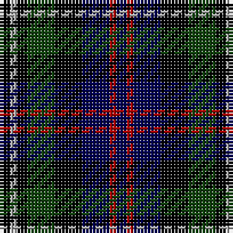

In pattern [BRBKGKYK](/stripes/brbkgkyk/).

This was sourced from weddslist.  It is a [8 stripe tartan](/stripes/stripes8/).

Original link http://www.weddslist.com/cgi-bin/tartans/pg.pl?source=x

## Thread count
K/3 N2 K3 DG8 K8 DB8 DR2 DB/3

## Palette
Each colour and the base-6 reference it is a variant of.

| Colour | Shade | Base |
|---|---|---|
| DB | <code style="background-color:#000052;">#000052</code> `oklch(19.8% 0.137 264.1)` <small>#000052</small> | B <code style="background-color:#2A418A;">#2A418A</code> |
| DG | <code style="background-color:#11450D;">#11450D</code> `oklch(34.4% 0.101 142.1)` <small>#11450D</small> | G <code style="background-color:#006100;">#006100</code> |
| DR | <code style="background-color:#AA0000;">#AA0000</code> `oklch(46.3% 0.190 29.2)` <small>#AA0000</small> | R <code style="background-color:#CC0000;">#CC0000</code> |
| K | <code style="background-color:#000000;">#000000</code> `oklch(0.0% 0.000 0.0)` <small>#000000</small> | K <code style="background-color:#000000;">#000000</code> |
| N | <code style="background-color:#AAAAAA;">#AAAAAA</code> `oklch(73.8% 0.000 89.9)` <small>#AAAAAA</small> | Y <code style="background-color:#F2BF00;">#F2BF00</code> |

# Sample pattern

## Nearest tartans

The nearest existing variants by ΔTartan distance, with this tartan at the top so the swatches line up against it.

ΔTartan

Tartan

Sett

—

<a href="/ttd/edit/#slug=k3lr2k3dg8k8db8r2db3">Davidson Double</a> <a class="nn-out" href="/setts/s8/k3lr2k3dg8k8db8r2db3/" title="open its dictionary page">↗</a>

0.00

<a href="/ttd/edit/#slug=k3lr2k3dg8k8db8r2db3~x2">Davidson Double</a> <a class="nn-out" href="/setts/s8/k3lr2k3dg8k8db8r2db3~x2/" title="open its dictionary page">↗</a>

0.90

<a href="/ttd/edit/#slug=dg3lb2k3dg8k8db8r2db3">Davidson Double</a> <a class="nn-out" href="/setts/s8/dg3lb2k3dg8k8db8r2db3/" title="open its dictionary page">↗</a>

0.97

<a href="/ttd/edit/#slug=r1k2dg4k1dg1k2db3k1w1~x6">MacKean dress</a> <a class="nn-out" href="/setts/s9/r1k2dg4k1dg1k2db3k1w1~x6/" title="open its dictionary page">↗</a>

1.25

<a href="/ttd/edit/#slug=r2k8ly1k8dg8db8r2~x2">Brodie Hunting</a> <a class="nn-out" href="/setts/s7/r2k8ly1k8dg8db8r2~x2/" title="open its dictionary page">↗</a>

1.26

<a href="/ttd/edit/#slug=db8k4lo2k3r2k3lo2k4g8~x4">Vosko</a> <a class="nn-out" href="/setts/s9/db8k4lo2k3r2k3lo2k4g8~x4/" title="open its dictionary page">↗</a>

1.28

<a href="/ttd/edit/#slug=k3w2k3g8k8db8r2db3~x2">Davidson, Double</a> <a class="nn-out" href="/setts/s8/k3w2k3g8k8db8r2db3~x2/" title="open its dictionary page">↗</a>

1.30

<a href="/ttd/edit/#slug=o8g4db16g4k14o14db4b3~x2">Hinnigan (Personal)</a> <a class="nn-out" href="/setts/s8/o8g4db16g4k14o14db4b3~x2/" title="open its dictionary page">↗</a>

1.33

<a href="/ttd/edit/#slug=k8r1db8lb1db8r1k8dg8k1dg8~x2">Hunter</a> <a class="nn-out" href="/setts/s10/k8r1db8lb1db8r1k8dg8k1dg8~x2/" title="open its dictionary page">↗</a>

1.36

<a href="/ttd/edit/#slug=r1db6k3dg6lr1~x2">Davidson of Tulloch</a> <a class="nn-out" href="/setts/s5/r1db6k3dg6lr1~x2/" title="open its dictionary page">↗</a>

1.38

<a href="/ttd/edit/#slug=o7k20o4k18y20dp5~x2">Williamson (Personal)</a> <a class="nn-out" href="/setts/s6/o7k20o4k18y20dp5~x2/" title="open its dictionary page">↗</a>

## Neighbour map

Every grey dot is one of 14299 variants placed by the first two principal components of the ΔTartan feature space (44% of its variance). Red is this tartan; blue dots are its nearest — click one to open its page.

<svg viewBox="0 0 640 380" role="img" style="max-width:100%;height:auto;border:1px solid #e0e0e0;border-radius:4px;display:block" xmlns="http://www.w3.org/2000/svg"><image href="/nn/cloud.v1.png" width="640" height="380"/><a href="/setts/s8/k3lr2k3dg8k8db8r2db3~x2/"><circle cx="111.5" cy="253.1" r="4" fill="#3465a4"><title>Davidson Double</title></circle></a><a href="/setts/s8/dg3lb2k3dg8k8db8r2db3/"><circle cx="66.2" cy="244.9" r="4" fill="#3465a4"><title>Davidson Double</title></circle></a><a href="/setts/s9/r1k2dg4k1dg1k2db3k1w1~x6/"><circle cx="89.3" cy="233.9" r="4" fill="#3465a4"><title>MacKean dress</title></circle></a><a href="/setts/s7/r2k8ly1k8dg8db8r2~x2/"><circle cx="165.5" cy="231.0" r="4" fill="#3465a4"><title>Brodie Hunting</title></circle></a><a href="/setts/s9/db8k4lo2k3r2k3lo2k4g8~x4/"><circle cx="104.6" cy="241.3" r="4" fill="#3465a4"><title>Vosko</title></circle></a><a href="/setts/s8/k3w2k3g8k8db8r2db3~x2/"><circle cx="104.3" cy="242.5" r="4" fill="#3465a4"><title>Davidson, Double</title></circle></a><a href="/setts/s8/o8g4db16g4k14o14db4b3~x2/"><circle cx="84.5" cy="224.1" r="4" fill="#3465a4"><title>Hinnigan (Personal)</title></circle></a><a href="/setts/s10/k8r1db8lb1db8r1k8dg8k1dg8~x2/"><circle cx="133.2" cy="213.9" r="4" fill="#3465a4"><title>Hunter</title></circle></a><a href="/setts/s5/r1db6k3dg6lr1~x2/"><circle cx="140.2" cy="249.2" r="4" fill="#3465a4"><title>Davidson of Tulloch</title></circle></a><a href="/setts/s6/o7k20o4k18y20dp5~x2/"><circle cx="76.7" cy="251.0" r="4" fill="#3465a4"><title>Williamson (Personal)</title></circle></a><circle cx="111.5" cy="253.1" r="5" fill="#c00000"/></svg>

ID: /setts/s8/k3lr2k3dg8k8db8r2db3/
