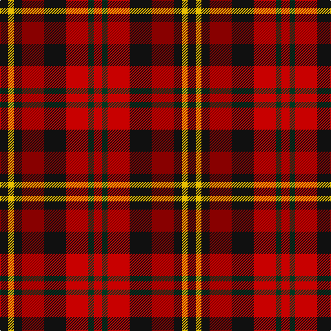

**Bands:** [KYKRKRGR](/stripes/kykrkrgr/) · **Stripes:** [K LY K R K R DG R](/stripes/stripes8/) K LY K R K R DG R

This was sourced from register-of-tartans.  It is a [8 band tartan](/bands/bands8/).

Original link https://www.tartanregister.gov.uk/tartanDetails.aspx?ref=898

## Attestations

This cloth appears in 2 source records; the oldest owns this page.

- 01/01/2003 — Davis (register-of-tartans, [record](https://www.tartanregister.gov.uk/tartanDetails.aspx?ref=898))
- 2003 — Davis (Name) (tartans-authority, [record](http://www.tartansauthority.com/tartan-ferret/display/5770/))

## Register references

External register numbers recorded for this tartan.

- Scottish Register of Tartans: [898](https://www.tartanregister.gov.uk/tartanDetails.aspx?ref=898)
- Scottish Tartans Authority (ITI): 5770

## Thread count
K/12 Y8 K12 DR32 K32 R32 DG8 R/12

## Palette
Each colour and its ΔE from the base-6 reference it is a variant of.

| Colour | Shade | Base | ΔE (OKLab) |
|---|---|---|---|
| DG | <code style="background-color:#003820;">#003820</code> `#003820` | G <code style="background-color:#006100;">#006100</code> | 0.15 |
| DR | <code style="background-color:#880000;">#880000</code> `#880000` | R <code style="background-color:#CC0000;">#CC0000</code> | 0.15 |
| K | <code style="background-color:#101010;">#101010</code> `#101010` | K <code style="background-color:#000000;">#000000</code> | 0.17 |
| R | <code style="background-color:#C80000;">#C80000</code> `#C80000` | R <code style="background-color:#CC0000;">#CC0000</code> | 0.01 |
| Y | <code style="background-color:#E8C000;">#E8C000</code> `#E8C000` | Y <code style="background-color:#F2BF00;">#F2BF00</code> | 0.02 |

# Sample pattern

## Nearest tartans

The nearest existing variants by ΔTartan distance.

1. [Tinkler (Corporate)](/setts/s9/g2lo9do6r3do2r3do2r10w2~x4/) — ΔT 1.17
1. [Stewart /Stuart- Fragment Cf 1452 & 1445](/setts/s7/r3t4k11r11g11do3r3~x4/) — ΔT 1.27
1. [Westgaard Htg (Personal)](/setts/s12/r9dg4r6db4dg2k2dg2r5db3ly2k2ly2~x2/) — ΔT 1.45
1. [MacNaughton (Logan)](/setts/s7/db5r17dg16k10db10r17db5~x2/) — ΔT 1.46
1. [Akins Red Dress](/setts/s9/g6r4g5r13k13w5k13r13ly6~x2/) — ΔT 1.54
1. [Chaudhri (Name)](/setts/s8/dp13r8lb5dg24lb5r10lb5r10~x2/) — ΔT 1.56
1. [MacInroy Clan Tartan Tartan Number: 1081. Earliest known date: 1819 The pattern books of the old firm of weavers, Wilson's of Bannockburn, provide a reliable early source for this tartan. Wilson's were in business with a monopoly to supply tartan to the regiments in the second half of the 18th century before this pattern was recorded. See products available Copyright © Blair Urquhart, Comrie, 2015](/setts/s10/k1g3k3r1dp3r1dp1r3g1k1~x4/) — ΔT 1.59
1. [Wilson's No.223](/setts/s8/dg6dp6y1r6dg6r6y1dp6~x4/) — ΔT 1.59
1. [Aboyne II (Fashion)](/setts/s6/r2ly1r5k4g5w1~x4/) — ΔT 1.62
1. [Commonwealth](/setts/s10/dt6lo2r6lb3k2lo6dt10r2dt3r2~x4/) — ΔT 1.62

## Neighbour map

Every grey dot is one of 14313 variants placed by the first two principal components of the ΔTartan feature space (44% of its variance). Red is this tartan; blue dots are its nearest — click one to open its page.

<svg viewBox="0 0 640 380" role="img" style="max-width:100%;height:auto;border:1px solid #e0e0e0;border-radius:4px;display:block" xmlns="http://www.w3.org/2000/svg"><image href="/nn/cloud.v1.png" width="640" height="380"/><a href="/setts/s9/g2lo9do6r3do2r3do2r10w2~x4/"><circle cx="159.7" cy="205.3" r="4" fill="#3465a4"><title>Tinkler (Corporate)</title></circle></a><a href="/setts/s7/r3t4k11r11g11do3r3~x4/"><circle cx="97.5" cy="233.3" r="4" fill="#3465a4"><title>Stewart /Stuart- Fragment Cf 1452 &amp; 1445</title></circle></a><a href="/setts/s12/r9dg4r6db4dg2k2dg2r5db3ly2k2ly2~x2/"><circle cx="144.5" cy="211.1" r="4" fill="#3465a4"><title>Westgaard Htg (Personal)</title></circle></a><a href="/setts/s7/db5r17dg16k10db10r17db5~x2/"><circle cx="131.2" cy="273.2" r="4" fill="#3465a4"><title>MacNaughton (Logan)</title></circle></a><a href="/setts/s9/g6r4g5r13k13w5k13r13ly6~x2/"><circle cx="68.9" cy="230.6" r="4" fill="#3465a4"><title>Akins Red Dress</title></circle></a><a href="/setts/s8/dp13r8lb5dg24lb5r10lb5r10~x2/"><circle cx="120.2" cy="231.0" r="4" fill="#3465a4"><title>Chaudhri (Name)</title></circle></a><a href="/setts/s10/k1g3k3r1dp3r1dp1r3g1k1~x4/"><circle cx="80.6" cy="253.7" r="4" fill="#3465a4"><title>MacInroy Clan Tartan Tartan Number: 1081. Earliest known date: 1819 The pattern books of the old firm of weavers, Wilson's of Bannockburn, provide a reliable early source for this tartan. Wilson's were in business with a monopoly to supply tartan to the regiments in the second half of the 18th century before this pattern was recorded. See products available Copyright © Blair Urquhart, Comrie, 2015</title></circle></a><a href="/setts/s8/dg6dp6y1r6dg6r6y1dp6~x4/"><circle cx="142.7" cy="255.5" r="4" fill="#3465a4"><title>Wilson's No.223</title></circle></a><a href="/setts/s6/r2ly1r5k4g5w1~x4/"><circle cx="113.6" cy="221.7" r="4" fill="#3465a4"><title>Aboyne II (Fashion)</title></circle></a><a href="/setts/s10/dt6lo2r6lb3k2lo6dt10r2dt3r2~x4/"><circle cx="149.7" cy="209.7" r="4" fill="#3465a4"><title>Commonwealth</title></circle></a><circle cx="125.0" cy="230.8" r="5" fill="#c00000"/></svg>

ID: /setts/s8/k3ly2k3r8k8r8dg2r3~x4/
