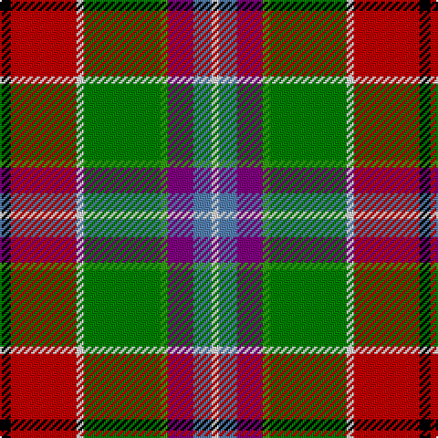

This page is one **sett** — a single exact thread-count. It belongs to the [tartan](/tartans/k3r18ln2ga21g2p7b5ln2/)
(the same proportion at any scale), whose colour order is pattern [KRWGGBBW](/stripes/krwggbbw/).

Sourced from weddslist.  It is a [8 stripe tartan](/stripes/stripes8/).

Original link http://www.weddslist.com/cgi-bin/tartans/pg.pl?source=sts

## Thread count
K/6 R36 LN4 Ga42 G4 P14 B10 LN/4

## Palette
Each colour and the base-6 reference it is a variant of.

| Colour | Shade | Base |
|---|---|---|
| B | <code style="background-color:#5480B0;">#5480B0</code> `oklch(58.8% 0.089 251.5)` <small>#5480B0</small> | B <code style="background-color:#2A418A;">#2A418A</code> |
| G | <code style="background-color:#30A010;">#30A010</code> `oklch(61.9% 0.195 140.5)` <small>#30A010</small> | G <code style="background-color:#006100;">#006100</code> |
| Ga | <code style="background-color:#008000;">#008000</code> `oklch(52.0% 0.177 142.5)` <small>#008000</small> | G <code style="background-color:#006100;">#006100</code> |
| K | <code style="background-color:#000000;">#000000</code> `oklch(0.0% 0.000 0.0)` <small>#000000</small> | K <code style="background-color:#000000;">#000000</code> |
| LN | <code style="background-color:#E0E0E0;">#E0E0E0</code> `oklch(90.7% 0.000 89.9)` <small>#E0E0E0</small> | W <code style="background-color:#F7F7F7;">#F7F7F7</code> |
| P | <code style="background-color:#800080;">#800080</code> `oklch(42.1% 0.193 328.4)` <small>#800080</small> | B <code style="background-color:#2A418A;">#2A418A</code> |
| R | <code style="background-color:#C00000;">#C00000</code> `oklch(50.7% 0.208 29.2)` <small>#C00000</small> | R <code style="background-color:#CC0000;">#CC0000</code> |

# Sample pattern

## Nearest tartans

The nearest existing variants by ΔTartan distance, with this tartan at the top so the swatches line up against it.

ΔTartan

Tartan

Sett

—

<a href="/ttd/edit/#slug=k3r18w2g21g2p7t5w2~x2">Wilson's, No 132</a> <a class="nn-out" href="/setts/s8/k3r18w2g21g2p7t5w2~x2/" title="open its dictionary page">↗</a>

0.68

<a href="/ttd/edit/#slug=t4p3g1g9w1r8k1~x4">Wilson's, No 121</a> <a class="nn-out" href="/setts/s7/t4p3g1g9w1r8k1~x4/" title="open its dictionary page">↗</a>

0.71

<a href="/ttd/edit/#slug=t3p10w3k3g19r14t3k2ly3~x2">Wilson's, No 110</a> <a class="nn-out" href="/setts/s9/t3p10w3k3g19r14t3k2ly3~x2/" title="open its dictionary page">↗</a>

0.90

<a href="/ttd/edit/#slug=w3r10dy6ly8t8dg32r8r10r6w3~x4">Unidentified Silk scarf</a> <a class="nn-out" href="/setts/s10/w3r10dy6ly8t8dg32r8r10r6w3~x4/" title="open its dictionary page">↗</a>

1.01

<a href="/ttd/edit/#slug=r24g22k2w6k2ly2k15y6r6w2~x2">Bruce of Kinnaird</a> <a class="nn-out" href="/setts/s10/r24g22k2w6k2ly2k15y6r6w2~x2/" title="open its dictionary page">↗</a>

1.08

<a href="/ttd/edit/#slug=t4dy27lr8k4lr8k4lr8r11ly3~x2">Brittany Hunting French Fancy Tartan Tartan Number: 5977. Earliest known date: 2003 For Richard and Anne-Marie Duclos of Le Coudray-Montceaux, France. Based on the Breton National at 3902. The term Randonnée (Walking) is used in the sense of the Scottish category, Hunting. See products available Copyright © Blair Urquhart, Comrie, 2015</a> <a class="nn-out" href="/setts/s9/t4dy27lr8k4lr8k4lr8r11ly3~x2/" title="open its dictionary page">↗</a>

1.12

<a href="/ttd/edit/#slug=o40ly10w6lo10dy6lo4dy6lo4dy60k34t11">Angels' Share, The</a> <a class="nn-out" href="/setts/s11/o40ly10w6lo10dy6lo4dy6lo4dy60k34t11/" title="open its dictionary page">↗</a>

1.14

<a href="/ttd/edit/#slug=k20lo4r4lo20y20lb5y2g2~x2">Hackett Hunting (Personal)</a> <a class="nn-out" href="/setts/s8/k20lo4r4lo20y20lb5y2g2~x2/" title="open its dictionary page">↗</a>

1.15

<a href="/ttd/edit/#slug=r4dy12k12dy1o12ly1k3w2k1b4~x2">Campbell Hunting</a> <a class="nn-out" href="/setts/s10/r4dy12k12dy1o12ly1k3w2k1b4~x2/" title="open its dictionary page">↗</a>

1.19

<a href="/ttd/edit/#slug=r12w1k1g12ly2db5t6r2t2r4g2r2k2g2~x2">Unnamed 11</a> <a class="nn-out" href="/setts/s14/r12w1k1g12ly2db5t6r2t2r4g2r2k2g2~x2/" title="open its dictionary page">↗</a>

1.23

<a href="/ttd/edit/#slug=dy5w1dy5w1g6ly1k1ly1lb8r1~x4">Glendale</a> <a class="nn-out" href="/setts/s10/dy5w1dy5w1g6ly1k1ly1lb8r1~x4/" title="open its dictionary page">↗</a>

## Neighbour map

Every grey dot is one of 14299 variants placed by the first two principal components of the ΔTartan feature space (44% of its variance). Red is this tartan; blue dots are its nearest — click one to open its page.

<svg viewBox="0 0 640 380" role="img" style="max-width:100%;height:auto;border:1px solid #e0e0e0;border-radius:4px;display:block" xmlns="http://www.w3.org/2000/svg"><image href="/nn/cloud.v1.png" width="640" height="380"/><a href="/setts/s7/t4p3g1g9w1r8k1~x4/"><circle cx="97.4" cy="150.0" r="4" fill="#3465a4"><title>Wilson's, No 121</title></circle></a><a href="/setts/s9/t3p10w3k3g19r14t3k2ly3~x2/"><circle cx="66.6" cy="123.3" r="4" fill="#3465a4"><title>Wilson's, No 110</title></circle></a><a href="/setts/s10/w3r10dy6ly8t8dg32r8r10r6w3~x4/"><circle cx="93.1" cy="123.3" r="4" fill="#3465a4"><title>Unidentified Silk scarf</title></circle></a><a href="/setts/s10/r24g22k2w6k2ly2k15y6r6w2~x2/"><circle cx="65.1" cy="102.8" r="4" fill="#3465a4"><title>Bruce of Kinnaird</title></circle></a><a href="/setts/s9/t4dy27lr8k4lr8k4lr8r11ly3~x2/"><circle cx="119.5" cy="150.5" r="4" fill="#3465a4"><title>Brittany Hunting French Fancy Tartan Tartan Number: 5977. Earliest known date: 2003 For Richard and Anne-Marie Duclos of Le Coudray-Montceaux, France. Based on the Breton National at 3902. The term Randonnée (Walking) is used in the sense of the Scottish category, Hunting. See products available Copyright © Blair Urquhart, Comrie, 2015</title></circle></a><a href="/setts/s11/o40ly10w6lo10dy6lo4dy6lo4dy60k34t11/"><circle cx="133.7" cy="90.9" r="4" fill="#3465a4"><title>Angels' Share, The</title></circle></a><a href="/setts/s8/k20lo4r4lo20y20lb5y2g2~x2/"><circle cx="117.6" cy="159.1" r="4" fill="#3465a4"><title>Hackett Hunting (Personal)</title></circle></a><a href="/setts/s10/r4dy12k12dy1o12ly1k3w2k1b4~x2/"><circle cx="89.3" cy="122.2" r="4" fill="#3465a4"><title>Campbell Hunting</title></circle></a><a href="/setts/s14/r12w1k1g12ly2db5t6r2t2r4g2r2k2g2~x2/"><circle cx="114.2" cy="101.6" r="4" fill="#3465a4"><title>Unnamed 11</title></circle></a><a href="/setts/s10/dy5w1dy5w1g6ly1k1ly1lb8r1~x4/"><circle cx="71.4" cy="131.7" r="4" fill="#3465a4"><title>Glendale</title></circle></a><circle cx="110.3" cy="123.3" r="5" fill="#c00000"/></svg>

ID: /setts/s8/k3r18w2g21g2p7t5w2~x2/
