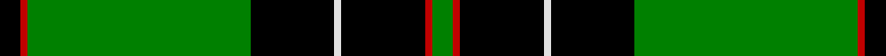
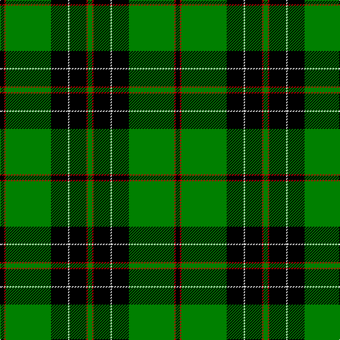

In pattern [GRKWKGRK](/stripes/grkwkgrk/).

This was sourced from weddslist.  It is a [8 stripe tartan](/stripes/stripes8/).

Original link http://www.weddslist.com/cgi-bin/tartans/pg.pl?source=sts

## Thread count
K/6 R2 G64 K24 LN2 K24 R2 G/6

## Palette
Each colour and the base-6 reference it is a variant of.

| Colour | Shade | Base |
|---|---|---|
| G | <code style="background-color:#008000;">#008000</code> `oklch(52.0% 0.177 142.5)` <small>#008000</small> | G <code style="background-color:#006100;">#006100</code> |
| K | <code style="background-color:#000000;">#000000</code> `oklch(0.0% 0.000 0.0)` <small>#000000</small> | K <code style="background-color:#000000;">#000000</code> |
| LN | <code style="background-color:#E0E0E0;">#E0E0E0</code> `oklch(90.7% 0.000 89.9)` <small>#E0E0E0</small> | W <code style="background-color:#F7F7F7;">#F7F7F7</code> |
| R | <code style="background-color:#C00000;">#C00000</code> `oklch(50.7% 0.208 29.2)` <small>#C00000</small> | R <code style="background-color:#CC0000;">#CC0000</code> |

# Sample pattern

## Nearest tartans

The nearest existing variants by ΔTartan distance, with this tartan at the top so the swatches line up against it.

ΔTartan

Tartan

Sett

—

<a href="/ttd/edit/#slug=k3r1g32k12w1k12r1g3~x2">MacHardy</a> <a class="nn-out" href="/setts/s8/k3r1g32k12w1k12r1g3~x2/" title="open its dictionary page">↗</a>

1.36

<a href="/ttd/edit/#slug=g44lb2g10t3k6lb1r2k18~x2">Mull Rugby Club (Old)</a> <a class="nn-out" href="/setts/s8/g44lb2g10t3k6lb1r2k18~x2/" title="open its dictionary page">↗</a>

1.45

<a href="/ttd/edit/#slug=g17t2g2t2k21t2k3g30k2t2k4~x2">Fort William</a> <a class="nn-out" href="/setts/s11/g17t2g2t2k21t2k3g30k2t2k4~x2/" title="open its dictionary page">↗</a>

1.47

<a href="/ttd/edit/#slug=dg48lo3k6w4dg3k15lo3dg4~x2">Birmingham Irish Pipes &amp; Drums</a> <a class="nn-out" href="/setts/s8/dg48lo3k6w4dg3k15lo3dg4~x2/" title="open its dictionary page">↗</a>

1.49

<a href="/ttd/edit/#slug=g70k26g12k14b3k16~x2">Duchess of Fife</a> <a class="nn-out" href="/setts/s6/g70k26g12k14b3k16~x2/" title="open its dictionary page">↗</a>

1.50

<a href="/ttd/edit/#slug=g3k6w1k6g2k2g16k1~x2">MacLean of Duart, hunting</a> <a class="nn-out" href="/setts/s8/g3k6w1k6g2k2g16k1~x2/" title="open its dictionary page">↗</a>

1.51

<a href="/ttd/edit/#slug=k6g55g6k85g4k4g12k2w5">Dropkick Murphys</a> <a class="nn-out" href="/setts/s9/k6g55g6k85g4k4g12k2w5/" title="open its dictionary page">↗</a>

1.54

<a href="/ttd/edit/#slug=k8dg1k20dg1k4dg1k3dg4w2dg24lo3~x2">Malone (2016)</a> <a class="nn-out" href="/setts/s11/k8dg1k20dg1k4dg1k3dg4w2dg24lo3~x2/" title="open its dictionary page">↗</a>

1.56

<a href="/ttd/edit/#slug=r3g14k2lp2g14k36ly3~x2">Vipont</a> <a class="nn-out" href="/setts/s7/r3g14k2lp2g14k36ly3~x2/" title="open its dictionary page">↗</a>

1.57

<a href="/ttd/edit/#slug=r1g16k8g4k4ly1~x2">Forbes</a> <a class="nn-out" href="/setts/s6/r1g16k8g4k4ly1~x2/" title="open its dictionary page">↗</a>

1.70

<a href="/ttd/edit/#slug=k6g4lb3g44k32g3k3lo3k2g3~x2">Smeaton Hunting (Name)</a> <a class="nn-out" href="/setts/s10/k6g4lb3g44k32g3k3lo3k2g3~x2/" title="open its dictionary page">↗</a>

## Neighbour map

Every grey dot is one of 14299 variants placed by the first two principal components of the ΔTartan feature space (44% of its variance). Red is this tartan; blue dots are its nearest — click one to open its page.

<svg viewBox="0 0 640 380" role="img" style="max-width:100%;height:auto;border:1px solid #e0e0e0;border-radius:4px;display:block" xmlns="http://www.w3.org/2000/svg"><image href="/nn/cloud.v1.png" width="640" height="380"/><a href="/setts/s8/g44lb2g10t3k6lb1r2k18~x2/"><circle cx="372.0" cy="105.3" r="4" fill="#3465a4"><title>Mull Rugby Club (Old)</title></circle></a><a href="/setts/s11/g17t2g2t2k21t2k3g30k2t2k4~x2/"><circle cx="288.2" cy="147.3" r="4" fill="#3465a4"><title>Fort William</title></circle></a><a href="/setts/s8/dg48lo3k6w4dg3k15lo3dg4~x2/"><circle cx="367.7" cy="150.3" r="4" fill="#3465a4"><title>Birmingham Irish Pipes &amp; Drums</title></circle></a><a href="/setts/s6/g70k26g12k14b3k16~x2/"><circle cx="363.6" cy="196.8" r="4" fill="#3465a4"><title>Duchess of Fife</title></circle></a><a href="/setts/s8/g3k6w1k6g2k2g16k1~x2/"><circle cx="334.8" cy="187.4" r="4" fill="#3465a4"><title>MacLean of Duart, hunting</title></circle></a><a href="/setts/s9/k6g55g6k85g4k4g12k2w5/"><circle cx="384.9" cy="124.0" r="4" fill="#3465a4"><title>Dropkick Murphys</title></circle></a><a href="/setts/s11/k8dg1k20dg1k4dg1k3dg4w2dg24lo3~x2/"><circle cx="312.6" cy="139.7" r="4" fill="#3465a4"><title>Malone (2016)</title></circle></a><a href="/setts/s7/r3g14k2lp2g14k36ly3~x2/"><circle cx="270.1" cy="148.0" r="4" fill="#3465a4"><title>Vipont</title></circle></a><a href="/setts/s6/r1g16k8g4k4ly1~x2/"><circle cx="318.7" cy="189.2" r="4" fill="#3465a4"><title>Forbes</title></circle></a><a href="/setts/s10/k6g4lb3g44k32g3k3lo3k2g3~x2/"><circle cx="360.5" cy="145.8" r="4" fill="#3465a4"><title>Smeaton Hunting (Name)</title></circle></a><circle cx="341.1" cy="133.1" r="5" fill="#c00000"/></svg>

ID: /setts/s8/k3r1g32k12w1k12r1g3~x2/
