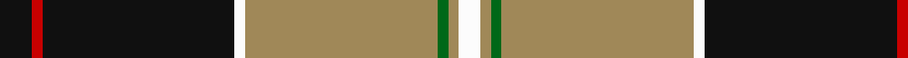
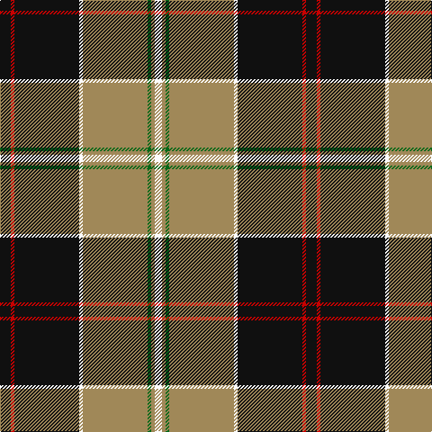

**Bands:** [KRKWYGYW](/stripes/krkwygyw/) · **Stripes:** [K R K W LO G LO W](/stripes/stripes8/) K R K W LO G LO W

This was sourced from register-of-tartans.  It is a [8 band tartan](/bands/bands8/).

Original link https://www.tartanregister.gov.uk/tartanDetails.aspx?ref=1047

## Attestations

This cloth appears in 2 source records; the oldest owns this page.

- 01/01/1984 — Dunlop Hunting (register-of-tartans, [record](https://www.tartanregister.gov.uk/tartanDetails.aspx?ref=1047))
- 1984 — Dunlop, Htg (Clan) (tartans-authority, [record](http://www.tartansauthority.com/tartan-ferret/display/1205/))

## Register references

External register numbers recorded for this tartan.

- Scottish Register of Tartans: [1047](https://www.tartanregister.gov.uk/tartanDetails.aspx?ref=1047)
- Scottish Tartans Authority (ITI): 1205
- Scottish Tartans World Register: 1205

## Thread count
K/12 R4 K72 W4 LT72 G4 LT4 W/8

## Palette
Each colour and its ΔE from the base-6 reference it is a variant of.

| Colour | Shade | Base | ΔE (OKLab) |
|---|---|---|---|
| G | <code style="background-color:#006818;">#006818</code> `#006818` | G <code style="background-color:#006100;">#006100</code> | 0.02 |
| K | <code style="background-color:#101010;">#101010</code> `#101010` | K <code style="background-color:#000000;">#000000</code> | 0.17 |
| LT | <code style="background-color:#A08858;">#A08858</code> `#A08858` | Y <code style="background-color:#F2BF00;">#F2BF00</code> | 0.21 |
| R | <code style="background-color:#C80000;">#C80000</code> `#C80000` | R <code style="background-color:#CC0000;">#CC0000</code> | 0.01 |
| W | <code style="background-color:#FCFCFC;">#FCFCFC</code> `#FCFCFC` | W <code style="background-color:#F7F7F7;">#F7F7F7</code> | 0.01 |

# Sample pattern

## Nearest tartans

The nearest existing variants by ΔTartan distance.

1. [Clyde Valley HOG](/setts/s8/k54lr6k6lr6o20lo40k6ly3/) — ΔT 1.03
1. [Motherwell Football Club. Modern](/setts/s9/lr60k6lr8k2lr8w2r12k49lo4/) — ΔT 1.08
1. [Rattray](/setts/s9/dg71k4r4db9r4db4r36db4lb4/) — ΔT 1.14
1. [Rogue Attitude](/setts/s11/dt31lr4n2r2n2lr6n2w4n2lr8dt2~x2/) — ΔT 1.18
1. [Royal College of G.P.s (Corporate)](/setts/s8/lo8k50o15dg6o6db3o6lo2~x2/) — ΔT 1.18
1. [Wcwm 1399](/setts/s10/k44lb3lo16lb2lo2lb2lo2y10k3y8~x2/) — ΔT 1.23
1. [Dinwiddie](/setts/s10/y7y2k2y41k12g22y6k2r4k2~x2/) — ΔT 1.24
1. [New York State Troopers (Corporate)](/setts/s7/o6dp4o2w2o24k25lo4~x2/) — ΔT 1.24
1. [Braemar or Blair Atholl](/setts/s8/do2w2k6do3k2o14k1o1~x4/) — ΔT 1.29
1. [MacNeill](/setts/s9/p6r1p20g6p6g24k1g2w4~x2/) — ΔT 1.29

## Neighbour map

Every grey dot is one of 14313 variants placed by the first two principal components of the ΔTartan feature space (44% of its variance). Red is this tartan; blue dots are its nearest — click one to open its page.

<svg viewBox="0 0 640 380" role="img" style="max-width:100%;height:auto;border:1px solid #e0e0e0;border-radius:4px;display:block" xmlns="http://www.w3.org/2000/svg"><image href="/nn/cloud.v1.png" width="640" height="380"/><a href="/setts/s8/k54lr6k6lr6o20lo40k6ly3/"><circle cx="229.3" cy="131.5" r="4" fill="#3465a4"><title>Clyde Valley HOG</title></circle></a><a href="/setts/s9/lr60k6lr8k2lr8w2r12k49lo4/"><circle cx="293.5" cy="97.6" r="4" fill="#3465a4"><title>Motherwell Football Club. Modern</title></circle></a><a href="/setts/s9/dg71k4r4db9r4db4r36db4lb4/"><circle cx="299.8" cy="120.3" r="4" fill="#3465a4"><title>Rattray</title></circle></a><a href="/setts/s11/dt31lr4n2r2n2lr6n2w4n2lr8dt2~x2/"><circle cx="265.3" cy="110.7" r="4" fill="#3465a4"><title>Rogue Attitude</title></circle></a><a href="/setts/s8/lo8k50o15dg6o6db3o6lo2~x2/"><circle cx="297.4" cy="121.4" r="4" fill="#3465a4"><title>Royal College of G.P.s (Corporate)</title></circle></a><a href="/setts/s10/k44lb3lo16lb2lo2lb2lo2y10k3y8~x2/"><circle cx="288.0" cy="112.7" r="4" fill="#3465a4"><title>Wcwm 1399</title></circle></a><a href="/setts/s10/y7y2k2y41k12g22y6k2r4k2~x2/"><circle cx="248.7" cy="115.3" r="4" fill="#3465a4"><title>Dinwiddie</title></circle></a><a href="/setts/s7/o6dp4o2w2o24k25lo4~x2/"><circle cx="242.5" cy="158.4" r="4" fill="#3465a4"><title>New York State Troopers (Corporate)</title></circle></a><a href="/setts/s8/do2w2k6do3k2o14k1o1~x4/"><circle cx="256.7" cy="154.7" r="4" fill="#3465a4"><title>Braemar or Blair Atholl</title></circle></a><a href="/setts/s9/p6r1p20g6p6g24k1g2w4~x2/"><circle cx="279.3" cy="125.7" r="4" fill="#3465a4"><title>MacNeill</title></circle></a><circle cx="266.7" cy="119.0" r="5" fill="#c00000"/></svg>

ID: /setts/s8/k3r1k18w1lo18g1lo1w2~x4/
